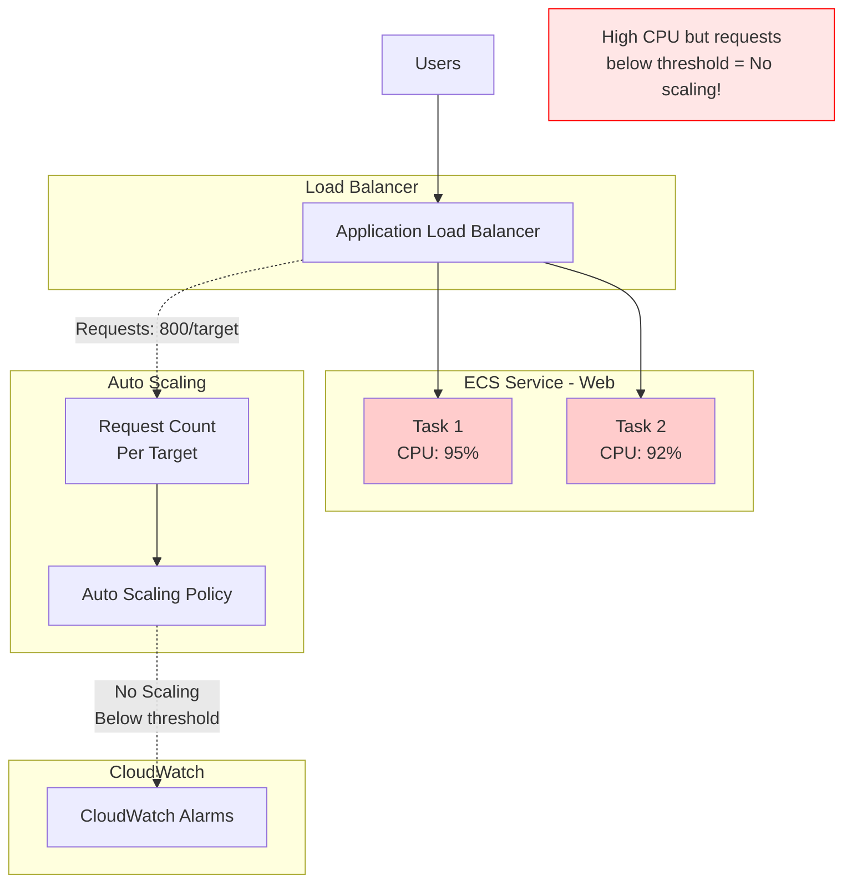
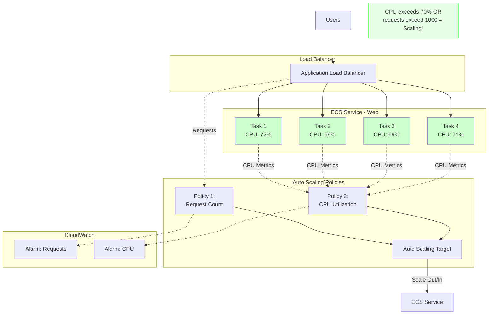
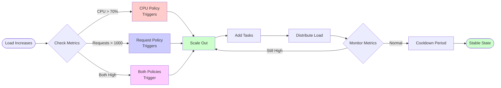
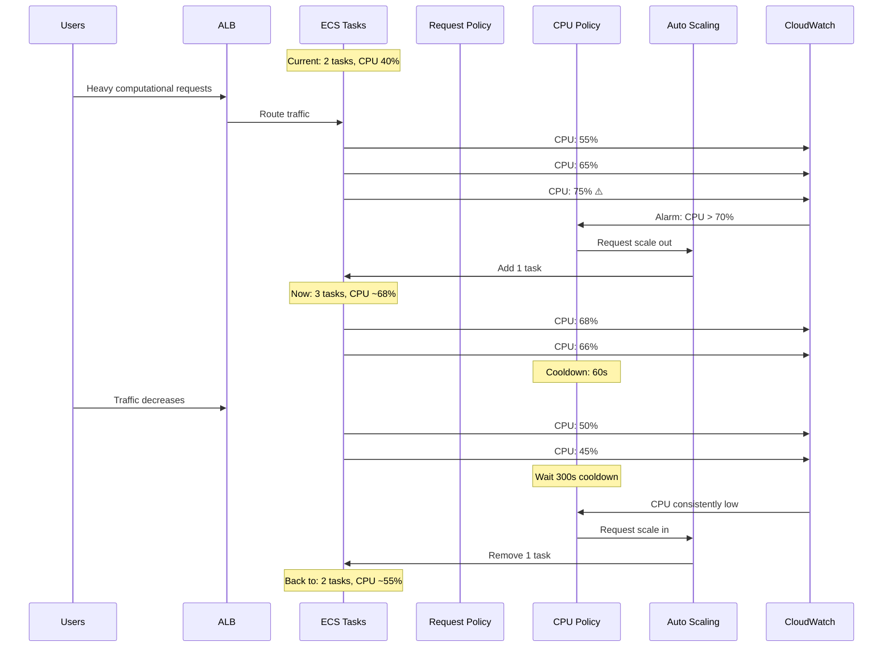
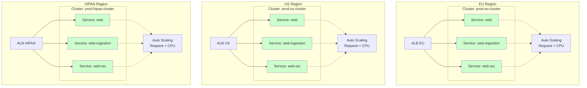
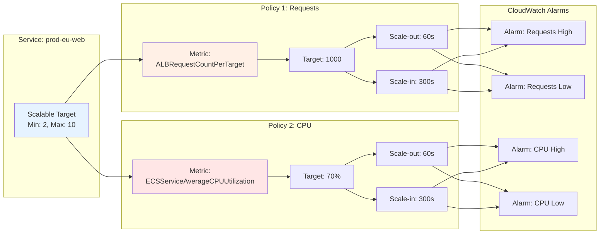
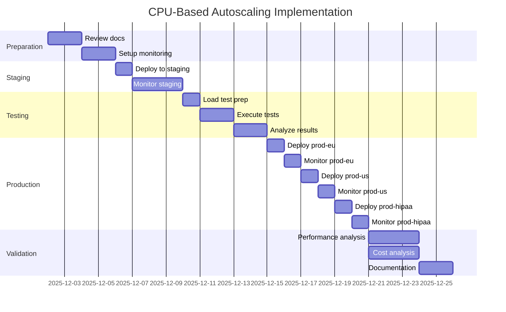

# CPU-Based Autoscaling Architecture

## Overview

This document provides visual representations of the autoscaling architecture before and after implementing CPU-based scaling.

## Current Architecture (Before)



**Problem:** Tasks are at 90%+ CPU, but request count (800/target) is below threshold (1000/target), so **no scaling occurs**. This leads to high latency and potential service degradation.

## New Architecture (After)



**Solution:** When CPU hit 70%, Policy 2 triggered scaling, adding Tasks 3 and 4. CPU is now distributed across more tasks, staying around the 70% target. Service remains responsive even under CPU-intensive workloads.

## Scaling Decision Flow



## Policy Interaction Diagram



## Multi-Region Deployment Architecture



**Note:** Each service in each region gets both CPU-based and request-based scaling policies.

## Scaling Policy Configuration



## Monitoring Dashboard Layout

```
┌─────────────────────────────────────────────────────────────┐
│                  ECS Autoscaling Dashboard                  │
├─────────────────────────────────────────────────────────────┤
│                                                              │
│  ┌──────────────────┐  ┌──────────────────┐               │
│  │  CPU Utilization │  │  Task Count     │               │
│  │                  │  │                  │               │
│  │  [Line Chart]    │  │  [Line Chart]    │               │
│  │  Target: 70%     │  │  Min: 2, Max: 10 │               │
│  └──────────────────┘  └──────────────────┘               │
│                                                              │
│  ┌──────────────────┐  ┌──────────────────┐               │
│  │  Requests/Target │  │  Response Time   │               │
│  │                  │  │                  │               │
│  │  [Line Chart]    │  │  [Line Chart]    │               │
│  │  Target: 1000    │  │  P95, P99        │               │
│  └──────────────────┘  └──────────────────┘               │
│                                                              │
│  ┌─────────────────────────────────────────┐               │
│  │      Scaling Events Timeline            │               │
│  │                                          │               │
│  │  [Timeline showing scale-out/in events]  │               │
│  │  Color-coded: CPU vs Request triggered  │               │
│  └─────────────────────────────────────────┘               │
│                                                              │
│  ┌──────────────────┐  ┌──────────────────┐               │
│  │  5xx Errors      │  │  Cost Estimate   │               │
│  │                  │  │                  │               │
│  │  [Bar Chart]     │  │  [Number]        │               │
│  │                  │  │  Task-hours/day  │               │
│  └──────────────────┘  └──────────────────┘               │
│                                                              │
└─────────────────────────────────────────────────────────────┘
```

## Cost Comparison

### Before CPU-Based Scaling

```
┌─────────────────────────────────────────┐
│  Time  │ CPU │ Tasks │ Requests │ State │
├────────┼─────┼───────┼──────────┼───────┤
│  00:00 │ 40% │   2   │   800    │  ✓    │
│  01:00 │ 50% │   2   │   900    │  ✓    │
│  02:00 │ 95% │   2   │   850    │  ⚠️   │ <- High latency!
│  03:00 │ 92% │   2   │   880    │  ⚠️   │ <- Still no scale
│  04:00 │ 45% │   2   │   700    │  ✓    │
└─────────────────────────────────────────┘

Average Tasks: 2
Task-hours: 48/day
Customer Impact: High latency 02:00-03:00
```

### After CPU-Based Scaling

```
┌─────────────────────────────────────────┐
│  Time  │ CPU │ Tasks │ Requests │ State │
├────────┼─────┼───────┼──────────┼───────┤
│  00:00 │ 40% │   2   │   800    │  ✓    │
│  01:00 │ 50% │   2   │   900    │  ✓    │
│  02:00 │ 72% │   3   │   850    │  ✓    │ <- Scaled up!
│  03:00 │ 68% │   3   │   880    │  ✓    │ <- Stable
│  04:00 │ 45% │   2   │   700    │  ✓    │ <- Scaled back
└─────────────────────────────────────────┘

Average Tasks: 2.2
Task-hours: 53/day (+10%)
Customer Impact: None - proactive scaling
```

**Cost Impact:** +10% task-hours, but prevented incident and maintained SLA.

## Implementation Timeline



## Key Takeaways

1. **Dual Protection:** Both CPU and request-based policies protect against different failure modes
2. **Independent Operation:** Policies work independently - removing one doesn't affect the other
3. **Quick Response:** 60-second scale-out cooldown ensures fast response to load increases
4. **Stable Operation:** 300-second scale-in cooldown prevents flapping
5. **Cost Efficient:** ~10% cost increase provides significant reliability improvement
6. **Easy Rollback:** Single command removes CPU policy if needed

---

**Visual Guide for:** LFE-7918 - Add CPU based scaling to web containers  
**Last Updated:** December 2, 2025
