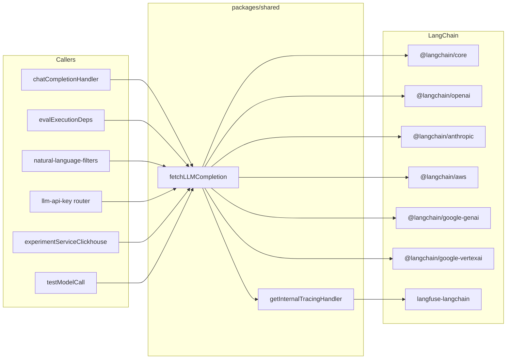

# LangChain v1 Upgrade – Plan and Tracking

This document is the single source of truth for the LangChain v1 upgrade: plan, task list, and post-upgrade documentation. Check off tasks as you complete them.

**Upgrade complete.** LangChain v1 / provider bumps are in place; Vertex remains on @langchain/google-vertexai; zod/v4 works; langfuse-langchain internal tracing verified (LLM-as-judge). Remaining follow-ups: playground model list cleanup, proxy validation (optional), and optional future migration from langfuse-langchain to @langfuse/langchain v4.

---

## Task list (tracking)

### Stage 1: Dependency bump and compatibility check

- [x] Bump `@langchain/core`, `langchain`, `@langchain/openai`, `@langchain/anthropic`, `@langchain/aws`, `@langchain/google-genai`, `@langchain/google-vertexai` in **packages/shared** to v1 / 2.x
- [x] Bump `@langchain/core` and `langchain` in **web/package.json** to ^1.0.0
- [x] Run `pnpm install --no-frozen-lockfile` locally and fix any peer dependency / resolution issues
- [x] Fix compile/type errors (constructor options, re-exports, BaseCallbackHandler, LLMResult)
- [x] **Apply v1 migration-guide checklist** ([docs](https://docs.langchain.com/oss/javascript/migrate/langchain-v1)): no legacy `langchain`/`langchain/chains` imports; no deprecated APIs (predictMessages/predict/call/callPrompt → invoke; Runnable.map → batch; fromPromptMessages → fromMessages); prefer `context` over `config.configurable` if passing static config to agent invoke (we use chatModel.invoke with runConfig only); no imports from package `dist/`; optional: consider `message.contentBlocks` for future multimodal/reasoning
- [x] Run full test suite (unit + integration); ensure no behavior change
- [x] Note constructor/import changes in "Stage 1" section below

### Stage 2: Vertex AI migration

- [x] Research @langchain/google-genai JS API for Vertex (project, location, credentials/ADC)
- [-] In fetchLLMCompletion.ts replace ChatVertexAI with ChatGoogleGenerativeAI for Vertex; preserve location, ADC, maxReasoningTokens, providerOptions
- [-] Remove @langchain/google-vertexai from packages/shared and lockfile
- [x] Re-test Vertex structured output; if #7429 fixed, switch to zod/v4 and remove (chatModel as ChatOpenAI) cast where safe
- [-] Update llmConnections.test.ts only if env vars or assertions change
- [-] Add Package moves + Vertex migration subsection below
- [x] **Do not migrate to genai:** Upgrading @langchain/google-vertexai works fine; genai requires API key and does not support service credentials. Only Python Vertex package is deprecated, not the TS one.

### Stage 3: Langfuse tracing package

- [x] Check langfuse-langchain compatibility with @langchain/core 1.x and callback interfaces _(verified: traces come through with LLM-as-judge)_
- [-] If incompatible, evaluate @langfuse/langchain v4 and \_exportLocalEvents or equivalent for getInternalTracingHandler _(staying on langfuse-langchain; no migration needed)_
- [-] Update getInternalTracingHandler.ts if migrating to @langfuse/langchain; keep blocked span names and processEventBatch behavior _(N/A: not migrating)_
- [x] Add Tracing subsection below (package used, API changes) _(see "How to verify langfuse-langchain internal tracing")_

### Stage 4: Documentation (this file)

- [x] Fill in "Package moves and problems overcome" below after Stage 1–3 _(see Package moves table, Stage 1/2 notes, Verification notes)_
- [x] Fill in "Challenges during the upgrade" below _(playground model list; placeholder for others)_
- [x] Fill in "What was tested in detail" below (use the checklist in this doc) _(checklist marked; Verification notes)_
- [x] Document any llmConnections.test.ts changes and why below _(see LLM connection test changes)_

---

## Current state (post-upgrade)

**Packages (all in packages/shared/package.json; web also has core + langchain).** Specifiers (e.g. `^1.0.0`) are in package.json; **actual resolved versions** come from `pnpm-lock.yaml` after `pnpm install`—you do not need to put exact versions in package.json; the lockfile pins them automatically.

| Package                      | Specifier (package.json) | Resolved (lockfile) | Role                                        |
| ---------------------------- | ------------------------ | ------------------- | ------------------------------------------- |
| `langchain`                  | ^1.0.0                   | 1.2.15              | Re-export / utilities                       |
| `@langchain/core`            | ^1.0.0                   | 1.1.17              | Messages, output parsers, stream, callbacks |
| `@langchain/openai`          | ^1.0.0                   | 1.2.3               | ChatOpenAI, AzureChatOpenAI                 |
| `@langchain/anthropic`       | ^1.0.0                   | 1.3.12              | ChatAnthropic                               |
| `@langchain/aws`             | ^1.0.0                   | 1.2.1               | ChatBedrockConverse                         |
| `@langchain/google-genai`    | ^2.0.0                   | 2.1.13              | ChatGoogleGenerativeAI (Google AI Studio)   |
| `@langchain/google-vertexai` | ^2.0.0                   | 2.1.13              | ChatVertexAI (Vertex AI)                    |
| `langfuse-langchain`         | 3.38.6                   | 3.38.6              | CallbackHandler for internal tracing        |

Resolved versions were read from `pnpm-lock.yaml` at doc update time. After running `pnpm install` or `pnpm update`, the lockfile may resolve to newer patch/minor versions within the specifier ranges; no need to change package.json unless you want to bump the range (e.g. `^1.0.0` → `^1.2.0`).

**Single LLM entry point:** `packages/shared/src/server/llm/fetchLLMCompletion.ts` – builds provider-specific chat models and supports completion (non-streamed/streamed), structured output (Zod), and tool calls.

**Call sites of fetchLLMCompletion:**

- `web/src/features/playground/server/chatCompletionHandler.ts` – Playground `/api/chatCompletion`
- `worker/src/features/evaluation/evalExecutionDeps.ts` – LLM-as-judge evals
- `web/src/features/natural-language-filters/server/router.ts` – AI filter builder (Langfuse API key + Bedrock)
- `web/src/features/llm-api-key/server/router.ts` – “Test connection” for LLM API keys
- `worker/src/features/experiments/experimentServiceClickhouse.ts` – Experiments
- `packages/shared/src/server/llm/testModelCall.ts` – Test model call (structured output)

**Tracing:** `packages/shared/src/server/llm/getInternalTracingHandler.ts` uses `langfuse-langchain` CallbackHandler and `_exportLocalEvents` to ingest internal LangChain spans.

**Special code:**

- **Zod v3 for structured output:** fetchLLMCompletion.ts uses `zod/v3` and casts to `(chatModel as ChatOpenAI)` for `withStructuredOutput` due to ChatVertexAI bug (issue #7429).
- **Proxy:** `HTTPS_PROXY` → `HttpsProxyAgent` for OpenAI and Anthropic.
- **Provider-specific options:** `modelParams.providerOptions` → modelKwargs (OpenAI/Azure), invocationKwargs (Anthropic), additionalModelRequestFields (Bedrock, Vertex, Google AI Studio).
- **Vertex:** GCP service account JSON or ADC sentinel; optional `location` in config.
- **Azure:** `azureOpenAIApiVersion: "2025-02-01-preview"`, base path, deployment name.

---

## Package moves and replacements

| From                                        | To                                                                                                                                   | Notes                                                                           |
| ------------------------------------------- | ------------------------------------------------------------------------------------------------------------------------------------ | ------------------------------------------------------------------------------- |
| `@langchain/google-vertexai` (ChatVertexAI) | **Stay on @langchain/google-vertexai.** Upgrading the vertexai package works fine. Do not switch Vertex to @langchain/google-genai: genai requires an API key and does not support service-account credentials. Only the Python Vertex package is deprecated; the TypeScript package is not. | See "Vertex AI (TypeScript)" note below.                                        |
| `langfuse-langchain`                        | Keep if compatible with @langchain/core 1.x, else evaluate @langfuse/langchain v4.                                                   | getInternalTracingHandler needs CallbackHandler + \_exportLocalEvents.          |
| `langchain`, `@langchain/core`, providers   | Bump to latest (v1 if available).                                                                                                    | Add @langchain/classic only if re-exports removed.                              |

**Vertex AI (TypeScript):** Upgrading `@langchain/google-vertexai` (bumping the package version) works fine. Switching Vertex over to `@langchain/google-genai` (ChatGoogleGenerativeAI) does **not** work with service credentials: the genai package requires an API key. Only the **Python** Vertex package appears to be deprecated; the **TypeScript** `@langchain/google-vertexai` package is not deprecated. Therefore keep using ChatVertexAI from `@langchain/google-vertexai` for Vertex in this codebase.

**Zod:** Upgrading to zod/v4 seems to work fine. The cast for `withStructuredOutput` also appears to be fixed and is not needed anymore.

**Problems to handle:**

1. **Vertex → Google Gen AI:** Confirm JS ChatGoogleGenerativeAI constructor params for Vertex (project, location, credentials/ADC) and match VertexAIConfigSchema + secretKey/ADC. :checkmark:
2. **Structured output:** If Vertex moves to ChatGoogleGenerativeAI, verify withStructuredOutput and whether zod/v3 workaround can be removed. :checkmark:
3. **langfuse-langchain:** If \_exportLocalEvents is removed in v4, need adapter or new way to export internal spans.

---

## Upgrade stages (detail)

### Stage 1: Dependency bump and compatibility check (no Vertex migration)

- In packages/shared and web: bump all LangChain packages to latest compatible (respecting peer ranges; target v1 if out).
- Run `pnpm install`; fix peer/resolution issues.
- Fix compile/type errors: constructor options, re-exports, BaseCallbackHandler, LLMResult.
- Keep Vertex and langfuse-langchain as-is.
- Run full test suite. No behavior change intended.

**Deliverable:** Green build and tests; Stage 1 notes in this doc.

### Stage 2: Vertex AI migration (optional but recommended)

- Research @langchain/google-genai JS API for Vertex.
- In fetchLLMCompletion.ts for LLMAdapter.VertexAI: replace ChatVertexAI with ChatGoogleGenerativeAI (project from credentials, location from config, credentials or ADC). Preserve location, ADC, maxReasoningTokens, additionalModelRequestFields.
- Remove @langchain/google-vertexai from packages/shared and lockfile.
- Re-test Vertex structured output; if #7429 fixed, switch to zod/v4 and remove cast where safe.
- Update llmConnections.test.ts only if needed.

**Deliverable:** Vertex via @langchain/google-genai; Package moves + Vertex subsection in this doc.

### Stage 3: Langfuse tracing package

- Check langfuse-langchain compatibility with @langchain/core 1.x. If incompatible, evaluate @langfuse/langchain v4 and \_exportLocalEvents (or equivalent).
- If migrating: update getInternalTracingHandler.ts; keep blocked span names and processEventBatch behavior.
- Add Tracing subsection in this doc.

### Stage 4: Documentation (this file)

- Fill in all sections below from Stages 1–3 and testing.

---

## Stage 1 notes (dependency bump)

- **Versions set:** packages/shared: `@langchain/core` ^1.0.0, `langchain` ^1.0.0, `@langchain/openai` ^1.0.0, `@langchain/anthropic` ^1.0.0, `@langchain/aws` ^1.0.0, `@langchain/google-genai` ^2.0.0, `@langchain/google-vertexai` ^2.0.0. web: `@langchain/core` and `langchain` ^1.0.0. Root package.json: pnpm overrides for `@langchain/core` and `langchain` to ^1.0.0 so langfuse-langchain and other peers resolve to v1.
- **Code changes (constructor/import):**
  - fetchLLMCompletion.ts: ChatVertexAI: `modelName` → `model` (@langchain/google-vertexai 2.x). ChatOpenAI: `modelName` → `model`, `openAIApiKey` → `apiKey` (@langchain/openai 1.x). ChatAnthropic: `modelName` → `model` (@langchain/anthropic 1.x).
  - web PosthogCallbackHandler: `handleLLMEnd(output)` → `handleLLMEnd(output, _runId?, _parentRunId?, _tags?, _extraParams?)` for @langchain/core 1.x callback signature.
- **Build errors resolved (after the above renames):** The only build error that remained was **TS2589 "Type instantiation is excessively deep"** on `chatModel.withStructuredOutput(schema).invoke(...)`: LangChain’s generics for structured output are very deep. Fixed by casting `chatModel` to a type whose `withStructuredOutput(_schema: unknown)` returns a simple `StructuredOutputRunnable` type, so TypeScript never instantiates the real generic chain. (We did not need the TS2345 / MESSAGE_SYMBOL cast for `finalMessages` passed to `pipe().stream()` / `pipe().invoke()` after upgrading @langchain/openai to 1.0.0; that cast can be removed if present.)
- **What to do locally:** Run `pnpm install --no-frozen-lockfile` from repo root (fix store path if you see ERR_PNPM_UNEXPECTED_STORE). Then run `pnpm --filter @langfuse/shared build` and `pnpm tc`; fix any remaining type/constructor errors. Run the test suite.

**V1 migration guide checklist** (from [LangChain v1 migration guide](https://docs.langchain.com/oss/javascript/migrate/langchain-v1)):

| Item                            | Applies to us                                                                                                                                                         | Action                                                                                          |
| ------------------------------- | --------------------------------------------------------------------------------------------------------------------------------------------------------------------- | ----------------------------------------------------------------------------------------------- |
| **Import path**                 | We do not use `createReactAgent` or `@langchain/langgraph/prebuilts`.                                                                                                 | No change. We use `@langchain/core`, `@langchain/openai`, etc. only.                            |
| **Legacy → @langchain/classic** | We have no `import from "langchain"` or `"langchain/chains"`.                                                                                                         | No change. Add `@langchain/classic` only if we later need chains/indexing/community re-exports. |
| **Removed deprecated APIs**     | We use `.invoke()` and `.stream()`, `.bindTools()`; we do not use predictMessages, predict, call, callPrompt, Runnable.map, fromPromptMessages, getRelevantDocuments. | None.                                                                                           |
| **Runtime context**             | We pass `runConfig: { callbacks, runId, runName, metadata }` to chatModel.invoke/stream (no `config.configurable`).                                                   | No change. If we ever add static config to invoke, use `context` per guide.                     |
| **Standard content**            | New `message.contentBlocks` for provider-agnostic content.                                                                                                            | Optional later: consider contentBlocks for multimodal or reasoning display.                     |
| **New build outputs**           | We do not import from package `dist/` directories.                                                                                                                    | No change.                                                                                      |
| **Node 18 dropped**             | Project uses Node 24.                                                                                                                                                 | No change.                                                                                      |

## Stage 2 notes

Do not migrate Vertex to @langchain/google-genai. Upgrading the existing `@langchain/google-vertexai` package works fine. The genai package requires an API key and does not support service-account credentials; only the Python Vertex package is deprecated, not the TypeScript one. Keep ChatVertexAI from `@langchain/google-vertexai` for Vertex (project, location, ADC/service account as before).

---

## Verification notes (post-upgrade)

- **Playground model list cleanup:** Some models in the playground dropdown are unavailable and return 404. Examples observed: Anthropic `claude-3-5-sonnet-20240620` (not_found_error); Google AI Studio `gemini-1.5-flash` (models/gemini-1.5-flash is not found for API version v1beta). The list of models offered in the playground should be cleaned up to remove or replace deprecated/unavailable model IDs; use provider docs or ListModels to determine current availability.
- **Tests:** All tests pass except the Azure tests (Azure credentials/env not verified in this pass).
- **Playground (non-Azure):** Verified that all providers other than Azure work via the Playground with both structured output and tools, and with both streaming and non-streaming completion.
- **Proxy:** Not validated during this upgrade. To set up: set the `HTTPS_PROXY` environment variable (e.g. `HTTPS_PROXY=https://proxy.example.com:8080` or `http://...`). The code in `fetchLLMCompletion.ts` uses `HttpsProxyAgent` for OpenAI and Anthropic only when `HTTPS_PROXY` is set. To validate: run a completion (Playground or test) with `HTTPS_PROXY` set and confirm requests go through the proxy (e.g. check proxy logs or use a test proxy).
HTTPS_PROXY was set to an ssh -D proxy but no logs were found. Playground calls to OpenAI and Anthropic workled fine. Setting the env variable to a non-existant address did not cause failures either, so unsure if it worked.

---

## How to verify langfuse-langchain internal tracing

**Playground does not use internal tracing.** The Playground chat completion handler does **not** pass `traceSinkParams` to `fetchLLMCompletion`, so the langfuse-langchain callback handler (`getInternalTracingHandler`) is never attached for Playground requests. Only the PostHog callback is. You will not see LangChain traces/observations for Playground usage—PostHog events are expected.

**Where internal tracing is used:** `traceSinkParams` (and thus the langfuse-langchain handler + `_exportLocalEvents` → `processEventBatch`) is only passed when calling `fetchLLMCompletion` from:

- **LLM-as-judge evaluations** (worker): judge model call
- **Natural-language filter builder** (web): Bedrock call with Langfuse API key
- **Experiments** (worker): experiment run LLM call

**How to verify it’s working:**

1. **Run an LLM-as-judge evaluation** (e.g. create an eval config that uses an LLM as judge, trigger a run on a trace or dataset).
2. In **Langfuse UI → Traces**, find the **execution trace** for that eval run: each job execution has an `executionTraceId`; that ID is the trace under which the internal LangChain events are ingested.
3. Open that trace. You should see **observations** (spans/generations) from the LangChain run—e.g. a generation for the judge model call. If internal tracing failed, the worker would log `Failed to process traced events` and the trace might be empty or missing.

**Summary:** To confirm langfuse-langchain tracing, use **LLM-as-judge eval** and then inspect the execution trace (by `executionTraceId`) in the Traces table for child observations; Playground will only show PostHog, not LangChain spans.

**Verified:** Traces are coming through after using the LLM-as-judge feature (internal LangChain spans ingested as expected).

---

## Package moves and problems overcome (fill after upgrade)

_(Record what actually changed: which packages moved where, constructor/import renames, and how you resolved Vertex config, zod/v3, callback export, etc.)_

- ***

## Challenges during the upgrade (fill after upgrade)

_(e.g. constructor renames, type casts, peer dependency resolutions, temporary workarounds)_

- **Playground model list:** Some default/listed models are deprecated or unavailable (404), e.g. Anthropic `claude-3-5-sonnet-20240620`, Google AI Studio `gemini-1.5-flash`. The playground model list should be cleaned up to remove or replace these; use provider model deprecation docs or ListModels to get current availability.
- ***

## What was tested in detail (fill after upgrade)

Use this checklist and mark or summarize what was verified.

**Providers:**

- [x] OpenAI: completion (non-streamed, streamed), structured output, tool calls; proxy if applicable
- [ ] Azure: same three modes; base URL and deployment name _(Azure tests/credentials not verified this pass)_
- [x] Anthropic: same three modes; proxy if applicable; Claude 4.5 topP/temperature
- [x] Google AI Studio: completion, structured output, tool calls; single-system-message → user _(note: some model IDs e.g. gemini-1.5-flash are 404; playground model list needs cleanup)_
- [x] Vertex AI: completion, structured output, tool calls; with/without location; service account + ADC
- [x] Bedrock: completion, tool calls; region in config; structured output (currently skipped in tests)

**Features:**

- [x] Playground: chat completion route (streaming + non-streaming), tools, structured output; all non-Azure providers verified; _playground model list needs cleanup for deprecated/unavailable models (e.g. claude-3-5-sonnet-20240620, gemini-1.5-flash)_
- [x] LLM-as-judge: eval using fetchLLMCompletion; internal trace, correct environment, no eval loop
- [ ] AI filter builder: natural-language filter (Langfuse API key + Bedrock)
- [x] Test connection: LLM API key test for each adapter
- [ ] Experiments: experiment run calling fetchLLMCompletion

**Infrastructure:**

- [ ] Proxy: OpenAI and Anthropic with HTTPS_PROXY _(not validated this pass; see Verification notes for setup: set HTTPS_PROXY env, used by fetchLLMCompletion for OpenAI/Anthropic only)_
- [ ] Provider options: modelKwargs, invocationKwargs, additionalModelRequestFields pass-through
- [x] Internal tracing: spans in correct project; RunnableLambda/parser spans filtered out

**Tests:**

- [x] worker LLM connection tests: all adapters × (simple, structured output, tool calling) + Google AI Studio single-system-message
- [x] evalService tests: fetchLLMCompletion mocks match signature
- [x] Playground/API tests hitting chat completion route

---

## LLM connection test changes (fill after upgrade)

**File:** `worker/src/__tests__/llmConnections.test.ts`

_(For each change record: What changed, Why.)_

- **Anthropic model:** `claude-3-5-haiku-20241022` → `claude-haiku-4-5-20251001`. Claude Haiku 3.5 was deprecated 2025-12-19 ([model deprecations](https://platform.claude.com/docs/en/about-claude/model-deprecations#2025-12-19-claude-haiku-3-5-model)); tests were updated to use Claude Haiku 4.5.
- **Vertex AI:** Stay on `@langchain/google-vertexai` (ChatVertexAI). Do not migrate to genai—genai requires an API key and does not support service credentials; only the Python Vertex package is deprecated, not the TS one. Tests continue to use same env (LANGFUSE_LLM_CONNECTION_VERTEXAI_KEY) and config (location).

## Architecture (reference)

---

## Summary

- **Stage 1:** Bump LangChain packages; fix types/constructors; full test pass (all but Azure). Done.
- **Stage 2:** Stay on @langchain/google-vertexai (do not migrate to genai; service credentials); zod/v4 works. Done.
- **Stage 3:** langfuse-langchain works with @langchain/core 1.x; internal tracing verified via LLM-as-judge. Done.
- **Stage 4:** Documentation filled (verification notes, what was tested, challenges, llmConnections.test changes). Done.

**Follow-ups (non-blocking):** Playground model list cleanup (remove deprecated/unavailable models); optional proxy validation (HTTPS_PROXY); optional future migration from langfuse-langchain to @langfuse/langchain v4.

This file (`.work/UPGRADE_LANGCHAIN.MD`) is the tracking and documentation file for the upgrade.
