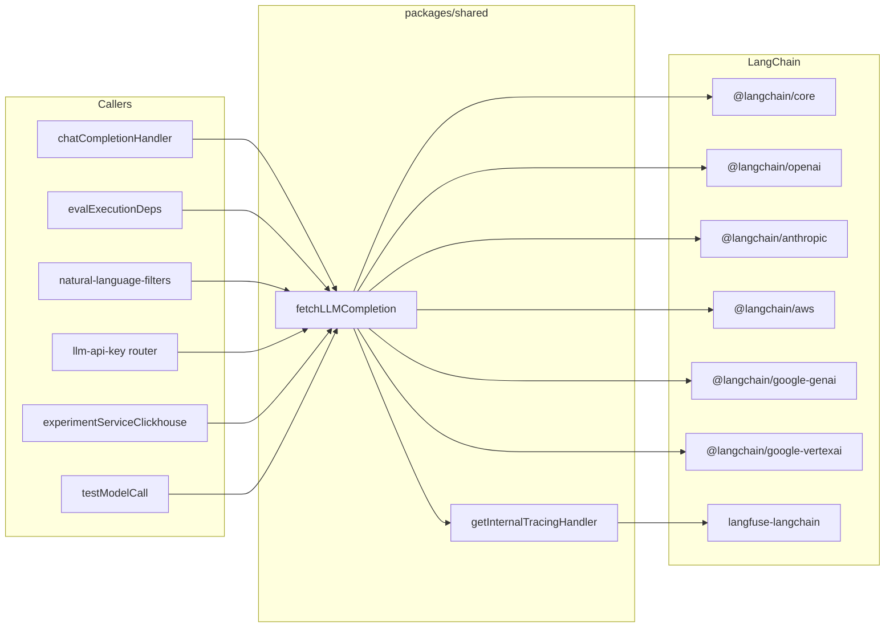

# LangChain v1 Upgrade – Plan and Tracking

This document is the single source of truth for the LangChain v1 upgrade: plan, task list, and post-upgrade documentation. Check off tasks as you complete them.

---

## Task list (tracking)

### Stage 1: Dependency bump and compatibility check

- [ ] Bump `@langchain/core`, `langchain`, `@langchain/openai`, `@langchain/anthropic`, `@langchain/aws`, `@langchain/google-genai`, `@langchain/google-vertexai` in **packages/shared** to latest compatible versions
- [ ] Bump `@langchain/core` and `langchain` in **web/package.json** to match
- [ ] Run `pnpm install` and fix peer dependency / resolution issues
- [ ] Fix compile/type errors (constructor options, re-exports, BaseCallbackHandler, LLMResult)
- [ ] Run full test suite (unit + integration); ensure no behavior change
- [ ] Note constructor/import changes in "Stage 1" section below

### Stage 2: Vertex AI migration

- [ ] Research @langchain/google-genai JS API for Vertex (project, location, credentials/ADC)
- [ ] In fetchLLMCompletion.ts replace ChatVertexAI with ChatGoogleGenerativeAI for Vertex; preserve location, ADC, maxReasoningTokens, providerOptions
- [ ] Remove @langchain/google-vertexai from packages/shared and lockfile
- [ ] Re-test Vertex structured output; if #7429 fixed, switch to zod/v4 and remove (chatModel as ChatOpenAI) cast where safe
- [ ] Update llmConnections.test.ts only if env vars or assertions change
- [ ] Add Package moves + Vertex migration subsection below

### Stage 3: Langfuse tracing package

- [ ] Check langfuse-langchain compatibility with @langchain/core 1.x and callback interfaces
- [ ] If incompatible, evaluate @langfuse/langchain v4 and \_exportLocalEvents or equivalent for getInternalTracingHandler
- [ ] Update getInternalTracingHandler.ts if migrating to @langfuse/langchain; keep blocked span names and processEventBatch behavior
- [ ] Add Tracing subsection below (package used, API changes)

### Stage 4: Documentation (this file)

- [ ] Fill in "Package moves and problems overcome" below after Stage 1–3
- [ ] Fill in "Challenges during the upgrade" below
- [ ] Fill in "What was tested in detail" below (use the checklist in this doc)
- [ ] Document any llmConnections.test.ts changes and why below

---

## Current state (pre-upgrade)

**Packages (all in packages/shared/package.json; web also has core + langchain):**

| Package                      | Current | Role                                        |
| ---------------------------- | ------- | ------------------------------------------- |
| `langchain`                  | ^0.3.37 | Re-export / utilities                       |
| `@langchain/core`            | ^0.3.80 | Messages, output parsers, stream, callbacks |
| `@langchain/openai`          | ^0.5.13 | ChatOpenAI, AzureChatOpenAI                 |
| `@langchain/anthropic`       | ^0.3.32 | ChatAnthropic                               |
| `@langchain/aws`             | ^0.1.15 | ChatBedrockConverse                         |
| `@langchain/google-genai`    | ^0.2.18 | ChatGoogleGenerativeAI (Google AI Studio)   |
| `@langchain/google-vertexai` | ^0.2.18 | ChatVertexAI (Vertex AI – deprecated path)  |
| `langfuse-langchain`         | 3.38.6  | CallbackHandler for internal tracing        |

**Single LLM entry point:** `packages/shared/src/server/llm/fetchLLMCompletion.ts` – builds provider-specific chat models and supports completion (non-streamed/streamed), structured output (Zod), and tool calls.

**Call sites of fetchLLMCompletion:**

- `web/src/features/playground/server/chatCompletionHandler.ts` – Playground `/api/chatCompletion`
- `worker/src/features/evaluation/evalExecutionDeps.ts` – LLM-as-judge evals
- `web/src/features/natural-language-filters/server/router.ts` – AI filter builder (Langfuse API key + Bedrock)
- `web/src/features/llm-api-key/server/router.ts` – “Test connection” for LLM API keys
- `worker/src/features/experiments/experimentServiceClickhouse.ts` – Experiments
- `packages/shared/src/server/llm/testModelCall.ts` – Test model call (structured output)

**Tracing:** `packages/shared/src/server/llm/getInternalTracingHandler.ts` uses `langfuse-langchain` CallbackHandler and `_exportLocalEvents` to ingest internal LangChain spans.

**Special code:**

- **Zod v3 for structured output:** fetchLLMCompletion.ts uses `zod/v3` and casts to `(chatModel as ChatOpenAI)` for `withStructuredOutput` due to ChatVertexAI bug (issue #7429).
- **Proxy:** `HTTPS_PROXY` → `HttpsProxyAgent` for OpenAI and Anthropic.
- **Provider-specific options:** `modelParams.providerOptions` → modelKwargs (OpenAI/Azure), invocationKwargs (Anthropic), additionalModelRequestFields (Bedrock, Vertex, Google AI Studio).
- **Vertex:** GCP service account JSON or ADC sentinel; optional `location` in config.
- **Azure:** `azureOpenAIApiVersion: "2025-02-01-preview"`, base path, deployment name.

---

## Package moves and replacements

| From                                        | To                                                                                                                                   | Notes                                                                           |
| ------------------------------------------- | ------------------------------------------------------------------------------------------------------------------------------------ | ------------------------------------------------------------------------------- |
| `@langchain/google-vertexai` (ChatVertexAI) | Option A: Keep and bump. Option B (recommended): Use @langchain/google-genai (ChatGoogleGenerativeAI) for Vertex with Vertex config. | Google deprecation June 2026; confirm JS supports project/location/credentials. |
| `langfuse-langchain`                        | Keep if compatible with @langchain/core 1.x, else evaluate @langfuse/langchain v4.                                                   | getInternalTracingHandler needs CallbackHandler + \_exportLocalEvents.          |
| `langchain`, `@langchain/core`, providers   | Bump to latest (v1 if available).                                                                                                    | Add @langchain/classic only if re-exports removed.                              |

**Problems to handle:**

1. **Vertex → Google Gen AI:** Confirm JS ChatGoogleGenerativeAI constructor params for Vertex (project, location, credentials/ADC) and match VertexAIConfigSchema + secretKey/ADC.
2. **Structured output:** If Vertex moves to ChatGoogleGenerativeAI, verify withStructuredOutput and whether zod/v3 workaround can be removed.
3. **langfuse-langchain:** If \_exportLocalEvents is removed in v4, need adapter or new way to export internal spans.

---

## Upgrade stages (detail)

### Stage 1: Dependency bump and compatibility check (no Vertex migration)

- In packages/shared and web: bump all LangChain packages to latest compatible (respecting peer ranges; target v1 if out).
- Run `pnpm install`; fix peer/resolution issues.
- Fix compile/type errors: constructor options, re-exports, BaseCallbackHandler, LLMResult.
- Keep Vertex and langfuse-langchain as-is.
- Run full test suite. No behavior change intended.

**Deliverable:** Green build and tests; Stage 1 notes in this doc.

### Stage 2: Vertex AI migration (optional but recommended)

- Research @langchain/google-genai JS API for Vertex.
- In fetchLLMCompletion.ts for LLMAdapter.VertexAI: replace ChatVertexAI with ChatGoogleGenerativeAI (project from credentials, location from config, credentials or ADC). Preserve location, ADC, maxReasoningTokens, additionalModelRequestFields.
- Remove @langchain/google-vertexai from packages/shared and lockfile.
- Re-test Vertex structured output; if #7429 fixed, switch to zod/v4 and remove cast where safe.
- Update llmConnections.test.ts only if needed.

**Deliverable:** Vertex via @langchain/google-genai; Package moves + Vertex subsection in this doc.

### Stage 3: Langfuse tracing package

- Check langfuse-langchain compatibility with @langchain/core 1.x. If incompatible, evaluate @langfuse/langchain v4 and \_exportLocalEvents (or equivalent).
- If migrating: update getInternalTracingHandler.ts; keep blocked span names and processEventBatch behavior.
- Add Tracing subsection in this doc.

### Stage 4: Documentation (this file)

- Fill in all sections below from Stages 1–3 and testing.

---

## Package moves and problems overcome (fill after upgrade)

_(Record what actually changed: which packages moved where, constructor/import renames, and how you resolved Vertex config, zod/v3, callback export, etc.)_

-

---

## Challenges during the upgrade (fill after upgrade)

_(e.g. constructor renames, type casts, peer dependency resolutions, temporary workarounds)_

-

---

## What was tested in detail (fill after upgrade)

Use this checklist and mark or summarize what was verified.

**Providers:**

- [ ] OpenAI: completion (non-streamed, streamed), structured output, tool calls; proxy if applicable
- [ ] Azure: same three modes; base URL and deployment name
- [ ] Anthropic: same three modes; proxy if applicable; Claude 4.5 topP/temperature
- [ ] Google AI Studio: completion, structured output, tool calls; single-system-message → user
- [ ] Vertex AI: completion, structured output, tool calls; with/without location; service account + ADC
- [ ] Bedrock: completion, tool calls; region in config; structured output (currently skipped in tests)

**Features:**

- [ ] Playground: chat completion route (streaming + non-streaming), tools, structured output; PostHog callback
- [ ] LLM-as-judge: eval using fetchLLMCompletion; internal trace, correct environment, no eval loop
- [ ] AI filter builder: natural-language filter (Langfuse API key + Bedrock)
- [ ] Test connection: LLM API key test for each adapter
- [ ] Experiments: experiment run calling fetchLLMCompletion

**Infrastructure:**

- [ ] Proxy: OpenAI and Anthropic with HTTPS_PROXY
- [ ] Provider options: modelKwargs, invocationKwargs, additionalModelRequestFields pass-through
- [ ] Internal tracing: spans in correct project; RunnableLambda/parser spans filtered out

**Tests:**

- [ ] worker LLM connection tests: all adapters × (simple, structured output, tool calling) + Google AI Studio single-system-message
- [ ] evalService tests: fetchLLMCompletion mocks match signature
- [ ] Playground/API tests hitting chat completion route

---

## LLM connection test changes (fill after upgrade)

**File:** `worker/src/__tests__/llmConnections.test.ts`

_(For each change record: What changed, Why.)_

-

---

## Architecture (reference)

---

## Summary

- **Stage 1:** Bump LangChain packages; fix types/constructors; leave Vertex and langfuse-langchain unchanged; full test pass.
- **Stage 2:** Migrate Vertex to @langchain/google-genai; optional zod/v4 and cast cleanup; document.
- **Stage 3:** Ensure tracing works (langfuse-langchain or @langfuse/langchain); document.
- **Stage 4:** Complete all sections in this file (package moves, challenges, testing, llmConnections.test changes).

This file (`.work/UPGRADE_LANGCHAIN.MD`) is the tracking and documentation file for the upgrade.
