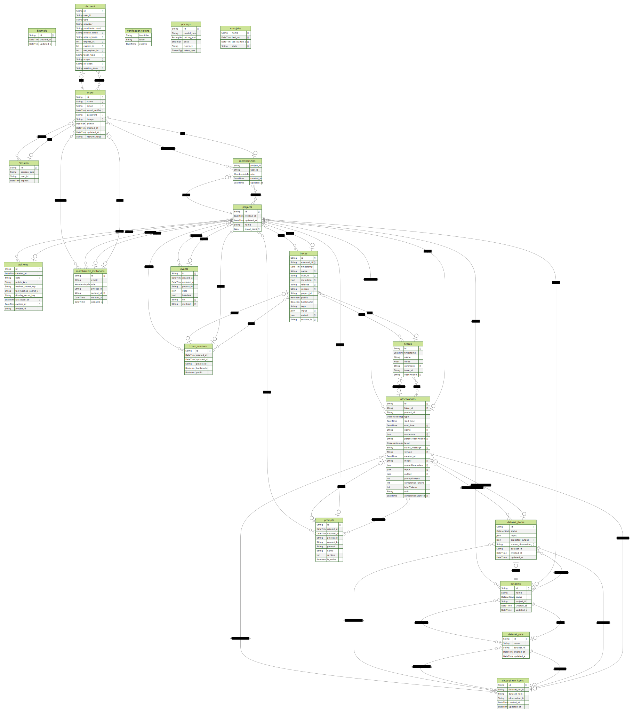

# Contributing to Langfuse

First off, thanks for taking the time to contribute! ❤️

The best ways to contribute to Langfuse:

- Submit and vote on [Ideas](https://github.com/orgs/langfuse/discussions/categories/ideas)
- Create and comment on [Issues](https://github.com/langfuse/langfuse/issues)
- Open a PR.

We welcome contributions through GitHub pull requests. This document outlines our conventions regarding development workflow, commit message formatting, contact points, and other resources. Our goal is to simplify the process and ensure that your contributions are easily accepted.

We gratefully welcome improvements to documentation ([docs repo](https://github.com/langfuse/langfuse-docs)), the core application (this repo) and the SDKs ([Python](https://github.com/langfuse/langfuse-python), [JS](https://github.com/langfuse/langfuse-js)).

The maintainers are available on [Discord](https://langfuse.com/discord) in case you have any questions.

> And if you like the project, but just don't have time to contribute code, that's fine. There are other easy ways to support the project and show your appreciation, which we would also be very happy about:
>
> - Star the project;
> - Tweet about it;
> - Refer to this project in your project's readme;
> - Submit and vote on [Ideas](https://github.com/orgs/langfuse/discussions/categories/ideas);
> - Create and comment on [Issues](https://github.com/langfuse/langfuse/issues);
> - Mention the project at local meetups and tell your friends/colleagues.

## Making a change

_Before making any significant changes, please [open an issue](https://github.com/langfuse/langfuse/issues)._ Discussing your proposed changes ahead of time will make the contribution process smooth for everyone. Large changes that were not discussed in an issue may be rejected.

Once we've discussed your changes and you've got your code ready, make sure that tests are passing and open your pull request.

A good first step is to search for open [issues](https://github.com/langfuse/langfuse/issues). Issues are labeled, and some good issues to start with are labeled: [good first issue](https://github.com/langfuse/langfuse/issues?q=is%3Aissue+is%3Aopen+label%3A%22good+first+issue%22).

## Project Overview

### Technologies we use

- Application (this repository)
  - NextJS 14, pages router
  - NextAuth.js / Auth.js
  - tRPC: Frontend APIs
  - Prisma ORM
  - Zod
  - Tailwind CSS
  - shadcn/ui tailwind components (using Radix and tanstack)
  - Fern: generate OpenAPI spec and Pydantic models
- JS SDK ([langfuse/langfuse-js](https://github.com/langfuse/langfuse-js))
  - openapi-typescript to generated types based on OpenAPI spec
- Python SDK ([langfuse/langfuse-python](https://github.com/langfuse/langfuse-python))
  - Pydantic for input validation, models generated by fern

### Architecture Overview

> [!NOTE]
> Infrastructure will change in Langfuse version 3.0. More in the [GitHub Discussions](https://github.com/orgs/langfuse/discussions/1902).
> `langfuse/langfuse/worker` is under active development and not recommended for production use in Langfuse 2.x


### Network Overview

> [!NOTE]
> This will change in Langfuse version 3.0. More in the [GitHub Discussions](https://github.com/orgs/langfuse/discussions/1902).


### Database Overview

The diagram below may not show all relationships if the foreign key is not defined in the database schema. For instance, `trace_id` in the `observation` table is not defined as a foreign key to the `trace` table to allow unordered ingestion of these objects, but it is still a foreign key in the application code.

Full database schema: [packages/shared/prisma/schema.prisma](packages/shared/prisma/schema.prisma)



## Repository Structure

We built a monorepo using [pnpm](https://pnpm.io/motivation) and [turbo](https://turbo.build/repo/docs) to manage the dependencies and build process. The monorepo contains the following packages:

- `web`: is the main application package providing Frontend and Backend APIs for Langfuse.
- `worker` (no production yet): contains an application for asynchronous processing of tasks. This package is not yet used in production.
- `packages`:
  - `shared`: contains shared code between the above packages.
  - `config-eslint`: contains eslint configurations which are shared between the above packages.
  - `config-typescript`: contains typescript configurations which are shared between the above packages.
- `ee`: contains all enterprise features. See [EE README](ee/README.md) for more details.

## Development Setup

Requirements

- Node.js 20 as specified in the [.nvmrc](.nvmrc)
- Docker to run the database locally

**Note:** You can also simply run Langfuse in a **GitHub Codespace** via the provided devcontainer. To do this, click on the green "Code" button in the top right corner of the repository and select "Open with Codespaces".

**Steps**

1. Fork the repository and clone it locally
2. Run the development database

   ```bash
   pnpm run infra:dev:up
   ```

3. Create an env file

   ```bash
    cp .env.dev.example .env
   ```

4. Install dependencies

   ```bash
   pnpm install
   ```

5. Run the migrations

   All database migrations and configs are in the `shared` package.

   ```bash
   pnpm --filter=shared run db:migrate

   # Optional: seed the database
   # pnpm run db:seed
   # pnpm run db:seed:examples
   # pnpm --filter=shared run db:seed:load
   ```

6. Start the development server

   ```bash
    pnpm run dev
   ```

7. Open the web app in the browser:

   http://localhost:3000

8. Log in as a test user (after you ran `db:seed` command):

   Username: demo@langfuse.com

   Password: password

## Monorepo quickstart

- Available packages and their dependencies

  Packages are included in the monorepo according to the `pnpm-workspace.yaml` file. Each package maintains its own dependencies defined in the `package.json`. Internal dependencies can be added as well by adding them to the package dependencies: `"@langfuse/shared": "workspace:*"`.

- Executing commands

  You can run commands in all packages at once. For example, to install all dependencies in all packages, you can execute:

  ```bash
  pnpm install
  pnpm run dev
  pnpm --filter=web run dev # execute command only in one package
  ```

  In the root `package.json`, you can find scripts which are executed with turbo e.g. `turbo run dev`. These scripts are executed with the help of Turbo. Turbo executes the commands in all packages taking care of the correct order of execution. Task definitions can be found in the `turbo.config.js` file.

- Run migrations

  To run migrations, you can execute the following command.

  ```bash
  pnpm run db:migrate -- --name <name of the migration>
  ```

> [!NOTE]
> If you frequently switch branches, use `pnpm run dx` instead of `pnpm run dev`. This command will install dependencies, reset the database (wipe and apply all migrations), and run the database seeder with example data before starting the development server.

> [!NOTE]
> If you find yourself stuck and want to clean the repo, execute `pnpm run nuke`. It will remove all node_modules and build files.

## System behavior

### Ingestion API `(/public/api/ingestion)`

- the ingestion API takes different event types (creation and updates of traces, generations, spans, events)
- The API loops through each event and:
  - validates the event
  - stores the event raw in the events table
  - calculates tokens for `generations`
  - matches models from the `models` table to model for `generations` events
  - upserts the event in the `traces` or `observations` table
- returns a `207` HTTP status code with a list of errors if any event failed to be ingested

## Commit messages

On the main branch, we adhere to the best practices of [conventional commits](https://www.conventionalcommits.org/en/v1.0.0/). All pull requests and branches are squash-merged to maintain a clean and readable history. This approach ensures the addition of a conventional commit message when merging contributions.

## Test the public API

The API is tested using Jest. With the development server running, you can run the tests with:

Run all

```bash
npm run test
```

Run interactively in watch mode

```bash
npm run test:watch
```

These tests are also run in CI.

## CI/CD

We use GitHub Actions for CI/CD, the configuration is in [`.github/workflows/pipeline.yml`](.github/workflows/pipeline.yml)

CI on `main` and `pull_request`

- Check Linting
- E2E test of API using Jest
- E2E tests of UI using Playwright

CD on `main`

- Publish Docker image to GitHub Packages if CI passes. Done on every push to `main` branch. Only released versions are tagged with `latest`.

## Staging environment

We run a staging environment at [https://staging.langfuse.com](https://staging.langfuse.com) that is automatically deployed on every push to `main` branch.

The same environment is also used for preview deployments of pull requests. Limitations:

- SSO is not available as dynamic domains are not supported by most SSO providers.
- When making changes to the database, migrations to the staging database need to be applied manually by a maintainer. If you want to interactively test database changes in the staging environment, please reach out.

You can use the staging environment end-to-end with the Langfuse integrations or SDKs (host: `https://staging.langfuse.com`). However, please note that the staging environment is not intended for production use and may be reset at any time.

## Production environment

When a new release is tagged on the `main` branch (excluding prereleases), it triggers a production deployment. The deployment process consists of two steps:

1. The Docker image is published to GitHub Packages with the version number and `latest` tag.
2. The deployment is carried out on Langfuse Cloud. This is done by force pushing the `main` branch to the `production` branch during every release, using the [`release.yml`](.github/workflows/release.yml) GitHub Action.

## Theming

At Langfuse, we utilize CSS variables to manage our theme settings across the platform.

Our approach leverages separate CSS variables for backgrounds (--background) and foregrounds (--foreground), fully adhering to the [shadcn/ui](https://ui.shadcn.com/docs/theming) color conventions. The background suffix can be omitted if the variable is used for the background color of the component. We recommend using HSL values for these colors to enhance consistency and customization. There is no need to manually handle dark mode styling with "dark:" prefixes, as next-themes automatically manages the theme switching.

Given the following CSS variables:

```
--primary: 222.2 47.4% 11.2%; // e.g. background-color
--primary-foreground: 210 40% 98%; // e.g. text-color
```

The background color of the following component will be `hsl(var(--primary))` and the foreground color will be `hsl(var(--primary-foreground))`.

```
<div class="bg-primary text-primary-foreground">Hello</div>
```

### Color Variables

| Variable                 | Description                                                        | Examples                         |
| ------------------------ | ------------------------------------------------------------------ | -------------------------------- |
| --background             | Background color                                                   | Default background color of body |
| --foreground             | Foreground color                                                   | Default text color of body       |
| --muted                  | Muted background color                                             | TabsList, Skeleton and Switch    |
| --muted-foreground       | Muted foreground color                                             |                                  |
| --popover                | Popover background color                                           | DropdownMenu, HoverCard, Popover |
| --popover-foreground     | Popover foreground color                                           |                                  |
| --card                   | Card background color                                              | Card                             |
| --card-foreground        | Card foreground color                                              |                                  |
| --border                 | Border color                                                       | Default border color             |
| --input                  | Input field border color                                           | Input, Select, Textarea          |
| --primary                | Primary button background colors                                   | Button variant="primary"         |
| --primary-foreground     | Primary button foreground color                                    |                                  |
| --secondary              | Secondary button background color                                  | Button variant="secondary"       |
| --secondary-foreground   | Secondary button foreground color                                  |                                  |
| --accent                 | Used for accents such as hover effects                             | DropdownMenuItem, SelectItem     |
| --accent-foreground      | Used for texts on hover effects                                    | DropdownMenuItem, SelectItem     |
| --destructive            | Destructive action color for background                            | Button variant="destructive"     |
| --destructive-foreground | Destructive action color for text                                  |                                  |
| --ring                   | Focus ring color                                                   | MultiSelect                      |
| --primary-accent         | Primary accent color used for branding                             | Layout                           |
| --hover-primary-accent   | Primary accent color used for hover effects for links              | SignIn and AuthCloudRegionSwitch |
| --muted-green            | Muted green for Event label                                        | ObservationTree                  |
| --muted-orange           | Muted orange for Generation label                                  | ObservationTree                  |
| --muted-blue             | Muted blue for Span label                                          | ObservationTree                  |
| --muted-gray             | Muted gray for disabled status badges                              | StatusBadge                      |
| --accent-light-green     | Light green accent for background of output and assistant messages | IOPreview, Generations, Traces   |
| --accent-dark-green      | Dark green accent for border of output and assistant messages      | CodeJsonViewer and IOPReview     |
| --light-red              | Light red for error background                                     | level-color and StatusBadge      |
| --dark-red               | Dark red for error text and error badge dot color                  | level-color and ErrorPage        |
| --light-yellow           | Light yellow for warning background                                | LevelColor                       |
| --dark-yellow            | Dark yellow for warning text                                       | LevelColor                       |
| --light-green            | Light green for success status badge background                    | StatusBadge                      |
| --dark-green             | Dark green for success status badge text and dot                   | StatusBadge                      |
| --light-blue             | Light blue for background of Staging label                         | LangfuseLogo                     |
| --dark-blue              | Dark blue for text and border of Staging label                     | LangfuseLogo                     |
| --accent-light-blue      | Light blue accent for table link hover effect                      | TableLink                        |
| --accent-dark-blue       | Dark blue accent for table link text                               | TableLink                        |

### Adding New Colors

1. Global Definitions: Add new CSS variable definitions in the global.css file.
2. Tailwind Configuration: Reflect these new colors in the tailwind.config.js to maintain alignment with Tailwind's utility classes.

By following these guidelines, you can ensure that any contributions to our theme are consistent, maintainable, and aligned with our design system.

## Maintainers

### Using secrets stored in 1Password

When applying changes to non-local environments, you may need to use secrets stored in 1Password. We use the 1Password CLI for this purpose.

Example:

```bash
op run --env-file="./.env" -- pnpm --filter=shared run db:deploy
```

## License

Langfuse is MIT licensed, except for `ee/` folder. See [LICENSE](LICENSE) and [docs](https://langfuse.com/docs/open-source) for more details.

When contributing to the Langfuse codebase, you need to agree to the [Contributor License Agreement](https://cla-assistant.io/langfuse/langfuse). You only need to do this once and the CLA bot will remind you if you haven't signed it yet.
