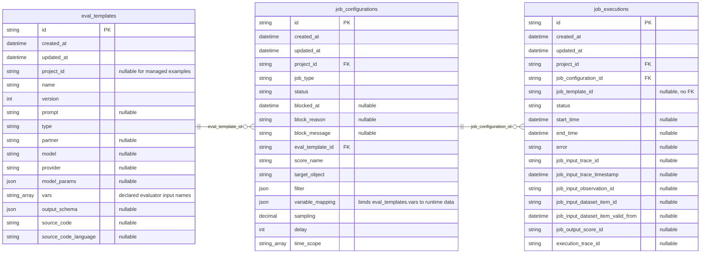
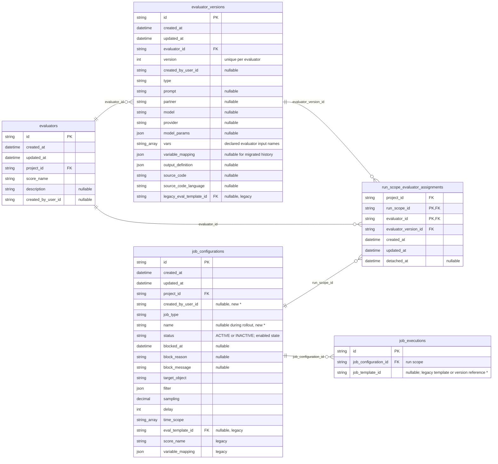
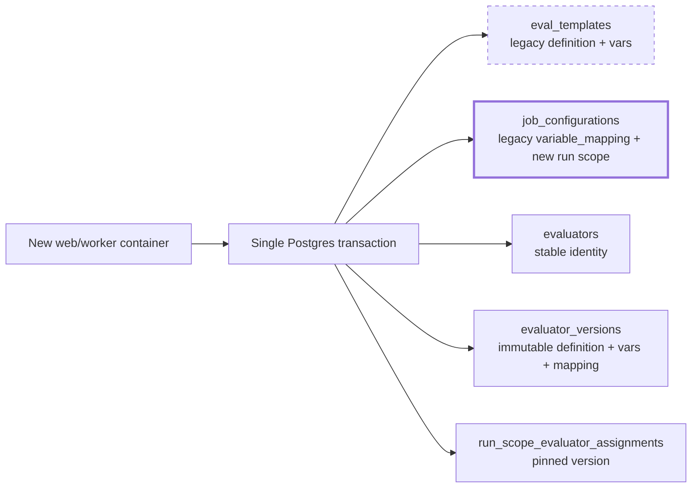

# Database migration

## Current state

Cloud production currently has three relevant tables:



The current setup has three migration-relevant problems:

1. **The evaluator definition and variable mapping are split.** `vars` and `variable_mapping` must remain compatible and change together, so both belong to the immutable evaluator version.
2. **The model only has a 1:n relationship.** One `eval_template` can be referenced by multiple `job_configurations`, but there is no n:m relationship between evaluators and evaluation rules. The important reuse case is defining one evaluation rule once and attaching multiple evaluators to it. Reusing one evaluator across multiple rules is supported by the same association, but is secondary.
3. **Versions and identity share one table.** Every `eval_templates` row is one version; there is no stable evaluator row. Logical identity is inferred from mutable attributes such as `(project_id, name)`, while foreign keys point directly to individual versions. This makes renames, version history, and relationships to “the evaluator” ambiguous. The target model needs a stable `evaluators.id` with immutable child rows in `evaluator_versions`.

## Required Changes

We want to have

- stable evaluator identity (based on ID instead of name) -> Separate version table
- variable mapping consolidated on one evaluator entity
- enable an n:m relationship between evaluators and what they target (evaluator rule)
- some nice to have attributes like `created_by_id`, `evaluator.description`
-

The target model needs to start tracking:

- A stable evaluator identity, including its `score_name`, `description`, and `created_by_user_id`.
- Immutable evaluator versions containing their definition, declared variables, `variable_mapping`, and creator.
- The n:m assignment between evaluation rules and evaluators, including the pinned evaluator version.
- A human-readable name and `created_by_user_id` for each evaluation rule.
- The exact evaluator version used by every new execution, using the existing `job_template_id` execution column.
- `run_scope_id`, `evaluator_id`, and `evaluator_version_id` on new ClickHouse events.

Column ownership changes, compatibility fields, and eventual cleanup are covered in the migration walkthrough below.

## Options

All three options require transactional dual-write and deployment gates while old and new containers can coexist. They differ in the size of that compatibility surface and the final model.

| Option                                                | Model                                                                                                                               | Key benefits                                                                                                                        | Key drawbacks                                                                                                                                                                                                                                                     |
| ----------------------------------------------------- | ----------------------------------------------------------------------------------------------------------------------------------- | ----------------------------------------------------------------------------------------------------------------------------------- | ----------------------------------------------------------------------------------------------------------------------------------------------------------------------------------------------------------------------------------------------------------------- |
| **1. Re-use existing tables**                         | Repurpose `eval_templates` as evaluators, add evaluator versions and the association, and reuse `job_configurations` as run scopes. | • Fewer new top-level tables.<br>• Existing PostgreSQL and ClickHouse history stays valid.                                          | • Still requires dual-write and deployment gates.<br>• More difficult migration because semantics of `eval_templates` change (we need to deduplicate eval templates inplace + control old UIs behavior with that)<br> • Harder to rollback if anything goes wrong |
| **2. New evaluator tables; reuse job configurations** | Add `evaluators`, `evaluator_versions`, and the association; reuse `job_configurations` as run scopes.                              | • Clean evaluator boundary.<br>• Old template readers remain isolated.<br>• Existing PostgreSQL and ClickHouse history stays valid. | • Requires dual-write and deployment gates.<br>• Legacy and new representations coexist until the rollback window closes.                                                                                                                                         |
| **3. New tables for everything**                      | Add evaluator, version, association, and run-scope tables; copy `job_configurations` into the new run scopes.                       | • Cleanest final schema and naming.<br>• No legacy columns in target tables.                                                        | • Requires dual-write and gates across the largest surface.<br>• Execution references need remapping or permanent legacy-ID resolution.<br>• Adds migration risk for little practical gain.                                                                       |

## Recommended option

Use **option 2: new `evaluators` and `evaluator_versions` tables, while reusing `job_configurations` as run scopes**.

This creates a clean boundary around the new evaluator model without breaking the most valuable historical relationship:

```text
job_executions.job_configuration_id
                  │
                  └── still points to the same run scope that triggered the run
```

For the baseline backfill, set `evaluators.id = job_configurations.id`. Existing executions can then appear in the migrated evaluator's history through `job_executions.job_configuration_id = evaluators.id` without rewriting execution rows. This shared ID is a migration aid, not the long-term relationship: once an evaluator is attached to additional run scopes, its complete history is resolved through all retained assignments. If several existing configurations are consolidated into one evaluator, use one canonical configuration ID and retain assignments for the others.

## Step-by-step walkthrough of the recommended option

The migration first reaches the following compatibility target. Legacy columns remain as long as historical or rollback reads depend on them.



`*` marks a new or semantically changed column on an existing table. `legacy` marks compatibility-only columns that can be removed once no remaining reads depend on them.

Keep `evaluator_versions.id` as the primary key. Enforce `UNIQUE (evaluator_id, version)` for the version sequence and `UNIQUE (evaluator_id, id)` so assignments can use a composite foreign key `(evaluator_id, evaluator_version_id)`. This prevents pinning a version that belongs to another evaluator.

### 1. Add the new schema without changing existing reads

Create:

- `evaluators`.
- `evaluator_versions` with immutable rows, primary key `id`, and unique `(evaluator_id, version)`, `(evaluator_id, id)`, and `(evaluator_id, legacy_eval_template_id)` constraints.
- `run_scope_evaluator_assignments` with project-scoped foreign keys and a composite `(evaluator_id, evaluator_version_id)` foreign key.
- A nullable run-scope `name` on `job_configurations`; continue using `status` for enabled/disabled.

Keep all legacy tables and columns. Old containers remain fully functional.

### 2. Deploy transactional dual-write

Every create/update/delete must write both representations in one Postgres transaction:



Example for one existing configuration:

```text
Legacy                                      New

EvalTemplate T7                             Evaluator E1 (id = J1)
      │                                          │
      ▼                                          ▼
JobConfiguration J1                       EvaluatorVersion E1:T7
      │                                          │
      ▼                                          ▼
JobExecution X  ────────────────►  RunScope J1 ↔ Assignment ↔ E1:T7
```

Rules:

- Dual-write starts before the backfill.
- Writes to old and new rows commit or roll back together.
- A definition/version write copies `eval_templates.vars` and `job_configurations.variable_mapping` into the same evaluator-version row.
- The corresponding association pins the run scope to that evaluator version.
- Creating a new version validates `vars` and `variable_mapping` together. Attaching it to a run scope validates that the mapping supports the scope's target type.
- Keep legacy writes throughout the rollback window.
- No database trigger or global lock is required if dual-write coverage is complete and the deployment is version-gated.

### 3. Wait for the writer gate

Before relying on the new representation:

- Confirm no legacy-only web or worker containers can still write.
- Keep old readers running if needed; they cannot see the new evaluator tables.
- Record dual-write mismatch metrics and require them to be zero.

This gate prevents a legacy container from creating data after the backfill that exists only in the old model.

### 4. Backfill with idempotent SQL

The SQL is driven by `job_configurations`, not by template rows. Evaluator IDs reuse the corresponding job-configuration IDs; this is valid because the IDs live in different tables.

Create the evaluator mapping. The illustrative SQL uses one evaluator per job configuration because the legacy schema has no stable evaluator identity. If an explicit identity rule is agreed before rollout, this is where configurations can be grouped; dual-write must then resolve legacy writes through the same mapping.

```sql
INSERT INTO evaluators (
  id, project_id, score_name, description, created_by_user_id,
  created_at, updated_at
)
SELECT
  jc.id, jc.project_id, jc.score_name, jc.description, jc.created_by_user_id,
  jc.created_at, jc.updated_at
FROM job_configurations jc
WHERE jc.job_type = 'EVAL'
  AND jc.eval_template_id IS NOT NULL
ON CONFLICT (id) DO NOTHING;
```

Copy the current template family into each evaluator. The legacy schema did not version `variable_mapping`, so only the version currently referenced by the job configuration receives the known mapping. Older definitions remain viewable history with a null mapping and cannot be executed directly. The deterministic version ID below is illustrative:

```sql
WITH evaluator_template_families AS (
  SELECT
    jc.id AS evaluator_id,
    jc.variable_mapping,
    current_template.id AS current_template_id,
    family.*
  FROM job_configurations jc
  JOIN eval_templates current_template
    ON current_template.id = jc.eval_template_id
  JOIN eval_templates family
    ON family.name = current_template.name
   AND family.project_id IS NOT DISTINCT FROM current_template.project_id
  WHERE jc.job_type = 'EVAL'
)
INSERT INTO evaluator_versions (
  id, evaluator_id, version, created_by_user_id, type, prompt, provider, model,
  model_params, vars, variable_mapping, output_definition,
  source_code, source_code_language, legacy_eval_template_id
)
SELECT
  family.evaluator_id || ':' || family.id,
  family.evaluator_id,
  family.version,
  family.created_by_user_id,
  family.type, family.prompt, family.provider, family.model,
  family.model_params, family.vars,
  CASE
    WHEN family.id = family.current_template_id THEN family.variable_mapping
    ELSE NULL
  END,
  family.output_schema,
  family.source_code, family.source_code_language, family.id
FROM evaluator_template_families family
ON CONFLICT (id) DO NOTHING;
```

Before eventually dropping `eval_templates`, separately verify that every non-null historical `job_executions.job_template_id` has a corresponding evaluator-version mapping. Keep the legacy lookup as a fallback until that check passes.

Make each existing job configuration an explicit run scope and create its initial assignment:

```sql
UPDATE job_configurations
SET name = COALESCE(name, score_name)
WHERE job_type = 'EVAL';

INSERT INTO run_scope_evaluator_assignments (
  project_id, run_scope_id, evaluator_id, evaluator_version_id
)
SELECT
  jc.project_id,
  jc.id,
  jc.id,
  jc.id || ':' || jc.eval_template_id
FROM job_configurations jc
WHERE jc.job_type = 'EVAL'
  AND jc.eval_template_id IS NOT NULL
ON CONFLICT (run_scope_id, evaluator_id) DO NOTHING;
```

Run the backfill more than once if useful. `ON CONFLICT` makes it safe alongside dual-write; live transactional writes win any race.

### 5. Validate before cutover

Gate cutover on all of the following:

- Every eligible job configuration has exactly one migrated evaluator.
- Every current template has a corresponding current evaluator version.
- Every migrated version has exactly the same ordered `vars` as its legacy template.
- Every current evaluator version has exactly the same `variable_mapping` as its legacy job configuration.
- Every non-null mapping key is declared by the same evaluator version's `vars`; missing and extra bindings are reported before cutover.
- Every assignment's pinned evaluator version is compatible with the run scope's target type.
- Every eligible run scope has its initial assignment.
- No association or version crosses a project boundary.
- Every non-null historical `(job_configuration_id, job_template_id)` for an eligible evaluation resolves to exactly one evaluator version.
- Legacy and new definitions/mappings match.
- Dual-write mismatch metrics are zero.
- No legacy-only writer remains.

### 6. Switch reads, but keep rollback compatibility

Switch web and worker reads to:

```text
run scope → assignment → evaluator → pinned evaluator version
```

During the rollback window, new executions write:

```text
job_configuration_id = run_scope_id
job_template_id = legacy_eval_template_id
```

New readers resolve the version through `(job_configuration_id, legacy_eval_template_id)`. After the rollback window, new rows can store `evaluator_versions.id` directly in `job_template_id`; historical rows continue using the compatibility lookup. This requires no PostgreSQL `job_executions` schema change.

New ClickHouse execution traces write `run_scope_id`, `evaluator_id`, and `evaluator_version_id` as metadata. Historical PostgreSQL and ClickHouse rows remain readable through their existing identifiers.

Continue dual-writing until the rollback window closes. Rolling back only changes the read path; the original representation is still current.

### 7. Enable reusable evaluation rules behind a worker gate

Do not attach multiple evaluators to one evaluation rule/run scope until every worker understands association fan-out and execution identity.

After the worker gate:

- Allow one evaluation rule to be reused by multiple evaluators.
- Keep detached association rows for historical resolution; detach by setting `detached_at` instead of hard-deleting the row.
- Pin every attachment to an explicit evaluator version.
- Use `(run_scope_id, evaluator_id, evaluator_version_id, target_id)` for execution idempotency.

### 8. Clean up later

After the rollback window:

- Stop legacy dual-write.
- Remove project-owned legacy template rows after historical references are verified.
- Remove evaluator-owned legacy columns from `job_configurations`; keep its block state.
- Remove `eval_template_id`. Keep `job_template_id` as the execution's version reference unless a later migration renames it.
- Keep `evaluator_versions.legacy_eval_template_id` while historical executions require the compatibility lookup; removing it would require rewriting those execution references.
- Serve Langfuse-managed examples only from UI-owned presets.
- Optionally rename `job_configurations` to `run_scopes` in a separate, low-risk migration.

If no safe evaluator identity rule is agreed before rollout, historical evaluator consolidation should remain a separate explicit product operation.
