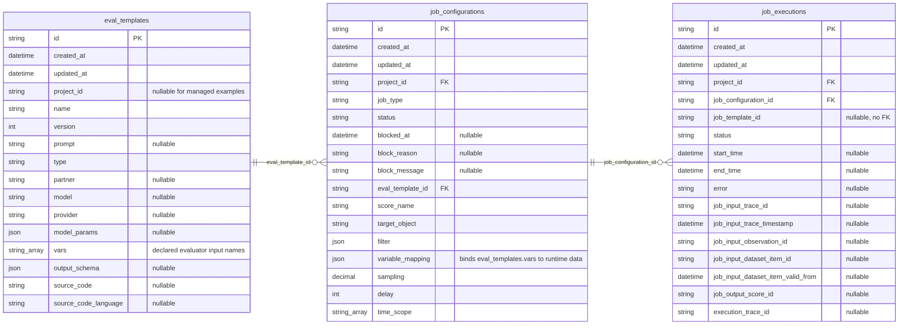
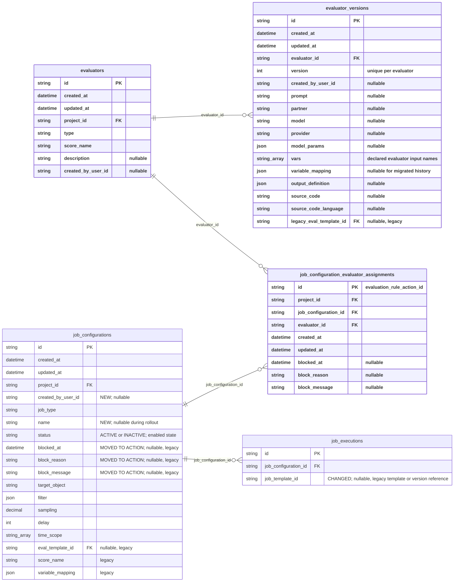
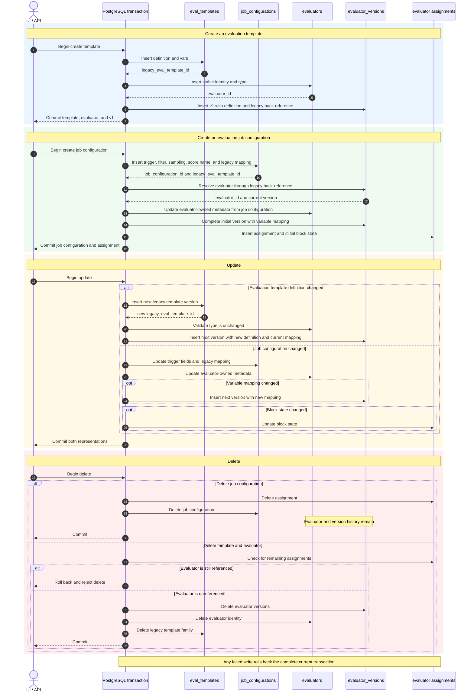

# Database migration

## Current state

Cloud production currently has three relevant tables:


```mermaid
erDiagram
    direction LR
    eval_templates ||--o{ job_configurations : "eval_template_id"
    job_configurations ||--o{ job_executions : "job_configuration_id"

    eval_templates {
        string id PK
        datetime created_at
        datetime updated_at
        string project_id "nullable for managed examples"
        string name
        int version
        string prompt "nullable"
        string type
        string partner "nullable"
        string model "nullable"
        string provider "nullable"
        json model_params "nullable"
        string_array vars "declared evaluator input names"
        json output_schema "nullable"
        string source_code "nullable"
        string source_code_language "nullable"
    }

    job_configurations {
        string id PK
        datetime created_at
        datetime updated_at
        string project_id FK
        string job_type
        string status
        datetime blocked_at "nullable"
        string block_reason "nullable"
        string block_message "nullable"
        string eval_template_id FK
        string score_name
        string target_object
        json filter
        json variable_mapping "binds eval_templates.vars to runtime data"
        decimal sampling
        int delay
        string_array time_scope
    }

    job_executions {
        string id PK
        datetime created_at
        datetime updated_at
        string project_id FK
        string job_configuration_id FK
        string job_template_id "nullable, no FK"
        string status
        datetime start_time "nullable"
        datetime end_time "nullable"
        string error "nullable"
        string job_input_trace_id "nullable"
        datetime job_input_trace_timestamp "nullable"
        string job_input_observation_id "nullable"
        string job_input_dataset_item_id "nullable"
        datetime job_input_dataset_item_valid_from "nullable"
        string job_output_score_id "nullable"
        string execution_trace_id "nullable"
    }
```

The current setup has three migration-relevant problems:

1. **The evaluator definition and variable mapping are split.** `vars` and `variable_mapping` must remain compatible and change together, so both belong to the same evaluator version.
2. **The model only has a 1:n relationship.** One `eval_template` can be referenced by multiple `job_configurations`, but there is no n:m relationship between evaluators and evaluation rules. The important reuse case is defining one evaluation rule once and attaching multiple evaluators to it. Reusing one evaluator across multiple rules is supported by the same association, but is secondary.
3. **Versions and identity share one table.** Every `eval_templates` row is one version; there is no stable evaluator row. Logical identity is inferred from mutable attributes such as `(project_id, name)`, while foreign keys point directly to individual versions. This makes renames, version history, and relationships to “the evaluator” ambiguous. The target model needs a stable `evaluators.id` with separate rows in `evaluator_versions`; changing an evaluator definition creates a new version row.

## Required Changes

We want to have

- stable evaluator identity (based on ID instead of name) -> Separate version table
- variable mapping consolidated on one evaluator entity
- enable an n:m relationship between evaluators and what they target (evaluator rule)
- some nice to have attributes like `created_by_id`, `evaluator.description`
-

The target model needs to start tracking:

- A stable evaluator identity, including its `type`, `score_name`, `description`, and `created_by_user_id`. The evaluator type does not change between versions.
- Evaluator versions containing their definition, declared variables, `variable_mapping`, and creator. Editing the definition creates a new version rather than changing an existing version row.
- The n:m assignment between evaluation rules and stable evaluator identities.
- A human-readable name and `created_by_user_id` for each evaluation rule.
- The exact evaluator version used by every new execution, using the existing `job_template_id` execution column.
- `job_configuration_id`, `evaluation_rule_action_id`, `evaluator_id`, and `evaluator_version_id` on new ClickHouse events.

Column ownership changes, compatibility fields, and eventual cleanup are covered in the migration walkthrough below.

## Options

All three options require transactional dual-write and deployment gates while old and new containers can coexist. They differ in the size of that compatibility surface and the final model.

| Option                                                | Model                                                                                                                                     | Key benefits                                                                                                                        | Key drawbacks                                                                                                                                                                                                                                                     |
| ----------------------------------------------------- | ----------------------------------------------------------------------------------------------------------------------------------------- | ----------------------------------------------------------------------------------------------------------------------------------- | ----------------------------------------------------------------------------------------------------------------------------------------------------------------------------------------------------------------------------------------------------------------- |
| **1. Reuse existing tables**                          | Repurpose `eval_templates` as evaluators, add evaluator versions and the association, and reuse `job_configurations` as evaluation rules. | • Fewer new top-level tables.<br>• Existing PostgreSQL and ClickHouse history stays valid.                                          | • Still requires dual-write and deployment gates.<br>• More difficult migration because semantics of `eval_templates` change (we need to deduplicate eval templates inplace + control old UIs behavior with that)<br> • Harder to rollback if anything goes wrong |
| **2. New evaluator tables; reuse job configurations** | Add `evaluators`, `evaluator_versions`, and the association; keep `job_configurations` as evaluation rules.                               | • Clean evaluator boundary.<br>• Old template readers remain isolated.<br>• Existing PostgreSQL and ClickHouse history stays valid. | • Requires dual-write and deployment gates.<br>• Legacy and new representations coexist until the rollback window closes.                                                                                                                                         |
| **3. New tables for everything**                      | Add evaluator, version, association, and evaluation-rule tables; copy `job_configurations` into the new evaluation rules.                 | • Cleanest final schema and naming.<br>• No legacy columns in target tables.                                                        | • Requires dual-write and gates across the largest surface.<br>• Execution references need remapping or permanent legacy-ID resolution.<br>• Adds migration risk for little practical gain.                                                                       |

## Recommended option

Use **option 2: new `evaluators` and `evaluator_versions` tables, while keeping `job_configurations` as evaluation rules**.

This creates a clean boundary around the new evaluator model without breaking the most valuable historical relationship:

```text
job_executions.job_configuration_id
                  │
                  └── still points to the same job configuration that triggered the run
```

For the baseline backfill, set `evaluators.id = job_configurations.id`. Existing executions can then appear in the migrated evaluator's history through `job_executions.job_configuration_id = evaluators.id` without rewriting execution rows. This shared ID is a migration aid, not the long-term relationship: once an evaluator is attached to additional job configurations, its complete history is resolved through all retained assignments. If several existing configurations are consolidated into one evaluator, use one canonical configuration ID and retain assignments for the others.

## Step-by-step walkthrough of the recommended option

Decisions:

- Associations link job configurations to stable evaluators, not evaluator versions. The evaluator's highest version is active, so publishing a new version only inserts a version row; explicit version selection can be added later if needed.
- Do not add evaluator columns to `job_executions`. Future evaluator-run history should be based on the `events` table, where new evaluator traces carry `job_configuration_id`, `evaluator_id`, and `evaluator_version_id`.

Target state:


```mermaid
erDiagram
    direction LR
    evaluators ||--o{ evaluator_versions : "evaluator_id"
    job_configurations ||--o{ job_configuration_evaluator_assignments : "job_configuration_id"
    evaluators ||--o{ job_configuration_evaluator_assignments : "evaluator_id"
    job_configurations ||--o{ job_executions : "job_configuration_id"

    evaluators {
        string id PK
        datetime created_at
        datetime updated_at
        string project_id FK
        string type
        string score_name
        string description "nullable"
        string created_by_user_id "nullable"
    }

    evaluator_versions {
        string id PK
        datetime created_at
        datetime updated_at
        string evaluator_id FK
        int version "unique per evaluator"
        string created_by_user_id "nullable"
        string prompt "nullable"
        string partner "nullable"
        string model "nullable"
        string provider "nullable"
        json model_params "nullable"
        string_array vars "declared evaluator input names"
        json variable_mapping "nullable for migrated history"
        json output_definition "nullable"
        string source_code "nullable"
        string source_code_language "nullable"
        string legacy_eval_template_id FK "nullable, legacy"
    }

    job_configurations {
        string id PK
        datetime created_at
        datetime updated_at
        string project_id FK
        string created_by_user_id "NEW; nullable"
        string job_type
        string name "NEW; nullable during rollout"
        string status "ACTIVE or INACTIVE; enabled state"
        datetime blocked_at "MOVED TO ACTION; nullable, legacy"
        string block_reason "MOVED TO ACTION; nullable, legacy"
        string block_message "MOVED TO ACTION; nullable, legacy"
        string target_object
        json filter
        decimal sampling
        int delay
        string_array time_scope
        string eval_template_id FK "nullable, legacy"
        string score_name "legacy"
        json variable_mapping "legacy"
    }

    job_configuration_evaluator_assignments {
        string id PK "evaluation_rule_action_id"
        string project_id FK
        string job_configuration_id FK
        string evaluator_id FK
        datetime created_at
        datetime updated_at
        datetime blocked_at "nullable"
        string block_reason "nullable"
        string block_message "nullable"
    }

    job_executions {
        string id PK
        string job_configuration_id FK
        string job_template_id "CHANGED; nullable, legacy template or version reference"
    }

    classDef newEntity font-weight:bold,stroke-width:2px
    class evaluators newEntity
    class evaluator_versions newEntity
    class job_configuration_evaluator_assignments newEntity
```

Bold entities are new tables. Within retained tables, `NEW`, `MOVED`, and `CHANGED` mark migration changes. `legacy` marks compatibility-only columns that can be removed once no remaining reads depend on them.

Required uniqueness constraints:

- `UNIQUE (evaluator_id, version)` on `evaluator_versions`.
- `UNIQUE (job_configuration_id, evaluator_id)` on `job_configuration_evaluator_assignments`. This is the physical equivalent of `UNIQUE (evaluation_rule_id, evaluator_id)` while `job_configurations` remains the evaluation-rule table.

Block state belongs to `job_configuration_evaluator_assignments`, because one broken evaluator must not block the other evaluators attached to the same rule. The existing block columns on `job_configurations` remain legacy compatibility fields during dual-write and can be removed after the rollback window.

### 1. Add the new schema without changing existing reads

Create:

- `evaluators`.
- `evaluator_versions`, where definition changes create a new row, with primary key `id` and unique `(evaluator_id, version)` and `(evaluator_id, legacy_eval_template_id)` constraints.
- `job_configuration_evaluator_assignments` with a stable action `id`, evaluator-specific block state, project-scoped job-configuration and evaluator foreign keys, and a unique `(job_configuration_id, evaluator_id)` constraint.
- A nullable `name` on `job_configurations`; continue using `status` for enabled/disabled.

Keep all legacy tables and columns. Old containers remain fully functional.

### 2. Deploy transactional dual-write (can happen in same release as step 1)

During the compatibility phase, each logical mutation is applied to the existing representation and the new evaluator representation in one Postgres transaction. `job_configurations` remains the trigger and is not duplicated into another rule table.


```mermaid
sequenceDiagram
    autonumber
    actor Caller as UI / API
    participant Tx as PostgreSQL transaction
    participant Templates as eval_templates
    participant Configs as job_configurations
    participant Evaluators as evaluators
    participant Versions as evaluator_versions
    participant Actions as evaluator assignments

    rect rgb(235, 245, 255)
        Note over Caller,Actions: Create an evaluation template
        Caller->>Tx: Begin create template
        Tx->>Templates: Insert definition and vars
        Templates-->>Tx: legacy_eval_template_id
        Tx->>Evaluators: Insert stable identity and type
        Evaluators-->>Tx: evaluator_id
        Tx->>Versions: Insert v1 with definition and legacy back-reference
        Tx-->>Caller: Commit template, evaluator, and v1
    end

    rect rgb(239, 250, 240)
        Note over Caller,Actions: Create an evaluation job configuration
        Caller->>Tx: Begin create job configuration
        Tx->>Configs: Insert trigger, filter, sampling, score name, and legacy mapping
        Configs-->>Tx: job_configuration_id and legacy_eval_template_id
        Tx->>Versions: Resolve evaluator through legacy back-reference
        Versions-->>Tx: evaluator_id and current version
        Tx->>Evaluators: Update evaluator-owned metadata from job configuration
        Tx->>Versions: Complete initial version with variable mapping
        Tx->>Actions: Insert assignment and initial block state
        Tx-->>Caller: Commit job configuration and assignment
    end

    rect rgb(255, 249, 230)
        Note over Caller,Actions: Update
        Caller->>Tx: Begin update
        alt Evaluation template definition changed
            Tx->>Templates: Insert next legacy template version
            Templates-->>Tx: new legacy_eval_template_id
            Tx->>Evaluators: Validate type is unchanged
            Tx->>Versions: Insert next version with new definition and current mapping
        else Job configuration changed
            Tx->>Configs: Update trigger fields and legacy mapping
            Tx->>Evaluators: Update evaluator-owned metadata
            opt Variable mapping changed
                Tx->>Versions: Insert next version with new mapping
            end
            opt Block state changed
                Tx->>Actions: Update block state
            end
        end
        Tx-->>Caller: Commit both representations
    end

    rect rgb(255, 238, 238)
        Note over Caller,Actions: Delete
        Caller->>Tx: Begin delete
        alt Delete job configuration
            Tx->>Actions: Delete assignment
            Tx->>Configs: Delete job configuration
            Note over Evaluators,Versions: Evaluator and version history remain
            Tx-->>Caller: Commit
        else Delete template and evaluator
            Tx->>Actions: Check for remaining assignments
            alt Evaluator is still referenced
                Tx-->>Caller: Roll back and reject delete
            else Evaluator is unreferenced
                Tx->>Versions: Delete evaluator versions
                Tx->>Evaluators: Delete evaluator identity
                Tx->>Templates: Delete legacy template family
                Tx-->>Caller: Commit
            end
        end
    end

    Note over Tx,Actions: Any failed write rolls back the complete current transaction.
```

Creating the first job configuration completes the initially unattached evaluator version with the mapping that only exists on `job_configurations`. After that initial completion, definition and mapping changes create new evaluator-version rows. The stable evaluator row is updated only for evaluator-owned metadata such as `score_name`; its `type` cannot change.

Deleting a job configuration removes only its assignment and trigger. The evaluator and its version history remain reusable. Deleting the evaluator itself is allowed only after its final assignment has been removed.

There is no asynchronous repair path during this phase: every diagram section is one transaction, and either all writes in that section commit or all roll back.

### 2a. Mixed-version worker compatibility

During rollout, both worker directions must remain valid:

- **Old worker, new write:** dual-write must continue creating the legacy `eval_templates` and `job_configurations` representation. Reusable rules with multiple evaluator actions must remain gated until no old worker is running because an old worker can execute only the single legacy `eval_template_id`.
- **New worker, old queued evaluation:** this is supported by the migration. `job_configuration_id` remains the trigger identity, and the migration creates the corresponding initial evaluator action and evaluator-version rows before the new worker starts.

Do not require newly introduced evaluator or action IDs in queue payloads during the compatibility window. When they are absent, the new worker resolves them from the migrated database rows using `jobConfigurationId`. A migrated legacy configuration has exactly one initial action because of `UNIQUE (job_configuration_id, evaluator_id)`. If the queued execution already has `job_executions.job_template_id`, resolve the exact migrated version through `evaluator_versions.legacy_eval_template_id`; do not silently replace it with the evaluator's latest version.

No existing trigger field on `job_configurations` needs to change for this rollout. New payload fields must remain optional until delayed queues created by old workers have been drained. The worker should treat a missing migrated action or version as a consistency error, because the database migration should already have created it.

### 3. Backfill with idempotent SQL

The SQL is driven by `job_configurations`, not by template rows. Evaluator IDs reuse the corresponding job-configuration IDs; this is valid because the IDs live in different tables.

Illustrative SQL (would of course do a bunch of test migrations before and iterate on it):

```sql
INSERT INTO evaluators (
  id, project_id, type, score_name, description, created_by_user_id,
  created_at, updated_at
)
SELECT
  jc.id, jc.project_id, current_template.type, jc.score_name,
  jc.description, jc.created_by_user_id,
  jc.created_at, jc.updated_at
FROM job_configurations jc
JOIN eval_templates current_template
  ON current_template.id = jc.eval_template_id
WHERE jc.job_type = 'EVAL'
  AND jc.eval_template_id IS NOT NULL
ON CONFLICT (id) DO NOTHING;
```

Copy the template family through the version currently referenced by each job configuration. This makes that version the evaluator's highest—and therefore active—version. The legacy schema did not version `variable_mapping`, so older definitions remain viewable history with a null mapping and cannot be executed directly.

```sql
WITH evaluator_template_families AS (
  SELECT
    jc.id AS evaluator_id,
    jc.variable_mapping,
    current_template.id AS current_template_id,
    family.*
  FROM job_configurations jc
  JOIN eval_templates current_template
    ON current_template.id = jc.eval_template_id
  JOIN eval_templates family
    ON family.name = current_template.name
   AND family.project_id IS NOT DISTINCT FROM current_template.project_id
   AND family.version <= current_template.version
  WHERE jc.job_type = 'EVAL'
)
INSERT INTO evaluator_versions (
  id, evaluator_id, version, created_by_user_id, prompt, provider, model,
  model_params, vars, variable_mapping, output_definition,
  source_code, source_code_language, legacy_eval_template_id
)
SELECT
  family.evaluator_id || ':' || family.id,
  family.evaluator_id,
  family.version,
  family.created_by_user_id,
  family.prompt, family.provider, family.model,
  family.model_params, family.vars,
  CASE
    WHEN family.id = family.current_template_id THEN family.variable_mapping
    ELSE NULL
  END,
  family.output_schema,
  family.source_code, family.source_code_language, family.id
FROM evaluator_template_families family
ON CONFLICT (id) DO NOTHING;
```

Also migrate project-owned template families for which no version is referenced by a job configuration:

```sql
WITH unattached_project_template_families AS (
  SELECT
    t.*,
    ROW_NUMBER() OVER (
      PARTITION BY t.project_id, t.name
      ORDER BY t.version DESC
    ) AS family_rank,
    MIN(t.created_at) OVER (
      PARTITION BY t.project_id, t.name
    ) AS family_created_at,
    MAX(t.updated_at) OVER (
      PARTITION BY t.project_id, t.name
    ) AS family_updated_at
  FROM eval_templates t
  WHERE t.project_id IS NOT NULL
    AND NOT EXISTS (
      SELECT 1
      FROM job_configurations jc
      JOIN eval_templates referenced_template
        ON referenced_template.id = jc.eval_template_id
      WHERE referenced_template.project_id = t.project_id
        AND referenced_template.name = t.name
    )
)
INSERT INTO evaluators (
  id, project_id, type, score_name, description, created_by_user_id,
  created_at, updated_at
)
SELECT
  'template:' || id,
  project_id,
  type,
  name,
  NULL,
  created_by_user_id,
  family_created_at,
  family_updated_at
FROM unattached_project_template_families
WHERE family_rank = 1
ON CONFLICT (id) DO NOTHING;
```

Copy every version in those families into `evaluator_versions` using the same evaluator ID, a null `variable_mapping`, and no assignment row. The highest version becomes active. Langfuse-managed templates (`project_id IS NULL`) are not migrated.

Create the initial assignment for each existing job configuration:

```sql
UPDATE job_configurations
SET name = COALESCE(name, score_name)
WHERE job_type = 'EVAL';

INSERT INTO job_configuration_evaluator_assignments (
  id, project_id, job_configuration_id, evaluator_id,
  blocked_at, block_reason, block_message
)
SELECT
  jc.id || ':' || jc.id,
  jc.project_id,
  jc.id,
  jc.id,
  jc.blocked_at,
  jc.block_reason,
  jc.block_message
FROM job_configurations jc
WHERE jc.job_type = 'EVAL'
  AND jc.eval_template_id IS NOT NULL
ON CONFLICT (job_configuration_id, evaluator_id) DO NOTHING;
```

Run the backfill more than once if useful. `ON CONFLICT` makes it safe alongside dual-write; live transactional writes win any race.

### 4. Cut over to the new UX

After validating the backfill and confirming all web and worker containers understand evaluator assignments:

- Enable the new evaluator and evaluation-rule UX, including multiple evaluators per job configuration.
- Keep dual-write active during the rollback window.
- Write `job_configuration_id`, `evaluation_rule_action_id`, `evaluator_id`, and `evaluator_version_id` to new evaluator traces.

## Self-hoster experience

For self-hosters we can't guarantee that they don't jump releases.
This means there is an inevitable gap between completed migration and new containers running.

Options:

1. come up with some logic to achieve eventual consistency upon read
2. accept given that the window is small and we expect them to have a maintenance window during the upgrade anyway

Recommendation: 2)

Error cases:

- User creates new template after migration completed -> Template is lost
- User writes creates new job configuration after migration completed -> Rule and potentially template is lost
- User creates new template and job configuration after migration was completed -> Rule will exist but no evaluator will be ran on this
- Aquivalent for edits/deletes (last versions)
- Old message with the new worker -> Worker needs to be backward compatible

Non error cases:

- Old worker reads after migration -> works fine as we don't change data
