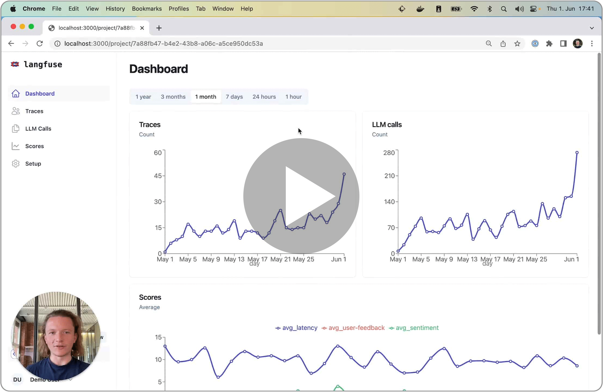

   <a href="https://langfuse.com">
      <h1>🪢 langfuse</h1>
   </a>
   <h3>
      Open-source experimentation platform for LLM-based applications
   </h3>
   
      Improve LLM features in production by capturing their I/O, add attributes, enriching it with user feedback, and identifying quality bottlenecks in use cases and chains
   
   

      <a href="https://langfuse.com/docs">
         <strong>Explore the docs »</strong>
      </a>
       
      <a href="https://discord.gg/7NXusRtqYU">
         <strong>Join the langfuse Discord</strong>
      </a>
       
      <a href="#-features">
         <strong>Features</strong>
      </a> ·
      <a href="https://langfuse.com/#roadmap">
         <strong>Roadmap</strong>
      </a> ·
      <a href="https://langfuse.com">
         <strong>langfuse.com</strong>
      </a> ·
      <a href="https://github.com/langfuse/langfuse/issues/new?labels=%F0%9F%90%9E%E2%9D%94+unconfirmed+bug&projects=&template=bug_report.yml&title=bug%3A+">
         <strong>Report Bug</strong>
      </a>
   

 

# 🤖 Features

Short walkthrough to help getting an overview of the project, who it is useful for, and how it is integrated with your application.

## 1. Monitor usage

- Stay on top of trends in output quality and feature adoption
- Track token usage by feature, user, and model (coming soon)

## 2. Understand and segment use cases

- LLM-based features can be used in all sorts of ways. With langfuse, you can easily segment executions by user attributes, scores, and other dimensions.
- Model-based clustering of use cases to help understand how users are using the features (coming soon)

## 3. Identify quality bottlenecks

- Compare low-quality executions side-by-side to gain a deep understanding on why chains did not perform well
- Model-based comparison of executions with automated suggestions (coming soon)

## 4. Built your data moat (coming soon)

- Retrieval API to query prompts/completions based on similarity to current prompt
- Exports of high-quality prompt/completions for fine tuning; e.g. use GPT-4 completions to train own Llama models

# 🚴‍ Get started

Follow the [quickstart](https://langfuse.com/docs/get-started) for local, self-hosted or cloud

# 🗺️ Roadmap

`langfuse` is built in public and the roadmap is shaped together with users of the project. While the details change frequently, you can find a rough outline of where the project is headed on our [roadmap](http://langfuse.com/#roadmap).

# 👫 Contributing

Join the community [on Discord](https://discord.gg/7NXusRtqYU).

To contribute, send us a PR, raise a github issue, or email at contributing@langfuse.com

# 🥷 Authors

- Max Deichmann ([@maxdeichmann](https://github.com/maxdeichmann))
- Marc Klingen ([@marcklingen](https://github.com/marcklingen))
- Clemens Rawert ([@clemra](https://github.com/clemra))

# 📜 License

langfuse is MIT licensed, except for `ee/` folder. See [LICENSE](LICENSE) and [docs](https://langfuse.com/docs/open-source) for more details.
