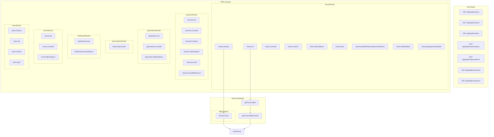

# Traces & Observations Migration Plan

## Overview
Migration from current `traces` and `observations` tables to new schema:
- **exp_traces_amt**: AggregatingMergeTree for trace-level aggregated data
- **exp_spans**: ReplacingMergeTree for individual observations (spans)
- **exp_trace_properties**: Normalized trace properties for efficient filtering

## Current Access Patterns Analysis

### Public API Routes Accessing Traces/Observations
- [ ] **`GET /api/public/traces`**: List traces with pagination
  - **Function**: Custom query with observation_stats and score_stats CTEs
  - **Access pattern**: Complex analytical query with JOINs
  - **Migration impact**: ⚠️ **Requires restructuring** - use exp_traces_amt + separate score queries

- [ ] **`GET /api/public/traces/[traceId]`**: Single trace with observations
  - **Functions**: `getTraceById()`, `getObservationsForTrace()`, `getScoresForTraces()`
  - **Access pattern**: Trace + all related observations and scores
  - **Migration impact**: ✅ **Similar** - exp_traces_amt + exp_spans queries

- [ ] **`DELETE /api/public/traces/[traceId]`**: Delete single trace
  - **Function**: TraceDeleteQueue processing
  - **Access pattern**: Single trace deletion
  - **Migration impact**: ✅ **Similar** - same deletion pattern

- [ ] **`GET /api/public/observations`**: List observations with filtering
  - **Functions**: `generateObservationsForPublicApi()`, `getObservationsCountForPublicApi()`
  - **Access pattern**: Paginated observations list with complex filters
  - **Migration impact**: ✅ **Similar** - query exp_spans directly

- [ ] **`GET /api/public/observations/[observationId]`**: Single observation
  - **Function**: `getObservationById()`
  - **Access pattern**: Direct observation lookup
  - **Migration impact**: ✅ **Similar** - direct lookup in exp_spans

- [ ] **`GET /api/public/v2/scores`**: List scores with filtering
  - **Function**: `generateScoresForPublicApi()`, `getScoresCountForPublicApi()`
  - **Access pattern**: Paginated scores list with complex filters. Joins traces onto scores for userId, tags, and environment.
  - **Migration impact**: ✅ **Similar** - query exp_scores directly

- [ ] **`GET /api/public/sessions/[sessionId]`**: Session with traces
  - **Function**: `getTracesBySessionId()`
  - **Access pattern**: Get traces by session_id
  - **Migration impact**: ✅ **Faster** - query exp_trace_properties for session_id

### TRPC Routes Accessing Traces/Observations
- [ ] **`traceRouter.hasAny`**: Checks if project has any traces
  - **Function**: `hasAnyTrace(projectId)`
  - **Access pattern**: Simple existence check
  - **Migration impact**: ✅ **No change** - same query on exp_traces_amt

- [ ] **`traceRouter.all`**: Main traces table listing with pagination/filtering
  - **Function**: `getTracesTable()` - Complex query with metrics aggregation
  - **Access pattern**: Paginated list with filters, search, sorting
  - **Migration impact**: ✅ **Much faster** - pre-aggregated metrics in exp_traces_amt

- [ ] **`traceRouter.countAll`**: Total trace count for UI
  - **Function**: `getTracesTableCount()`
  - **Access pattern**: Simple count query
  - **Migration impact**: ✅ **Similar** - direct count on exp_traces_amt

- [ ] **`traceRouter.metrics`**: Trace table metrics for UI
  - **Function**: `getTracesTableMetrics()`
  - **Access pattern**: Aggregated metrics calculation
  - **Migration impact**: ✅ **Much faster** - direct aggregation on exp_traces_amt

- [ ] **`traceRouter.filterOptions`**: Filter dropdown options (names, tags, users)
  - **Functions**: `getTracesGroupedByName()`, `getTracesGroupedByTags()`
  - **Access pattern**: GROUP BY aggregations for UI filters
  - **Migration impact**: ✅ **Much faster** - exp_trace_properties for tags, exp_traces_amt for names

- [ ] **`traceRouter.byId`**: Single trace details
  - **Function**: `getTraceById()` via middleware
  - **Access pattern**: Single record lookup
  - **Migration impact**: ✅ **Similar** - direct lookup in exp_traces_amt

- [ ] **`traceRouter.observationsAndScores`**: Trace detail page data
  - **Functions**: `getObservationsForTrace()`, `getScoresForTraces()`
  - **Access pattern**: Get all observations for a trace + scores
  - **Migration impact**: ✅ **Similar** - query exp_spans by trace_id

- [ ] **`traceRouter.deleteMany`**: Batch trace deletion
  - **Functions**: Batch deletion via TraceDeleteQueue
  - **Access pattern**: Bulk delete operations
  - **Migration impact**: ✅ **Similar** - same deletion pattern

- [ ] **`observationsRouter.byId`**: Single observation lookup
  - **Function**: `getObservationById()`
  - **Access pattern**: Direct observation lookup
  - **Migration impact**: ✅ **Similar** - direct lookup in exp_spans

- [ ] **`sessionRouter.all`**: Session list with traces
  - **Function**: `getSessionsTable()`
  - **Access pattern**: Paginated list with filters, search, sorting
  - **Migration impact**: ✅ **Faster** - pre-aggregated metrics in exp_traces_amt

- [ ] **`sessionsRouter.countAll`**: Total session count for UI
  - **Function**: `getSessionsTableCount()`
  - **Access pattern**: Simple count query
  - **Migration impact**: ✅ **Similar** - direct count on exp_trace_properties

- [ ] **`sessionRouter.metrics`**: Session table metrics for UI
  - **Function**: `getSessionsTableMetrics()`
  - **Access pattern**: Aggregated metrics calculation
  - **Migration impact**: ✅ **Much faster** - pre-aggregated metrics in exp_traces_amt

- [ ] **`sessionRouter.filterOptions`**: Filter dropdown options (names, tags, users)
  - **Functions**: `getSessionsGroupedByUsers()`, `getSessionsGroupedByTags()`
  - **Access pattern**: GROUP BY aggregations for UI filters
  - **Migration impact**: ✅ **Much faster** - exp_trace_properties for tags, exp_traces_amt for names

- [ ] **`sessionRouter.byId`**: Session details with traces
  - **Functions**: `getTracesIdentifierForSession()`, `getScoresForTraces()`, `getCostForTraces()`
  - **Access pattern**: Get all traces for session + aggregated metrics
  - **Migration impact**: ✅ **Faster** - pre-aggregated costs in exp_traces_amt

- [ ] **`sessionRouter.byIdWithScores`**: Session details with scores
  - **Function**: `handleGetSessionById()`
  - **Access pattern**: Get trace identifiers and users for session and scores
  - **Migration impact**: ✅ **Similar** - direct query on scores table

- [ ] **`generationsRouter.all`**: List generations with filtering
  - **Function**: `getAllGenerations()`
  - **Access pattern**: Paginated list with complex filters
  - **Migration impact**: ✅ **Similar** - query exp_spans directly

## Implementation Plan

### Phase 1: Infrastructure Setup
- [ ] Deploy new table schemas (exp_traces_amt, exp_spans, exp_trace_properties)
- [ ] Create materialized views for data population
- [ ] Set up monitoring for materialized view performance
- [ ] Validate data consistency between old and new schemas

### Phase 2: Read Path Migration
- [ ] Create abstraction layer for database access
- [ ] Implement new query methods for each access pattern
- [ ] Add feature flags for gradual rollout
- [ ] Performance testing and optimization

### Phase 3: Write Path Migration  
- [ ] Update ingestion pipeline to use new schema
- [ ] Migrate batch operations and background jobs
- [ ] Update deletion and cleanup processes

### Phase 4: Cleanup
- [ ] Remove old table dependencies
- [ ] Drop old tables after validation period
- [ ] Update monitoring and alerting

## Open Questions

1. **Materialized View Refresh Strategy**: How to handle high-volume ingestion with materialized view consistency?

2. **Backward Compatibility**: Do we need to maintain old API responses during transition?

3. **Data Migration**: How to migrate existing historical data to new schema?

4. **Performance Validation**: What are the acceptable performance thresholds for each query type?

5. **Rollback Strategy**: How to quickly revert if performance degrades?

6. **Monitoring**: What metrics should we track during migration?

## Performance Comparison Queries

The following queries represent the most critical access patterns for performance testing. Each query has been separated into individual SQL files in the `performance-queries/` directory for easier management and execution.

### 1. TRPC traces.all - Main Traces Table Listing

- **Current**: [`performance-queries/01-traces-all-current.sql`](performance-queries/01-traces-all-current.sql) - Complex CTE with observation_stats and score_stats JOINs
- **New**: [`performance-queries/01-traces-all-new.sql`](performance-queries/01-traces-all-new.sql) - Direct query on exp_traces_amt with pre-aggregated metrics
- **Expected improvement**: 60-80% faster

### 2. TRPC traces.byId - Single Trace Details

- **Current**: [`performance-queries/02-traces-byid-current.sql`](performance-queries/02-traces-byid-current.sql) - Simple SELECT from traces table
- **New**: [`performance-queries/02-traces-byid-new.sql`](performance-queries/02-traces-byid-new.sql) - Direct query on exp_traces_amt
- **Expected improvement**: Similar performance, potentially 10-20% faster

### 3. TRPC traces.byIdWithObservationsAndScores - Trace Detail Page

- **Current**: [`performance-queries/03-observations-for-trace-current.sql`](performance-queries/03-observations-for-trace-current.sql) + [`performance-queries/04-scores-for-trace-current.sql`](performance-queries/04-scores-for-trace-current.sql)
- **New**: [`performance-queries/03-observations-for-trace-new.sql`](performance-queries/03-observations-for-trace-new.sql) + [`performance-queries/04-scores-for-trace-new.sql`](performance-queries/04-scores-for-trace-new.sql)
- **Expected improvement**: 10-30% faster

### 4. TRPC traces.filterOptions - Filter Dropdown Options

- **Names Current**: [`performance-queries/06-filter-names-current.sql`](performance-queries/06-filter-names-current.sql) - GROUP BY on traces
- **Names New**: [`performance-queries/06-filter-names-new.sql`](performance-queries/06-filter-names-new.sql) - Direct aggregation on exp_traces_amt
- **Expected improvement**: 70-90% faster

### 5. Dashboard Analytics - TRPC dashboard.chart

- **Current**: [`performance-queries/07-dashboard-cost-by-type-current.sql`](performance-queries/07-dashboard-cost-by-type-current.sql) - Complex aggregation with JOINs
- **New**: [`performance-queries/07-dashboard-cost-by-type-new.sql`](performance-queries/07-dashboard-cost-by-type-new.sql) - Pre-aggregated data from exp_spans
- **Expected improvement**: 50-70% faster
