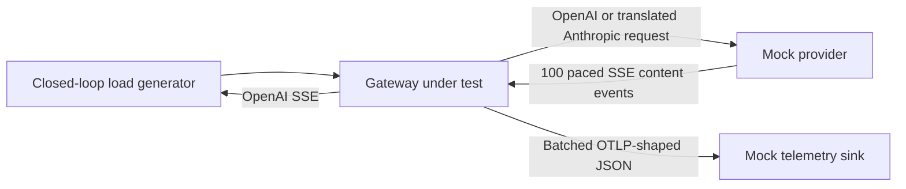

# Node 24 vs. Node 26 vs. Rust gateway results

## Context

The first benchmark made Rust look materially safer than Node 24 for a gateway
that translates LLM protocols while recording large telemetry previews. This
rerun asks whether upgrading the runtime changes that decision enough to avoid
introducing Rust for the Langfuse gateway V1.

The comparison was run locally on Docker Desktop on 2026-08-26. It uses the
same JavaScript source, Express version, application dependencies, and
`undici@7.29.0` lockfile for both Node variants:

| Variant | Runtime | Execution model |
| --- | --- | --- |
| Node 24 | Node 24.19.0, V8 13.6 | One JavaScript event loop |
| Node 26 | Node 26.7.0, V8 14.6 | One JavaScript event loop |
| Rust | Axum, Hyper, Tokio | Four Tokio worker threads |

Every gateway had the same 4-CPU, 2-GiB container limit. Changing the Node
image therefore isolates the Node/V8/core-runtime change; it does not measure
an Undici upgrade or a rewritten gateway.

The central workload is deliberately expensive:

- 60% 103-KB text requests, 30% 570-KB text requests, and 10% 5.9-MB
  image-bearing requests, for a weighted request size of 824 KB;
- OpenAI Chat Completions request parsing and translation to Anthropic
  Messages, followed by incremental Anthropic SSE parsing and translation back
  to OpenAI chunks;
- 100 response content events per stream, split between text and streamed tool
  arguments;
- telemetry capture of up to 2 MiB each of input and output, OTLP-shaped span
  construction, JSON serialization, and HTTP publication in batches of 50
  spans or after 250 ms; and
- starts spread over five seconds, a five-second measured window, and one
  unmeasured warm-up per fresh gateway container.

The 50-ms cadence produces roughly 20 content events per second per active
stream. The dense 25-ms case doubles that rate. The load generator checks exact
content-event counts and bytes, finish reasons, and `[DONE]` for every
successful stream.

## Problem

Rust adds a second backend language, with real implementation, review,
debugging, deployment, and on-call cost. That cost is justified only if Node's
performance or predictability is insufficient for a plausible V1 operating
envelope. The relevant questions are:

1. Does Node 26 materially move the Node 24 tail-latency cliff?
2. Which work causes Node to degrade: raw proxying, translation, or telemetry?
3. Where does Node 26 first degrade and then fail under this exact resource
   limit and workload?
4. Does Rust retain enough headroom to outweigh its ownership cost?

## Results

### Node 26 materially moves the boundary

The table reports median p99 TTFT with the observed range across two measured
repetitions. Every listed request completed successfully, telemetry drained,
and no container was CPU-throttled.

| Concurrent 50-ms streams | Node 24 p99 TTFT | Node 26 p99 TTFT | Rust p99 TTFT |
| ---: | ---: | ---: | ---: |
| 750 | 56 ms `[54-58]` | 33 ms `[33-34]` | 21 ms `[20-22]` |
| 825 | 132 ms `[78-186]` | 38 ms `[36-40]` | 22 ms `[21-23]` |
| 850 | 108 ms `[106-110]` | 39 ms `[39-39]` | 20 ms `[18-22]` |
| 875 | 83 ms `[74-93]` | 43 ms `[38-48]` | 19 ms `[18-20]` |
| 1,000 | 633 ms `[598-667]` | 69 ms `[54-85]` | 22 ms `[20-23]` |

Node 24 is noisy and non-monotonic between c825 and c875, so those samples do
not define a precise cliff. The c1000 result is unambiguous: changing only the
runtime reduced median p99 TTFT by 89% and kept both Node 26 repetitions below
100 ms.

At c1000, Node 26 also used less CPU than Node 24, but Rust retained substantial
headroom:

| Runtime | CPU per completion | Container peak | p99 completion |
| --- | ---: | ---: | ---: |
| Node 24 | 8.65 ms `[8.59-8.70]` | 1.85 GiB `[1.83-1.87]` | 5.80 s `[5.78-5.82]` |
| Node 26 | 7.25 ms `[7.11-7.39]` | 1.76 GiB `[1.75-1.77]` | 5.25 s `[5.24-5.26]` |
| Rust | 4.81 ms `[4.65-4.98]` | 0.99 GiB `[0.98-0.99]` | 5.24 s `[5.23-5.26]` |

Node 26 used about 16% less CPU per completion than Node 24. Rust still used
about 34% less CPU and 44% less peak memory than Node 26.

### The Node 26 degradation and failure modes are distinct

Additional Node 26 repetitions located its boundary under the same 2-MiB
capture and 2-GiB container limit:

| Concurrent 50-ms streams | Repetitions | p99 TTFT | Outcome | Container peak |
| ---: | ---: | ---: | --- | ---: |
| 1,000 | 2 | 54-85 ms | All requests completed | 1.75-1.77 GiB |
| 1,050 | 3 | 99-172 ms | All requests completed | 1.85-1.87 GiB |
| 1,100 | 3 | 476-628 ms | All requests completed | 1.95-2.00 GiB |
| 1,150 | 1 | Not representative after failure | OOM kill, exit 137 | 2-GiB ceiling |
| 1,200 | 1 | Not representative after failure | OOM kill, exit 137 | 2-GiB ceiling |

c1050 is a transition zone: one run was just below 100 ms and two exceeded it.
At c1100, all three runs showed severe latency degradation before requests
failed. At c1150 and c1200, the process crossed from latency overload to
outright memory failure. The closed-loop generator retried after the crash, so
the recorded 7,334 and 9,494 connection/timeout errors are retry-storm counts,
not counts of distinct original streams.

Rust stayed at 20-22 ms p99 through c1200 and peaked at about 1.11 GiB there.
One Rust c1050 run recorded a single 30-second client timeout even though the
gateway reported completing all attempts; later c1100-c1200 samples were clean.
The evidence supports a strong successful-request latency and memory advantage,
not a claim that Rust can never experience an end-to-end timeout.

### Dense streams remain a harder Node case

At c500 and a 25-ms cadence, both cases have roughly 20,000 content events per
second, but requests complete and restart twice as often as at c1000/50 ms.

| Runtime | p99 TTFT, four Node/two Rust repetitions | CPU per completion | Peak memory |
| --- | ---: | ---: | ---: |
| Node 24 | 224 ms median `[153-383]` | 7.65 ms | 1.14 GiB |
| Node 26 | 54 ms median `[36-124]` | 6.19 ms | 1.10 GiB |
| Rust | 20 ms `[20-20]` | 4.64 ms | 0.59 GiB |

Node 26 again removes most of the Node 24 tail, but one of four repetitions
still exceeded 100 ms. It is much better, not as flat as Rust.

### Raw passthrough is not the problem

The native c1000/50-ms control performs no provider translation and captures
only one byte for telemetry.

| Runtime | p99 TTFT | CPU per completion | Peak memory |
| --- | ---: | ---: | ---: |
| Node 24 | 19 ms `[16-22]` | 5.37 ms | 1.06 GiB |
| Node 26 | 24 ms `[22-26]` | 4.64 ms | 1.02 GiB |
| Rust | 11 ms `[11-11]` | 2.64 ms | 0.32 GiB |

Both Node versions proxy 1,000 paced streams without meaningful tail
degradation. Node 26 lowers CPU use but does not improve native p99 in these two
samples. The runtime decision is therefore about the combined translation,
telemetry, and live-payload workload—not ordinary byte forwarding alone.

### Telemetry size is the main Node 24 amplifier

Changing only the capture limit at c1000/50 ms separates translation from
large telemetry materialization:

| Capture per side | Node 24 p99 TTFT | Node 26 p99 TTFT | Node 24 peak | Node 26 peak |
| ---: | ---: | ---: | ---: | ---: |
| 1 byte | 57 ms `[48-65]` | 31 ms `[30-31]` | 1.12 GiB | 1.06 GiB |
| 256 KiB | 417 ms `[295-539]` | 70 ms `[65-76]` | 1.50 GiB | 1.40 GiB |
| 2 MiB | 633 ms `[598-667]` | 69 ms `[54-85]` | 1.85 GiB | 1.76 GiB |

For Node 24, larger captured telemetry strongly amplifies tail latency. For
Node 26, the 256-KiB and 2-MiB latency ranges overlap; the experiment proves
monotonic memory and CPU growth, not a latency difference between those two
limits. Translation alone still costs more than native passthrough, but it is
not sufficient to reproduce the Node 24 c1000 collapse.

The benchmark did not collect CPU profiles, so it cannot attribute the Node 26
gain to one V8 optimization, garbage-collector change, or core-library change.
Because application code and dependencies are identical, the gain belongs to
the runtime as a whole. Rust's remaining advantage is consistent with lower
allocation/serialization overhead and using multiple Tokio workers for CPU
work, but the benchmark does not isolate those mechanisms instruction by
instruction.

## Solution and recommendation

Do not adopt Rust for V1 solely on the earlier Node 24 benchmark. Node 26
materially changes the engineering tradeoff and is the recommended starting
runtime once that release line is acceptable for Langfuse production use. It
keeps the team's existing language and operational expertise while handling
the central c1000 workload without the Node 24 latency collapse.

That recommendation depends on designing the gateway around the observed
failure mode:

- cap captured payloads by bytes and avoid embedding base64 media in telemetry;
- batch telemetry, but also bound queues and batches by bytes rather than span
  count alone;
- use admission control and autoscaling signals for memory, event-loop delay,
  input bytes/s, request starts/s, and provider events/s—not concurrent streams
  alone;
- keep substantial headroom below the tested transition; c1000 is evidence,
  not a production per-pod target; and
- validate against production-shaped traffic and an explicit TTFT SLO before
  fixing pod size or concurrency limits.

Rust remains the stronger efficiency choice. It is warranted if measured
traffic requires the c1050-c1200 synthetic density inside a 2-GiB pod, if
Langfuse wants roughly one-third lower gateway CPU and roughly half the memory
at the high end, or if predictable tail headroom is worth owning a second
backend language. The current evidence does not show that V1 needs that trade.

## Coverage limits

These are short, closed-loop, local Docker Desktop runs with a small number of
repetitions. The fixture is a synthetic, plausible coding-agent shape, not a
measurement of Langfuse customer traffic. The setup excludes TLS, auth,
database/configuration lookup, real provider networking, production telemetry
ingestion, and a complete compatibility layer. Completion latency is dominated
by the configured 2.5- or 5-second stream cadence. Memory is the container's
lifetime peak including warm-up; CPU is the measured window through telemetry
drain.

Raw logs for this run are local and disposable:

- `/tmp/gateway-node26-boundary.log`
- `/tmp/gateway-node26-dense.log`
- `/tmp/gateway-node26-dense-confirm.log`
- `/tmp/gateway-node26-native.log`
- `/tmp/gateway-node26-translate-cap1.log`
- `/tmp/gateway-node26-translate-cap256k.log`
- `/tmp/gateway-node26-extended-boundary.log`
- `/tmp/gateway-node26-boundary-confirm.log`
