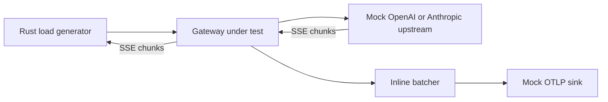

# Node 24 vs. Node 26 vs. Rust LLM gateway benchmark

This is a disposable local benchmark for deciding whether the Langfuse AI
gateway data plane should use Node.js or Rust. It is deliberately isolated from
Langfuse authentication, databases, deployment infrastructure, and production
ingestion. It answers a narrower question: how do the runtimes behave while
proxying many concurrent LLM streams, translating protocols, and preparing and
publishing telemetry?

## Components

The benchmark builds six Docker images and runs six services:

- `node24-gateway`: pinned Node.js 24.19.0, Express, and Undici. Telemetry is
  serialized and batched on the gateway's JavaScript event loop; HTTP
  publication is asynchronous.
- `node26-gateway`: the byte-identical inline gateway on pinned Node.js 26.7.0.
  Both Node images install the same lockfile, including `undici@7.29.0`, so the
  comparison isolates the Node/V8 runtime rather than changing the HTTP client.
- `rust-gateway`: Axum, Hyper, and Tokio, with telemetry serialized on Tokio
  request workers and published by an asynchronous batch worker.
- `mock-upstream`: accepts native OpenAI Chat Completions or Anthropic Messages
  and returns a deterministic SSE stream.
- `mock-otel`: accepts OTLP-shaped JSON and counts requests, bytes, and spans.
- `loadgen`: a Rust closed-loop load generator shared by every variant.



All gateway variants default to the same aggregate envelope: 4 CPUs and 2 GiB.
Rust uses four Tokio workers. Each Node variant has one JavaScript event loop.

## Request and stream fixtures

The realistic pass uses three deterministic coding-agent request fixtures:

| Fixture | Serialized size | Shape |
| --- | ---: | --- |
| Small text | 103,309 B | ~32 KiB source/history plus tools |
| Large text | 569,993 B | ~512 KiB source/history plus tools |
| Media | 5,907,111 B | ~256 KiB text plus one 4 MiB image encoded as a data URL |

The mixed profile schedules 60% small, 30% large, and 10% media requests, for a
weighted serialized request size of 823,694 B. Each request includes system and
developer instructions, multi-turn user/assistant/tool history, null assistant
content with tool calls, one or two tool calls per turn, tool results, eight
function definitions with substantial descriptions and JSON schemas, and
generation controls.

In translation mode, the gateway parses
[OpenAI Chat Completions](https://developers.openai.com/api/reference/cli/resources/chat/subresources/completions)
JSON, maps it directly to
[Anthropic Messages](https://platform.claude.com/docs/en/api/http/messages),
serializes the upstream request, incrementally parses
[Anthropic SSE](https://platform.claude.com/docs/en/build-with-claude/streaming),
maps text and tool-input deltas back to OpenAI chunks, and serializes each
outbound event. The coding-agent response contains 100 content events by
default: 50 text deltas and 50 streamed tool-argument deltas, followed by
finish, usage, and `[DONE]` events. The load generator verifies exact content
event counts and bytes as well as finish and done markers; focused unit tests
cover representative mapping branches used by the fixture.

The translation uses a synthetic, plausible OpenAI function-calling coding-agent
shape intended to exercise likely CPU/allocation hotspots, not a
production-complete compatibility layer. It includes images and tools but omits
less common OpenAI fields and content types, multiple streamed choices, full
error normalization, provider-specific extensions, schema-library validation,
TLS, auth, and connection resolution. Both translators track indexed tool
blocks, but the response fixture exercises one streamed tool call and the load
generator validates only `tool_calls[0]`; multiple or interleaved streamed tool
calls are not benchmark-validated. The benchmark also has a text-only response
profile to check whether results are an artifact of the tool-delta branch.

## Telemetry

Every gateway captures at most 2 MiB each of the request and response while
tracking their full byte counts. Telemetry contains those previews as span
attributes and is published as OTLP-shaped JSON. This intentionally models the
expensive end of observability; a production design that extracts or references
media instead of duplicating it should consume less memory.

Telemetry batch collection is triggered when either threshold is reached:

- 50 spans have been collected; or
- a partial batch's 250-ms collection timer fires.

Publication is sequential, so a slow in-flight publish can delay an eligible
batch; 250 ms is not a hard end-to-end delivery bound.

The Node parent pending set and Rust ingress channel are configured for 1,024
spans; Rust can additionally hold the active batch removed from its channel.
The batch thresholds can be changed with `TELEMETRY_BATCH_MAX_SPANS` and
`TELEMETRY_BATCH_MAX_WAIT_MS`; capture with `GATEWAY_CAPTURE_LIMIT_BYTES`. The
benchmark records drops, publish failures, batch counts, pending bytes, and peak
pending bytes. Pending-byte counters are diagnostic within one implementation,
not cross-runtime metrics: Node counts captured preview bytes while Rust counts
serialized span JSON. Use container-cgroup memory for runtime comparisons.

The earlier IPC experiment is preserved in `REALISTIC_RESULTS.md`, but it is no
longer part of the active benchmark matrix.

## Synthetic cadence assumptions

Providers do not promise one fixed delay between SSE events, so the benchmark
uses a sensitivity sweep rather than claiming one universal cadence:

- 100 ms: slow stream, about 10 content events/s/stream and ~10 s total.
- 50 ms: central planning assumption, about 20 events/s/stream and ~5 s total.
- 25 ms: dense stream, about 40 events/s/stream and ~2.5 s total.
- 0 ms: CPU burst ceiling only; not representative of a normally paced stream.

Workers start uniformly over five seconds in the realistic pass. This avoids
turning `c500` into a single 500-request arrival shock while still maintaining
the selected concurrency during the measured steady interval. Concurrency is
not a sufficient capacity metric by itself: chunk cadence, request starts per
second, request bytes, response events, and telemetry capture size all drive
work.

## Run

Requirements: Docker Desktop, Docker Compose, Bash, and curl.

Run the short original smoke matrix:

```bash
cd gateway-benchmark
./run.sh
```

Run the synthetic fixed-cadence matrix:

```bash
REALISTIC_PASS=1 REPETITIONS=2 DURATION_SECONDS=15 ./run.sh
```

The realistic pass includes three c20 fixture baselines, a c500 native control,
and translation sweeps across configured cadences and concurrency. Useful
controls are:

- `RUNTIMES=node24,node26,rust`
- `REALISTIC_CONCURRENCIES=20,100,250,500`
- `REALISTIC_CHUNK_DELAYS_MS=25,100`
- `REALISTIC_START_SPREAD_MS=5000`
- `REALISTIC_INCLUDE_BASELINES=1`
- `REALISTIC_INCLUDE_NATIVE_CONTROL=1`
- `REALISTIC_INCLUDE_TRANSLATION_SWEEP=1`
- `REALISTIC_NATIVE_CONTROL_CONCURRENCY=500`
- `REALISTIC_STREAM_PROFILE=coding-agent`
- `REALISTIC_CHUNK_COUNT=100`
- `REPETITIONS`, `DURATION_SECONDS`, and `WARMUP_SECONDS`
- `GATEWAY_CPUS`, `GATEWAY_MEMORY_LIMIT`, and `TOKIO_WORKER_THREADS`

For example, the central long-lived sweep used for the current decision was:

```bash
REALISTIC_PASS=1 REALISTIC_INCLUDE_BASELINES=0 \
  REALISTIC_INCLUDE_NATIVE_CONTROL=0 \
  REALISTIC_CONCURRENCIES=750,825,850,875,1000 \
  REALISTIC_CHUNK_DELAYS_MS=50 REALISTIC_START_SPREAD_MS=5000 \
  REALISTIC_STREAM_PROFILE=coding-agent RUNTIMES=node24,node26,rust \
  GATEWAY_CAPTURE_LIMIT_BYTES=2097152 \
  GATEWAY_CPUS=4 GATEWAY_MEMORY_LIMIT=2g \
  REPETITIONS=2 DURATION_SECONDS=5 WARMUP_SECONDS=1 ./run.sh
```

Each group recreates fresh gateway containers and runs an unmeasured warm-up.
Runtime order rotates across cases and repetitions. The runner prints a JSON
record for load results, cgroup-v2 CPU and memory deltas through telemetry
drain, gateway metrics, and sink metrics. It captures up to ten distinct load
errors and records Docker state if a gateway exits, allowing an overload sweep
to continue.

Stop the services with:

```bash
docker compose down
```

## Interpreting results

The load is closed-loop: each worker starts its next request after the previous
one completes. TTFT is time until the first complete SSE event reaches the load
generator; completion is time through `[DONE]`. Completion latency includes the
configured synthetic delay, so compare excess over that configured floor or
over another runtime in the same case.

Docker Desktop shares a Linux VM with other local workloads. Use repetitions
and treat isolated outliers as host noise unless reproduced. The results are
directional runtime evidence, not production capacity or an open-loop SLO
measurement. The native control exercises OpenAI Chat Completions passthrough;
native Anthropic Messages is not yet benchmarked. Stream integrity checks cover
transport, exact content counts/bytes, finish, and done markers, not every
protocol field. See [NODE26_RESULTS.md](./NODE26_RESULTS.md) for the current
findings. [REALISTIC_RESULTS.md](./REALISTIC_RESULTS.md) preserves the earlier
Node 24 and IPC investigation, and [RESULTS.md](./RESULTS.md) preserves the
earlier zero-delay CPU-stress run.

The benchmark uses fixed internal destinations and no security controls. Do not
expose these services to untrusted traffic.
