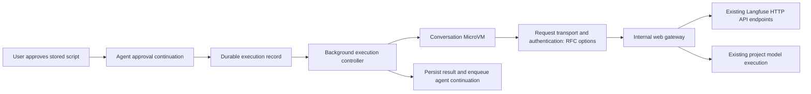

# Internal SDK and model gateway PoC

**Status:** implementation plan for review, based on the requirements interview and source research on 21 September 2026. Product scope below is agreed. Technical choices and initial defaults are recommendations; the listed feasibility checks are implementation work, not completed evidence.

## 1. Agreed scope

| Area | Decision |
| --- | --- |
| Outcome | One complete judge-calibration flow using the real Python Langfuse SDK: existing trace/feedback files → labeled dataset → baseline and candidate → persisted experiments, traces and scores → comparison. |
| Candidate | Change only the judge prompt; use the same project-configured model and connection for both runs. Evaluator activation is a separate user action. |
| SDK coverage | Support the operations required by this flow; reject other operations explicitly. Keep the architecture extensible to the full SDK without claiming untested compatibility. JavaScript/TypeScript follows later. |
| SDK gateway behavior | Forward SDK HTTP requests to the existing Langfuse API endpoints. Preserve existing handlers, business logic and wire contracts; do not build internal-service adapters or reimplement SDK functionality. Upstream authentication/authorization is an RFC choice. |
| MicroVM egress | Keep default-deny outbound access. Allow only the internal SDK gateway HTTPS destination, plus one internal model-proxy HTTPS destination if separate. Standard SDK package with an overridden base URL; all SDK JSON/OTLP and model traffic must use those destinations. All other application egress remains blocked. |
| Approval | One interrupt approves one execution of the exact stored script and its limits. Show readable code and a short impact summary. Changed scripts and deliberate reruns require fresh approval; individual requests do not. |
| Sandbox | Keep the existing conversation-scoped MicroVM and workspace, including tool-result files across turns. No new per-process isolation or separate execution VM in this PoC. |
| Waiting | Release the agent worker while the script runs. Pause new assistant turns until execution/continuation permits them; show status. Backend completion wakes the agent independently of the browser. |
| Identity | Prefer identity outside the guest, or behind a proven guest-inaccessible boundary. Short-lived guest-held gateway credentials remain an RFC option, conditional on the required sandbox-only access boundary. Distinguish sandbox-network reachability from authentication of the originating VM; the required strength is an RFC decision. Never expose real Langfuse or provider API keys. |
| Permissions | Every protected operation remains within the triggering user's current project permissions. Approval and dummy SDK credentials never confer extra privileges. |
| Limits | Enforce request counts/rates, concurrency, payload/output and duration limits. No guaranteed monetary cap. |
| Failure | Keep partial writes/results, explain failures and require approval for reruns. No automatic rollback or automatic whole-script retries. |
| Cancellation | User-triggered script cancellation is deferred. Preserve a path to later stop the actual background script; stopping an agent turn must not be represented as stopping that script. Deadlines and expired gateway access still apply now. |
| Deployment | Cloud-only implementation and runtime proof. Evaluate and document self-hosting readiness; no self-hosted deployment or non-AWS executor implementation required. Aim for an AWS-independent gateway. |
| Future question | Could the same gateway support MCP code-mode? Record useful constraints without designing or implementing it now. |

## 2. Demonstration and success criteria

Start from an existing evaluator. Fetch its safe configuration through the existing MCP tool and retain it in the conversation's tool-result files: prompt/messages, variable mappings, output schema, score type and approved model reference. Do not invent a Python SDK evaluator API or move the evaluator into prompt management.

The script:

1. Reads existing trace/input/output and human-feedback files.
2. Validates label mapping and creates a small dataset with source references and human expected outputs. Missing/ambiguous labels are reported, not invented.
3. Defines the **judge completion as the experiment task**. It does not rerun the customer's application.
4. Runs the existing prompt and one candidate against identical examples through the same project model connection.
5. Records real model calls as generations/traces; compares predicted labels with human labels.
6. Persists item scores and aggregate run scores, flushes, and produces a structured comparison with experiment links and representative disagreements.
7. Returns control to the assistant, which explains the results and recommends a next step.

**Proposed fixture:** 20 text-only examples with explicit binary human labels, balanced where practical; 40 planned completions; concurrency 2. Report agreement, TP/FP/TN/FN, precision, recall and failed/malformed counts. Undefined metrics are N/A, with denominators and coverage shown. This is a mechanics proof, not a statistically credible quality benchmark or a guarantee the candidate improves results.

**Success:** backend readback finds the expected dataset items, both experiment runs, successful judgment traces and corresponding item/run scores. Partial outcomes are visible. Python exit 0 or SDK flush alone is insufficient: ingestion is asynchronous and SDKs may isolate errors.

The full [Marlies meeting transcript](https://circleback.ai/meetings/Z3lUjresX2biXbcSGG9lM), 25 August 2026, supports this shape: existing evaluator at 14:11–14:48; expert labels at 14:48–15:09; judge calls, item/run metrics and iterative calibration at 15:09–17:34; simple comparison code at 19:50–20:30. The RFC adds the need to preserve evaluator semantics and prove flushed results. Neither source specifies sample size or quality thresholds. One candidate, exact-script approval and separate activation are decisions from this interview.

**Excluded:** customer-application execution, remote webhook experiments, new annotation UX, evaluator activation, broad dependency installation, managed-prompt improvement, JavaScript support and automatic multi-round optimization.

## 3. Architecture and responsibility

The diagram leaves request transport open for the RFC discussion. Options are an external identity proxy, direct HTTPS with an execution credential, or a backend relay/tunnel. The controller starts/observes the execution and resumes the agent; only the relay options additionally put it on the SDK request path. Document tradeoffs and evidence before selecting or implementing a transport.

| Owner | Responsibility |
| --- | --- |
| Web | Approval/status API and UI; execution admission; gateway authentication, current-user authorization, policy checks, quotas, HTTP forwarding and model execution. Existing API endpoints retain business validation and processing. |
| Worker/controller | Start/status polling, runtime binding, optional relay pumping, deadlines, output persistence and completion dispatch. No LLM polling. |
| Shared | Minimal execution schemas/persistence, existing role resolution and queue/run contracts. No dependency on web from worker/shared. |
| Sandbox runtime | Launch approved Python script, retain workspace, expose bounded asynchronous status/output and request/response transport. Guest messages remain untrusted. |
| Infrastructure | MicroVM networking, internal gateway reachability, service authentication and exclusion of gateway routes from public ingress where feasible. |

Keep feature-specific logic cohesive. Do not introduce a generic integration broker, new workflow engine or independent proxy deployment unless feasibility proves it necessary.

## 4. Identity, transport and private routing

### Transport choice: a relay is not mandatory

The gateway is an HTTP proxy with authorization and credential handling; a relay is only one way to reach it with trusted execution identity. Forward SDK HTTP/OTLP traffic to existing Langfuse API endpoints. SDK functionality and API business logic stay in their existing implementations; no Python-method RPC layer or gateway-owned dataset/experiment/ingestion implementation is required.

| Approach | Where the credential/identity lives | Advantages | Costs and limits |
| --- | --- | --- | --- |
| External egress proxy with verified VM attachment | Outside the guest; proxy derives the VM from a trusted attachment/channel and authenticates to the gateway | Ordinary HTTP requests; no guest credential; language-independent; natural fit for host-managed networking | Requires a proven per-VM attachment before shared egress. A shared NAT address, guest VM ID or proxy URL is insufficient. AWS-managed host access is not established. |
| Backend-initiated reverse tunnel | Backend connects to the known VM's authenticated inbound endpoint; requests return over that bound channel | No guest credential; persistent bidirectional transport can avoid polling delay | Still a relay: tunnel framing, bounded concurrency, reconnects and uncertain in-flight requests need implementation. AWS documents inbound WebSockets, not a ready-made reverse HTTP proxy. |
| Backend-pulled HTTP mailbox | Backend uses the same authenticated VM endpoint and supplies execution identity | Can preserve denied guest egress; ordinary bounded HTTP control requests; no guest credential | Polling latency and traffic; custom correlation, queues/backpressure and timeouts; controller is on every SDK/model request's critical path. |
| Direct HTTPS with a short-lived execution token | Guest holds a narrowly scoped gateway credential; real Langfuse/provider keys remain outside | Simplest direct path; normal SDK HTTP behavior; portable gateway; no additional relay protocol | Token can be copied and used while active by anyone with network access to the gateway. Conditional RFC option: verify the required sandbox-only network/origin boundary. |
| Guest-side request signing or mTLS | Signing/private key inside guest unless a separate protected component is introduced | Standard mechanisms can authenticate requests and limit captured-request/token reuse | Readable keys remain copyable; signatures do not prove the approved script authored the request. More integration/lifecycle work than an opaque token, including both SDK HTTP and OTLP clients. |

**Relay downsides:** an additional availability dependency, payload copies and backend bandwidth, SDK timeout/retry interactions, and maintenance for binary/compressed OTLP bodies, response/error fidelity and eventually streaming. A reverse tunnel reduces polling overhead but adds connection recovery complexity. Both need bounded buffers and must avoid replaying uncertain writes/paid calls. Self-hosting also needs the relay/controller, although the gateway itself can stay AWS-independent.

**Signing outside the guest** is a valid form of the external-proxy design: receive the request through a trusted per-VM channel, associate it with the active execution, then sign/forward it or use mTLS to the gateway. Signing cannot manufacture source identity. A remote signer accepting an unsigned guest-supplied VM ID has the same gap as an unsigned identity header. A pre-signed credential returned to the guest is still guest-held authority until it expires.

On a self-managed Firecracker host, a per-VM host-side socket/vsock attachment can support that binding when the supervisor owns the socket and VM mapping. Firecracker documents the transport; the proxy and identity policy remain our implementation. This does not establish availability in AWS Lambda MicroVMs. [Firecracker vsock](https://github.com/firecracker-microvm/firecracker/blob/main/docs/vsock.md). A separate privileged signer inside the VM could protect its key from an unprivileged script, but requires the process boundary deferred from this PoC; moving a key to another process running as the same user is insufficient.

**RFC decision, not a selected implementation:** compare external proxy identity, direct execution credentials and relay/tunnel against the required security boundary, documented platform support, operational complexity and self-hosting implications. Direct credentials simplify the SDK path but require an explicit decision on sandbox-network restriction versus originating-VM binding. Signing inside the existing same-user guest does not hide its credential. Start with documentation; use only the experiments needed to resolve missing evidence and implement only the selected transport.

**What a protected signer means:** a component that can use a private/signing key but does not let the script read it. Examples are a host-side proxy, a genuinely isolated privileged daemon, or a hardware-backed key service. It exposes an operation such as “sign this request,” not “read this key.” The boundary must prevent file/memory access, debugging and privilege escalation into that component. A normal helper in the existing same-user runtime does not qualify. Key non-extractability also does not prevent a script from asking the signer to sign malicious requests; the caller binding, active execution and gateway permissions still have to constrain their use. KMS/HSM access alone does not solve caller authentication. This is extra infrastructure/isolation, not a requirement for the direct-token PoC.

### Protected transport candidate: backend-pulled relay

Configure Python SDK and model-helper base URLs to a local adapter with dummy SDK credentials. The adapter queues method/path/header/body envelopes. A trusted backend polls the **known VM endpoint** over its authenticated control channel, attaches the server-owned execution binding, calls the internal gateway and returns correlated responses.

The backend resolves execution → conversation → VM incarnation → user/project/approval. Ignore guest assertions of those identities. The gateway authenticates the backend relay before accepting its execution binding; an execution ID alone is not a credential. Keep all service keys on the backend.

### Credential and authentication contract for the protected relay candidate

| Value | Location and purpose | Gateway treatment |
| --- | --- | --- |
| Dummy SDK public/secret keys | Guest SDK configuration only; fixed, visibly non-secret placeholders where the SDK requires values | Grant no authority. Never register them as project keys, look up a real key through them, or accept them as authentication. Discard SDK authorization headers at the gateway boundary. |
| Execution/conversation/project IDs | Execution ID may be visible in the guest; identity and approval bindings are authoritative only in backend persistence | IDs are references, not secrets. Resolve the user/project from the authenticated relay's bound execution, never from guest headers or payload claims. |
| AWS VM control token | Backend only; authenticates control requests to the known VM endpoint | Scope to the bridge port and short lifetime. AWS removes its proxy-auth header before guest delivery. Never put it in guest environment, command arguments, files or request envelopes. |
| Dedicated relay service key | Worker and web secret configuration only; authenticates relay → gateway traffic | Verify a request-bound signature before dispatch. This new infrastructure secret is separate from all SDK, project and provider keys. |
| Real Langfuse project API key | Gateway-only secret storage if upstream credential substitution is selected | Select from the authenticated execution's fixed project, replace guest authentication and forward to the existing API. Never return it. A trusted execution principal accepted by existing API authentication is an alternative. |
| Real provider API key | Existing encrypted project connection storage; decrypted only by the trusted server-side model helper | Resolve the approved connection from backend state. Never return credential fields, upstream authorization headers or raw provider errors to guest/agent/browser. |

**Conditional relay authentication:** if the relay runs in worker and calls a separate web gateway, use HTTPS plus a dedicated HMAC-SHA256 service key, or verified deployment mTLS. This service hop and signing mechanism are not requirements for the direct-token design. A relay and gateway in the same trusted process can pass verified context internally without signing an internal function call. The existing AI-gateway verifier and `web/src/server/utils/hmac.ts` provide a local cryptographic/rotation pattern, but their current credential-hash signature does not bind a forwarded SDK request. Do not reuse the AI-gateway key or verifier unchanged. For the separate-worker design, put the minimal common signing contract in shared server code, since worker cannot import web.

Bind a versioned, unambiguously encoded envelope to the intended gateway audience, timestamp, unique relay request ID, execution ID, operation/method, canonical target including query, content type/encoding and exact payload digest. Sign the execution ID selected by the backend controller, not one supplied in the guest envelope. Specify canonicalization once, verify the same bytes before interpretation, restrict algorithms/keys to server configuration, and reject missing/invalid signatures, unknown versions/audiences, tampering and expired timestamps. Use a short skew window (initially 60 seconds) and atomic replay admission shared across replicas; fail closed if replay protection is unavailable. Envelope replay prevention does not make SDK writes or provider billing exactly-once. An uncertain dispatched mutation must not be automatically replayed under a fresh request ID.

Use the existing deployment secret mechanism to provision a **feature-specific** current/previous service key, rotate with a bounded overlap, and reject startup/enablement when configuration is missing. Strip guest-supplied service-auth and identity headers; create trusted authentication fields afresh. Log allowlisted execution/request IDs and outcomes, not signatures, credentials or complete upstream errors. TLS remains necessary: signatures provide authentication/integrity, not confidentiality. The request coverage and replay considerations follow [RFC 9421](https://www.rfc-editor.org/rfc/rfc9421.html); this proposal does not claim the existing verifier implements that standard. mTLS is an alternative if already supplied by deployment infrastructure, but no such deployment was verified during planning.

This establishes **which trusted backend and approved execution** a request belongs to. Current-user authorization in section 6 remains mandatory; authenticating the relay never grants its requests the relay's own infrastructure privileges. The PoC trusts backend/control-plane integrity and retains the agreed VM-level execution boundary, without claiming individual guest-process attribution.

AWS documents unique MicroVM inbound endpoints, expiring VM/port-scoped tokens and removal of X-aws-proxy-* headers before guest delivery. These primitives support investigating this relay; they do not constitute a ready-made outbound gateway. VPC egress connectors are shared and public egress is the service default. [AWS networking](https://docs.aws.amazon.com/lambda/latest/dg/microvms-networking.html).

If selected, the protocol needs bounded queues/bodies, request IDs, response correlation, backpressure and timeouts. Reuse one controller for execution observation and relay work. Compare short/long polling with a backend-initiated WebSocket in the spike, using SDK latency and reconnect behavior to choose; both are supported inbound transport primitives, not completed relay implementations. Preserve binary bodies and response status/content type. Never blindly replay a write or paid call after an uncertain response.

### User-proposed boundary header

A trusted external HTTP proxy could strip guest identity headers and inject a canonical execution header. The gateway would trust it only over an authenticated proxy connection. Use a dedicated internal header, not HTTP Origin.

The unresolved prerequisite is **how that proxy independently identifies the VM** before shared egress loses the distinction. A guest-provided ID, shared source IP or private subnet is insufficient. Packet-level routing cannot add headers inside end-to-end HTTPS; the proxy must terminate HTTP/TLS at the configured endpoint. Header mutation itself is standard functionality. [Envoy route API](https://www.envoyproxy.io/docs/envoy/latest/api-v3/config/route/v3/route_components.proto.html).

No inspected AWS MicroVM documentation establishes an immutable outbound VM-identity header. Verify provider capability rather than assuming it. If available and simpler, this can replace the pull transport without changing gateway authorization.

### Direct SDK access with short-lived credentials

This is an RFC option, conditional on the sandbox-only access requirement below. It needs no request mailbox or tunnel: **SDK → HTTPS gateway → existing Langfuse HTTP API**. Model requests use their separately specified endpoint. The backend still observes background execution for completion/deadlines, but does not poll or shuttle every SDK request. The following is its proposed contract if selected.

**Token contract:** generate 32 random bytes with a platform CSPRNG after approval and before execution launch; encode for transport and store only a SHA-256 digest plus a unique credential identifier in trusted persistence. Bind it to the immutable execution/user/project/approval, allowed operations/model and fixed deadline. The gateway looks up the identifier, compares the token digest in constant time, and checks the active execution and current permissions on each request. Unknown tokens fail closed. Server state, not token content or a guest timestamp, determines scope and expiry. This follows the opaque, unpredictable identifier/server-side state pattern in [OWASP session management](https://cheatsheetseries.owasp.org/cheatsheets/Session_Management_Cheat_Sheet.html).

Salt and encoding are not encryption or authentication. Do not encode a real Langfuse/provider key into the token, and do not invent a reversible salted-key scheme. A high-entropy random token needs no decoded identity claims; its hash enables server-side verification without retaining the original credential. A signed JWT is an alternative, but still needs live execution/permission checks for revocation and adds signing-key/claim-validation work. If ever selected, use a maintained library and validate algorithm, issuer, audience and time claims according to [JWT BCP](https://www.rfc-editor.org/rfc/rfc8725.html); decoding alone never authenticates a JWT.

**SDK configuration to validate:** use the dedicated gateway base URL, a synthetic public-key value identifying the execution credential, and the opaque token in the SDK secret-key slot. Those fields then carry a **real temporary gateway credential**, not two dummy values. The gateway alone interprets the SDK Basic-auth pair in its separate credential namespace; it is never registered as a Langfuse project API key. No token in the public-key field, URLs or query strings. SDK OTLP source constructs Basic auth from these fields; verify the pinned SDK sends the intended pair for both JSON and OTLP traffic, and does not forward it on redirects. [SDK exporter](https://raw.githubusercontent.com/langfuse/langfuse-python/main/langfuse/_client/span_processor.py). The model helper uses the same dedicated gateway credential; allow exactly the documented auth format on each route, without ambiguous fallback between authentication schemes.

Inject credentials through the trusted runtime launch configuration, outside the approved script source, agent messages and browser approval payload. Use execution-scoped process configuration rather than persistent workspace files or command-line arguments, and redact authorization across infrastructure/app logs and errors. The guest can still read its process credential: that exposure is accepted here. Keep real upstream keys outside. After authentication, remove guest credential/identity headers and construct the selected upstream authentication before forwarding. Use HTTPS, disable cross-origin credential forwarding and restrict guest egress to the gateway; bearer credentials confer authority to whoever holds them. [Bearer-token security](https://www.rfc-editor.org/rfc/rfc6750.html#section-5).

**Lifetime:** one approved execution, initially at most 10 minutes from start admission, including bounded SDK flush. It is not tied to the lifetime of an LLM worker/turn, which ends while the script runs, or to the persistent conversation/VM. Revoke immediately on terminal state and deny every request after expiry even if cleanup fails. No guest refresh, sliding extension or reuse in the next execution. A longer job requires an explicitly approved longer bound; a rerun requires new approval and a new credential. Current permissions remain authoritative throughout.

**Residual risk:** a copied token can be used from any caller that can reach the gateway during its active window, within the same execution's permissions and shared quotas. A stored VM ID does not prove the caller is that VM. Concurrent copied requests must consume the same limits. Cross-project substitution, new executions and post-expiry use remain denied. A replay-resistant sender proof would require additional protected key/transport work; no such guarantee is claimed for this alternative.

Disclose explicitly in the RFC and PoC result that guest code can copy/replay the token while valid. Signing with a guest-accessible key does not remove that risk; sender constraint loses protection if the attacker also has the key. [RFC 9700](https://www.rfc-editor.org/rfc/rfc9700.html#section-4.10). AWS execution-role credentials available through IMDSv2 are also guest credentials, not protected external identity. [AWS integration](https://docs.aws.amazon.com/lambda/latest/dg/microvms-integrations-claude-managed-agents.html).

### Network configuration

**Agreed egress goal:** the AWS MicroVM may reach exactly the configured internal SDK gateway HTTPS destination and, only if deployed separately, the configured internal model-proxy HTTPS destination. If both share one gateway origin, there is one allowed destination with separate API routes. The gateway/proxy makes upstream Langfuse and provider connections outside the MicroVM; the guest cannot reach those upstreams directly. Keep all other application egress denied, including public internet and unrelated internal services.

Use the standard, unmodified Langfuse SDK package with its base URL overridden to the SDK gateway. Ensure both JSON API requests and OTLP exports follow this configuration. A guest can change a client setting or use raw HTTP, but must not be able to bypass externally enforced egress restrictions. Enforce approved destinations at the network/proxy boundary and allowed HTTP paths/methods at the gateway; a base-URL setting alone is not a firewall rule. Document any strictly necessary platform/DNS plumbing separately, without turning it into general-purpose guest egress. The exact AWS enforcement mechanism and deployed behavior require the network experiment below.

The RFC must distinguish three claims:

| Claim | What establishes it | What it does not establish |
| --- | --- | --- |
| Unusable directly from the public internet | Private listener/routes and enforced firewall/security-group policy, without a public forwarding path | An unrelated internal workload, VPN client or another sandbox may still have access. Private DNS alone is insufficient. |
| Usable only through the approved sandbox network boundary | Explicit ingress allowlist for dedicated sandbox egress, denied unrelated internal sources, and no alternative ingress/proxy path | Which particular sandbox supplied a copied bearer token. Shared sandbox egress authenticates no individual VM. |
| Usable only from the originating sandbox | Independently verified per-VM connection/network identity matched to the credential's execution, or protected sender-bound authentication | Which process or exact script inside that VM authored the request. That isolation is deferred. |

**Open RFC requirement:** does “only inside the sandbox” mean only the sandbox network, or only the particular VM that received the credential? A private HTTPS endpoint can satisfy the former with sufficiently narrow enforced ingress; it does not by itself satisfy the latter. AWS documents reusable egress connectors, so source identity must not be assumed to remain unique per VM. [AWS networking](https://docs.aws.amazon.com/lambda/latest/dg/microvms-networking.html). Private network location is a defense layer, not a substitute for authentication and authorization. [NIST SP 800-207](https://csrc.nist.gov/pubs/sp/800/207/final).

For direct-token access, restrict gateway ingress to the required sandbox egress boundary and reject unrelated workloads/VPN/public paths; for a relay, restrict it to the trusted relay callers. Enforce this with private listener/load-balancer and firewall/security-group configuration, not a guest-supplied header or secret hostname. Check every route to the same application handler, including public web ingress, internal forwarders and alternate addresses. If infrastructure cannot enforce the claimed boundary, record the limitation and do not describe the credentials as sandbox-only. Privileged control-plane compromise is outside this PoC threat model; other guest workloads remain untrusted.

Credential replacement protects upstream secrets; it does not establish source identity or enforce quotas. Authenticate the execution and check current permissions and shared limits before attaching a real project/provider credential or trusted execution assertion. Never implement a private endpoint that merely swaps arbitrary supplied credentials for a more privileged key. Request, concurrency, payload and duration limits remain server-enforced even on private networks.

The pull design can retain denied guest egress. A direct-header/token design must implement the one-or-two-destination allowlist above. Fail launch if required restricted networking is missing. Verify the SDK gateway and optional separate model proxy succeed, while changed base URLs, public internet, direct provider/public-API access and unrelated VPC destinations fail. Include metadata, DNS, IPv6, alternate ports and redirects in bypass checks. Actual private web topology remains unverified.

## 5. Approval and conversation workspace

Reuse persisted approval interrupts: store the script, summary, explicit inputs, model binding and limits before presenting approval. The client submits the proposal ID/decision; the backend loads stored contents and validates ownership/expiry. Launch those bytes rather than rereading a mutable script path. A content digest supports integrity checks and audit correlation.

The UI shows complete, syntax-highlighted source and a short agent-written explanation of reads/writes. Show server-derived project/model/limits separately. The summary explains expected behavior; it is not the permission policy. Disable conversation-wide “always allow” for this operation in both UI and backend.

Current sandbox read/write/edit/bash tools auto-approve. Add a distinct approved execution tool and gate gateway access on its active execution record, independently of SDK imports or raw HTTP. Outside that window, ordinary bash has no gateway authority.

This follows the principle of binding approval to the actual action and checking it at execution, while keeping policy enforcement separate from agent-generated explanations. [OWASP transaction authorization](https://cheatsheetseries.owasp.org/cheatsheets/Transaction_Authorization_Cheat_Sheet.html), [OWASP agent security](https://cheatsheetseries.owasp.org/cheatsheets/AI_Agent_Security_Cheat_Sheet.html).

**Workspace preservation:** the conversation stores providerSessionId. Tool-result JSON is rebuilt from persisted/live MCP events before ordinary sandbox operations. Preserve those files for the script; status/relay polling must not invoke the sync path that deletes/recreates tool_calls. Runtime-generated files remain in the conversation workspace.

**Deliberate PoC boundary:** interrupts control which script the agent launches. Protected transport identifies the conversation VM and its active execution window; direct-token access proves possession of that execution's credential. Neither attributes individual guest processes. Same-user background processes are not separately isolated. Per-process compartments and separate execution VMs are deferred, as requested; they are not PoC blockers. Current-user permissions, tenant isolation and real upstream key protection remain mandatory; the direct token's guest visibility is an explicit tradeoff.

## 6. Authorization and HTTP forwarding

For every SDK/model request:

1. Authenticate the trusted transport or accepted fallback token.
2. Load the execution, approval, VM binding, deadline and fixed project/user; reject inactive or mismatched bindings.
3. Reload current user/project access, including explicit project-role overrides, membership removal and existing admin semantics. Do not reuse the agent's start-time role snapshot.
4. Identify the allowed route/operation and any authorization-relevant fields, apply its current user scope and technical limits, then forward to the fixed upstream API with the selected authentication.
5. Return the existing API response with safe headers and credential redaction; audit the proxy decision and upstream outcome. Existing API handlers own business validation, resource scoping and persistence.

Reuse the existing resolveUserProjectAccess logic in worker execution by extracting only the needed role resolver into shared auth ownership. Use resolveProjectRole and hasProjectAccessByRole/canonical role definitions. Do not copy role grants into a proxy.

**Important mismatch:** public API tokens such as traces:create and scores:create are explicitly not assigned to UI roles in projectAccessRights.ts. The API-key ContextResolver derives key grants, not the creator's current permissions. Simply attaching a project API key or evaluating those public-API actions against UI roles is incorrect.

Proposed narrow operation mapping:

| Operation | Existing user scope / rule |
| --- | --- |
| Dataset read / create-item-create | datasets:read / datasets:CUD |
| Experiment creation and run linkage | promptExperiments:CUD; also preserve datasets:CUD for dataset-run-items and project-scoped access to referenced dataset/items |
| Score creation | scores:CUD, with project-scoped referenced resources |
| Evaluator configuration read | evaluator:read; ordinarily obtained through existing MCP |
| Model completion | playground:execute plus the approved project connection/model binding |
| Safe connection metadata | llmApiKeys:read; execution permission remains separate |
| Calibration telemetry ingestion | **Proposed:** promptExperiments:CUD for the approved calibration workflow. This mapping needs explicit security review because there is no canonical UI traces:create grant. |

The telemetry mapping must describe exactly which events and resource references it authorizes, including updates to existing IDs. It must not silently turn experiment creation permission into arbitrary administrative or cross-project writes. Resolve this policy question in the authorization work package; if the selected scope cannot justify a route's effects, keep that route denied.

**Capability preview:** derive the assistant's supported-operation summary from this same operation registry intersected with current user scopes. Include safe model metadata, Python usage examples and the effective limits before script generation/approval. Refresh after a permission failure. The preview is advisory; every request is checked again, so a stale preview cannot grant access. Do not maintain a second role matrix for prompt/tool descriptions.

### Upstream authentication options for RFC discussion

Both options below send HTTP requests through the existing Langfuse API handlers; neither creates an alternate implementation of datasets, experiments, scoring or ingestion.

| Option | Implementation | Tradeoff / prerequisite |
| --- | --- | --- |
| A. Substitute a gateway-held project API key | Gateway checks current user permissions and limits, replaces SDK authentication with a key for the fixed project, then forwards the request. Existing public API authentication/handlers run normally. | Smallest change to existing endpoints, but a key can have more authority than the user. The proxy must enforce every allowed operation, including mixed batches. Requires secure key provisioning/storage/rotation and correlated user/execution audit. |
| B. Add an execution principal to existing API authentication | Gateway forwards a backend-authenticated execution reference/assertion. Existing API authentication resolves its user/project and authorizes it before the same route handler processes the request. | Avoids a stored broad project secret and places enforcement next to route/event semantics. Requires a narrow, audited authentication/policy extension and honest actor attribution; not an unsigned header bypass. Existing API-key callers must keep their current behavior. |

**Option A key lifecycle:** existing project secrets are stored hashed and cannot be recovered from the database. For the synthetic PoC, an authorized operator can provision a dedicated project-scoped key into gateway-only secret storage. Broader deployment needs an explicit provisioning, encrypted storage, rotation and revocation plan; do not imply existing user keys can be decoded or mint keys using permissions the user does not possess. A project-level gateway key may outlive individual executions, but guest tokens never inherit that lifetime. Use no organization-wide/admin key. Existing `isInAppAgentKey` credentials cannot simply be reused: ordinary SDK routes need explicit support for them, and such support alone does not establish current-user RBAC.

**Option A authorization boundary:** the method/path allowlist is sufficient only where it fully describes the permitted effect. Ingestion and other mixed-operation endpoints require authorization-aware inspection using existing schemas/parsers, or a narrowly equivalent check in API middleware. Reject a whole unapproved batch before forwarding for the simplest PoC; do not synthesize a parallel ingestion pipeline. For forwarded authorized requests, preserve upstream partial-error semantics. The proxy policy must account for updates to existing IDs and cross-project references; rely on existing endpoint checks only after verifying their actual guarantees. A blind key swap cannot meet the stated no-role-escalation requirement.

**Option B boundary:** trust the execution assertion only from an authenticated gateway connection, bind it to the request and resolve authoritative state server-side. Do not trust client role/project headers. Reuse existing handlers and permission helpers; adapt API authentication/actor types only where necessary. Record this as an alternative requiring investigation, not an already available implementation.

Audit option A with a gateway record linking execution/user/project, route, decision and upstream request correlation; retain the API's real key attribution. Option B should retain an explicit execution/user actor. Do not falsify API-key identities to fill existing `apiKeyId`/`publicKey` fields.

Future SDK expansion is a policy/authentication coverage task, not automatic permission to forward every route. Project-key grants do not cover organization administration; support such capabilities later only with a separately justified principal and the user's matching permissions. Never broaden the proxy's upstream key to an admin key to make an unsupported call work.

### Forwarding contract

- Fix the upstream origin per deployment and derive the project/key from authenticated execution state. Preserve the approved API path/query; reject absolute URLs, authority overrides, path normalization bypasses and arbitrary destinations. The SDK's gateway base URL must not loop back into the proxy when forwarding. Cloud can route internally to the same API service; self-hosted operators configure their own target.
- Preserve method, body bytes, content type/encoding and normal API response semantics, including status codes, pagination, 207 ingestion results and safe rate-limit/retry headers. Bound buffering and decompression used for authorization; existing handlers retain full business validation and processing.
- Replace authorization and any upstream key-identification headers consistently; strip guest cookies, trusted-identity headers, proxy credentials and hop-by-hop headers. Rebuild Host/authority for the fixed target and use the same normalized target for authorization and forwarding. Apply standard proxy handling rather than blindly copying headers. [HTTP forwarding requirements](https://www.rfc-editor.org/rfc/rfc9110.html#section-7.6.1).
- Disable redirects for credentialed upstream requests unless a specific same-origin rule is justified; never forward keys to guest-selected or redirected hosts. Enforce deployment-controlled destination validation and private-service allowlists with the existing outbound security helpers.
- Retain upstream tenant isolation, ingestion suspension and rate limits in addition to execution quotas. Do not cache private responses across executions. Do not automatically retry uncertain writes or model calls. Filter unsafe response headers and redact credentials without inventing success responses or replacing API business errors wholesale.

Direct internal-service adapters are excluded by the clarified requirement. Broader SDK support should extend transport/policy coverage, not duplicate API functionality.

## 7. Python SDK compatibility and model endpoint

### SDK contract

Pin an exact Python SDK/dependency set after the compatibility spike; no tested version is asserted yet. Record both SDK and deployed Langfuse versions. Override the base URL. With externally authenticated transport, use dummy SDK keys; with direct-token access, configure the synthetic public identifier and real temporary gateway token described in section 4.

Expected calls: create_dataset, create_dataset_item, get_dataset, dataset.run_experiment for baseline/candidate, item/run Evaluation callbacks, generation observations and flush. Obtain evaluator configuration through MCP getEvaluator, not an invented SDK method. [Python reference](https://python.reference.langfuse.com/langfuse), [experiment runner](https://langfuse.com/docs/evaluation/experiments/experiments-via-sdk).

Initial route inventory, confirmed against **actual pinned wire traffic** before finalizing:

| Method/path beneath SDK base URL | Use and validation |
| --- | --- |
| POST /api/public/v2/datasets | Create the calibration dataset; existing JSON schema and dataset scope. |
| GET /api/public/v2/datasets/{name} | Read the project-bound dataset; canonical path decoding. |
| POST /api/public/dataset-items | Create labeled examples; validate source/resource IDs within project. |
| GET /api/public/dataset-items | Dataset item pagination and response contract. |
| POST /api/public/dataset-run-items | Include if emitted by the pinned SDK; validate item/run/trace linkage and current deployment ingestion mode. |
| POST /api/public/otel/v1/traces | OTLP/HTTP protobuf, including configured gzip; reuse parsers and enforce encoded/decoded limits. |
| POST /api/public/ingestion | Only the required score/event types, with per-event authorization and compatible 207 results. |
| Project discovery, only if emitted | Forward only a verified project-scoped metadata endpoint; otherwise construct experiment links outside the SDK. No gateway-generated substitute API or broad discovery. |

Python uses separate JSON and OTLP transports; an httpx interceptor alone does not cover tracing. Current SDK source still emits dataset-run-items alongside OTLP experiment metadata even though the endpoint is deprecated for newer flows. Do not reject it solely because of that label. [SDK client](https://raw.githubusercontent.com/langfuse/langfuse-python/main/langfuse/_client/client.py), [span processor](https://raw.githubusercontent.com/langfuse/langfuse-python/main/langfuse/_client/span_processor.py).

Reject unknown routes, methods, content types and unapproved event kinds. Ensure every event/span is covered by authorization before processing, not just the outer URL. Option A may reject the whole batch before forwarding if any event is forbidden; forwarded allowed requests retain upstream per-event results. Option B enforces the equivalent check in existing API auth/ingestion entry points before enqueue. Neither option should inherit modes that merely observe authorization failures while retaining forbidden events. Reuse existing parsers; do not implement ingestion in the gateway.

### Model contract

Route model calls through the same allowed gateway origin or the sole additional model-proxy destination specified in the egress policy. Never allow direct provider egress from the MicroVM.

Propose a small nonstreaming JSON endpoint, illustratively POST /models/complete:

- Input: text messages, bounded output-token request and the narrow supported generation/structured-output parameters.
- Model/connection: derive from the approved execution; no arbitrary guest model, base URL, provider headers, credentials or override configuration.
- Output: text or validated structured result, safe model/usage metadata and a stable sanitized error shape.
- Exclude streaming, tools, remote media and provider passthrough parameters initially.

A small preinstalled Python helper calls this endpoint; the Langfuse SDK owns experiment and trace recording. This avoids claiming general OpenAI compatibility. An explicitly limited OpenAI-compatible adapter is a later alternative if needed.

Resolve project connections server-side and use generateLLMText with existing secure fetch/base-URL validation. Preserve DNS/connect/redirect checks and self-hosted allowlists. Do not expose keys, ciphertext, raw provider configuration or error headers. Return only allowlisted metadata through capability discovery.

Propagate the request/execution deadline through AbortSignal to the provider call where supported; record an uncertain provider outcome if the connection ends without a confirmed response. A timeout must not trigger an automatic paid retry outside the attempt budget.

## 8. Technical limits and error behavior

Proposed initial server-enforced defaults; tune from the fixture's wire proof without widening them silently at runtime:

| Limit | Initial value |
| --- | --- |
| Active executions | 1 per conversation |
| Execution gateway lifetime | 10 minutes from start admission |
| Model attempts | 50 total, concurrency 2, 30/minute |
| Model request/output | 64 KiB text/JSON input; maximum 2,048 output tokens per call |
| SDK traffic | 500 HTTP requests, concurrency 4, 20 requests/second |
| Batch content | 1,000 total submitted ingestion events/spans per execution |
| SDK bodies | 1 MiB encoded, 4 MiB decoded per request; similarly bounded responses |
| Captured stdout/stderr | 128 KiB combined, with truncation marker |
| Structured final report | 64 KiB |
| Individual model deadline | At most 60 seconds and never beyond remaining execution time |

These defaults cover the proposed 40-call example, not general workloads. Set generateLLMText maxRetries to 0 for this PoC; count each admitted model call, including helper retries, against its attempt budget. Any later provider-internal retry support must meter actual attempts. SDK retries and batch contents consume their respective budgets. Keep existing project/organization controls in addition to these execution limits.

Store total admitted counts atomically in the execution record or an existing durable counter facility. Use existing Redis primitives for shared rate/concurrency controls across web replicas; never per-process counters. Reject admission if limit state cannot be checked. Do not free a model concurrency reservation before its request has ended or timed out.

Use 429 for rate/concurrency saturation, with bounded retry guidance; use a stable terminal quota/deadline code when waiting cannot restore allowance. The Python helper must distinguish these cases. Stop new gateway work at expiry, attempt to stop the command and use runtime termination as the final deadline containment mechanism if needed; report workspace loss if VM termination is required. This automatic safety deadline is separate from the deferred user-cancel feature.

Report observed usage/estimated cost when available, clearly distinguishing missing usage and uncertain paid-call outcomes. No currency ceiling is promised.

## 9. Durable execution, completion and recovery

### Minimal new state

Propose one InAppAgentScriptExecution record, colocated with existing agent persistence:

| Fields | Purpose |
| --- | --- |
| ID, project/conversation/user, parent run/tool-call/approval IDs | Fixed ownership and unique logical execution. |
| Stored script + digest, inputs, model binding and limits | Approved proposal. Reuse persisted approval payload where practical; avoid two editable copies. |
| Bound providerSessionId, admission/start/deadline timestamps | Runtime identity and lifetime. |
| State, bounded output/cursor, exit code/error, result links/summary | Durable observation and partial-result reporting. |
| Admission counters and continuationRunId | Enforced budgets and recoverable completion dispatch. |

Use uniqueness on the logical approved invocation. Execution states can be PENDING, RUNNING, SUCCEEDED, FAILED, TIMED_OUT and UNKNOWN. Cancellation states are future work.

Add WAITING_EXECUTION to agent run lifecycle, keeping finishedAt unset. Existing one-unfinished-run admission then blocks new turns. RUNNING is unsuitable because it implies an active agent worker/heartbeat; approval-waiting is unsuitable because no further human approval is pending. A separate script row is needed because agent runs can end/restart independently of the VM and results.

### Start and wait

1. After approval, persist execution binding and the waiting transition before releasing the agent worker.
2. A lightweight worker controller uses the existing PeriodicExclusiveRunner pattern to scan bounded batches of pending/active executions. No separate workflow platform or script queue is necessary initially.
3. Extend runtime/provider contracts with startExecution(id, storedScript, digest, deadline, limits) and getExecution(id, outputCursor). Start returns promptly; status remains responsive.
4. Persist a guest manifest before launch. Duplicate starts with the same ID/digest return the known state; mismatches reject. An ambiguous spawn window must produce UNKNOWN rather than silently launch again.
5. Poll only the bound VM; never replace a missing VM and rerun the script automatically. Add separate runtime control routes that avoid ordinary sandbox-operation serialization and tool-file synchronization.

The optional pull relay shares this controller, with bounded per-request processing. The model worker is released; backend execution supervision still consumes ordinary worker capacity.

### Completion and browser discovery

Under the conversation lock, persist one terminal execution outcome, its result event, finish the waiting run and create one normal queued continuation. Save that continuation ID transactionally. Re-enqueue that same queued run after a dispatch failure, using its ID as the queue job ID; never create a second continuation for the same terminal execution.

Extend integrity reconciliation for waiting executions and execution deadlines rather than agent heartbeats. On restart, query the existing VM/manifest and resume supervision. Lost VM/manifest or uncertain mutation completion becomes an explicit partial/unknown outcome.

Reuse conversation-wide persisted event watching and snapshot reconstruction. Add script-running/status/output presentation; browser disconnect/reopen must not affect execution or continuation. Recheck user access before continuation and before returning protected results.

### Failure and future cancellation

Retain datasets, traces, scores and other completed writes. Surface failed items, last known phase and whether the outcome is uncertain. A rerun is a new approved execution; transport retries for the same dispatch are not a rerun.

Initial UI offers status while busy, without a functional script-cancel control. Existing turn-stop, conversation-delete or archive paths must not falsely claim to stop an active script or discard its binding; for the PoC, reject incompatible actions while it runs.

Later cancellation will target the durable execution ID, stop admission/model requests, terminate the actual script and its descendants, confirm the outcome and report partial results. Merely interrupting the LLM turn is insufficient. Do not implement that user flow now.

## 10. Runtime and self-hosting assessment

- Preserve the conversation VM/session and tool-result paths. Preinstall the pinned Python SDK and helper; no runtime package downloads for the demonstration.
- AWS idle detection counts inbound endpoint traffic, not CPU work or SDK egress. Configure a sufficient active-job idle window and test CPU-only intervals; do not mistake autoResumeEnabled=false for disabling suspension. [IdlePolicy](https://docs.aws.amazon.com/lambda/latest/microvm-api/API_IdlePolicy.html).
- Restrict control tokens to the bridge port. Evaluate omitting the runtime execution role or limiting it to necessary logging; never grant provider-secret retrieval or VM administration. Execution roles are optional at service level, although local configuration currently requires one. [AWS security](https://docs.aws.amazon.com/lambda/latest/dg/microvms-security.html).
- Keep credentials and customer data out of reusable images/snapshots; populate execution/conversation data after launch. Bound runtime output and preserve diagnostics without dumping requests, headers or secrets into logs.
- Cloud Terraform currently expresses denied sandbox egress, but deployed enforcement and private web routing require proof.
- The existing dangerous-docker provider is development-only. A future production executor must supply isolation, authenticated control, restricted networking, bounded execution/output and restart observation. Firecracker host-side vsock is one possible future relay transport, not a documented AWS-managed API. [Firecracker design](https://github.com/firecracker-microvm/firecracker/blob/main/docs/design.md), [vsock](https://github.com/firecracker-microvm/firecracker/blob/main/docs/vsock.md).

The PoC result must separate portable gateway/controller behavior from AWS adapter/network provisioning. List required configuration, TLS/service authentication, database/Redis/worker dependencies and private model-connection allowlists. No Cloud test establishes full self-hosting readiness.

## 11. Implementation work packages

File paths below identify existing ownership; proposed new filenames are illustrative.

| Order | Work and owner | Completion evidence |
| --- | --- | --- |
| 1. Documentation and RFC transport decision | Document external identity proxy, direct execution credentials and relay/tunnel; clarify sandbox-network versus originating-VM restriction. Review provider/networking guarantees before targeted playground work in the worker provider, runtime, web ingress and infrastructure. Implement only the selected transport after RFC discussion. | Evidence for the chosen credential and network boundary; synthetic playground checks below; five-minute execution without an occupied agent worker. Signed-relay checks apply only if selected. Record latency, failure behavior and implementation burden before expanding the API surface. |
| 2. SDK wire contract | Python fixture + fern dataset contracts and web public schemas. Pin versions and capture sanitized method/path/type/encoding inventory. | Initial wire capture identifies dataset, experiment-link, score and OTLP traffic without invented/deprecated-route assumptions. Full gateway persistence proof follows work packages 6–7 and is signed off in package 10. |
| 3. Execution persistence | packages/shared/prisma/schema.prisma; shared in-app-agent schema/runLifecycle. Add the minimum execution record and waiting status. | Unique approved invocation and transactional waiting/continuation state; documented migration and recovery behavior. |
| 4. Approval and discovery | web in-app-agent router/backgroundRunService; shared mcpPolicy; tool-call card/details. | Exact code/summary/limits displayed; stale/tampered/blanket approvals denied; safe capability metadata available before generation. |
| 5. Authorization integration | Shared userProjectRoleAuth and existing worker role resolver; gateway policy for option A or a narrow existing public-API authentication extension for option B. | Current roles/overrides checked on every operation; telemetry scope mapping reviewed; upstream authentication choice and key lifecycle explicit; no copied role matrix or key-based escalation. |
| 6. SDK HTTP forwarding | Gateway HTTP client/proxy, existing public API schemas/authentication and OTLP parser for policy inspection where needed. Existing public handlers remain owners of business processing. | Required SDK requests reach existing endpoints; no dataset/experiment/ingestion reimplementation; compressed payloads, pagination, errors and tenant controls preserved; unauthorized events never enqueue. |
| 7. Model endpoint and quotas | Existing shared llm/llmText.ts + secure fetch; new narrow web adapter and existing Redis limit primitives. | Real project connection used without secret exposure; all attempts/concurrency/payload limits enforced across replicas. |
| 8. Runtime/controller | sandbox runtime contracts/server, provider types/service; worker execution feature and integrity-runner pattern. | Prompt-returning start/status, bounded output, unchanged workspace during polling, recovery without silent reruns, deadline enforcement. |
| 9. Continuation/status UI | executeInAppAgentRun, runLifecycle, backgroundRunService, watch and agent UI. | Worker released while waiting; one persisted continuation; busy-state enforced server-side; reopen discovers results; no misleading cancel behavior. |
| 10. Cloud proof and result | Synthetic project, two conversations/roles, real configured model; deployment notes. | End-to-end evidence and negative tests below, documented limitations, self-hosting assessment and any guest-token fallback disclosure. |

Read narrower AGENTS before implementation. Keep public API contracts unchanged where possible; if a public contract does change, update Fern sources/regeneration rather than hand-edit generated clients.

## 12. Verification and evidence to retain

### Documentation first, then dedicated playground experiments

No playground resources have been created or tests executed for this plan. Start with one bounded documentation/code review, then three small experiments. Do not prototype several transport architectures. External signing is a documentation question unless the provider identifies a concrete supported mechanism.

**AWS research still needed:**

| Question | Inspect / expected output |
| --- | --- |
| How do we restrict this deployment to one or two gateway destinations? | Trace the existing VPC connector, subnet routes, security groups, private listener and DNS. Produce the smallest proposed network change and identify every public/alternate route to the same handler. Security groups control network destinations/ports, not base URLs or HTTP paths; enforce route restrictions at the gateway. [Networking](https://docs.aws.amazon.com/lambda/latest/dg/microvms-networking.html), [connector API](https://docs.aws.amazon.com/cli/latest/reference/lambda-core/create-network-connector.html), [security groups](https://docs.aws.amazon.com/vpc/latest/userguide/security-group-rules.html). |
| Are DNS/metadata/IPv6 exceptions outside the stated boundary? | Inspect actual resolver path and runtime role. AWS security groups do not block Route 53 Resolver queries; determine whether that applies to this managed MicroVM path and whether DNS filtering is required. Do not claim blocked DNS or credential-free metadata from empty egress rules alone. Record minimal controls or an explicit unresolved requirement. [Security-group DNS limitation](https://docs.aws.amazon.com/vpc/latest/userguide/security-group-rules.html), [MicroVM security](https://docs.aws.amazon.com/lambda/latest/dg/microvms-security.html). |
| Is usable per-VM external identity actually exposed? | Seek documented non-spoofable identity at egress, not ingress proxy headers or shared connector IPs. If absent, mark unsupported/unverified and stop this branch; no custom signer/tunnel investigation unless selected in RFC discussion. |
| Will detached execution survive idle policy and observer restart? | Verify deployed idle settings, session reuse and bridge-port token expiry. Idle activity is measured through inbound proxy traffic; SDK egress/CPU activity is not the documented trigger. Choose an active-job window that survives the intended interruption. [IdlePolicy](https://docs.aws.amazon.com/lambda/latest/microvm-api/API_IdlePolicy.html). |

Inspect current source/configuration read-only; do not read secret values. For experiments use an existing suitable non-production environment, one dedicated test gateway and one MicroVM, adding a second VM only for the copied-token check. Use two small synthetic Langfuse projects/users for tenant and role checks and a test model connection. Names such as `sdk-gateway-poc-a/b` are illustrative, not existing resources. Never modify a shared live connector to run a spike; use an isolated connector/configuration and fresh VM where needed. Record account/region, resource owner and cleanup commands before deployment. Clarify connector update semantics before any production rollout: AWS guidance and API references must be reconciled if they differ.

| Experiment / timing | Smallest useful procedure | Pass evidence and stopping rule |
| --- | --- | --- |
| E1. Network restriction, before API implementation | Use a minimal HTTPS health endpoint with no credentials. From the MicroVM allow the SDK gateway and optional model proxy; try one public destination, one unrelated internal service and a disallowed route/Host on any shared listener. Check gateway reachability from a public client and a known unrelated internal workload. Check resolver/metadata/IPv6 behavior only as applicable to the deployed configuration. | Record an allowed/blocked matrix and exact ingress/egress configuration. A timeout alone is inconclusive without a known reachable control target or supporting network evidence. If the required boundary cannot be enforced, stop Cloud rollout and report the specific gap; do not relax egress. No model calls needed. |
| E2. SDK proxy and authorization, after the first thin proxy slice | Start with two synthetic labeled items and two tiny runs through the actual API, including JSON scoring and compressed OTLP; at most four real model completions for this smoke test. Check role removal between requests, a cross-project reference, one mixed forbidden batch, token expiry and credential-free errors/logs. For direct tokens, try one copied token from a second reachable sandbox and record its expected boundary. Add 100 SDK reads at concurrency 2 to catch obvious forwarding/timeouts issues; this is not a load benchmark. Most negative cases can run locally against the real API/auth stack before one Cloud smoke run. | API readback proves stored results, forwarded bodies/status/errors match the supported contract, forbidden operations do not persist, and real upstream keys never reach guest/output. Copied-token admission is not a failure unless originating-VM binding was selected. Count SDK reads separately from model usage. No SDK rewrite or broad performance campaign. |
| E3. Detached execution, after lifecycle integration | Run one five-minute script containing a quiet interval and a few SDK reads. Release the agent worker, close/reopen the browser and restart the test observer once. Verify existing workspace data survives and one continuation reports the result. Use a separate short configured deadline to test authority expiry/process containment without another long run. | Recorded execution states, no occupied model worker, no duplicate script launch or continuation, and deadline behavior. Use integration tests for additional fault races rather than repeated Cloud chaos experiments. |

After these pass, run the agreed 20-item calibration demo once as final acceptance; it is not another architecture experiment. Retain sanitized configuration, source/version pins, short reproduction steps, expected/actual results and cleanup evidence. If the account, endpoint or deployment permissions are unavailable, prepare runnable fixtures/configuration and list the exact missing dependency; do not pretend a Cloud proof ran. No reverse-tunnel, HSM/signer, per-VM connector fleet, alternative sandbox provider or full SDK test matrix is needed for this PoC.

### Focused regression checks

Build the smallest focused checks at each behavior boundary:

- **Approval/admission:** mismatched script/project/limits, expired approval, duplicate start and a second browser turn; correct single execution and busy status.
- **Authorization:** allowed member flow, viewer write/model denial, explicit project-role override, membership removal between requests, cross-project IDs and inactive execution. Include the reviewed telemetry mapping.
- **Credentials/transport:** dummy keys alone grant nothing; forged identity headers, unauthenticated gateway access, wrong execution/project binding, expired/revoked tokens and canary secrets through guest files, responses/errors and logs. For a signed relay also cover missing/invalid signatures, changed execution/target/body/encoding, stale timestamps, duplicate request IDs and key rotation. For direct tokens, verify copied-token requests share scope/quotas and are denied after expiry/revocation; do not claim origin-bound replay protection.
- **Ingestion:** compressed-size limits, malformed protobuf, mixed allowed/forbidden events, tenant references, legacy linkage under the deployed ingestion mode and SDK-visible partial errors.
- **Models/limits:** real connection resolution, unsupported fields/base URLs, quota concurrency races and retry accounting. Preserve existing SSRF regression coverage.
- **Lifecycle:** five-minute CPU/SDK execution, zero active agent worker during wait, controller restart, lost start acknowledgement, duplicate completion, lost enqueue, browser close/reopen and hard deadline. Never promise exactly-once provider billing.
- **End-to-end:** 20 examples, two runs, expected successful judgment traces/item/run scores; compare actual persisted counts with expected counts after bounded ingestion settling. Explicit partial-failure demonstration.

No need for tests that restate labels, static mappings or limit constants. Extend existing server/worker suites. Use story play tests for interactive approval/status components that already have stories. Use the seed CLI for reproducible local fixtures; Cloud proof uses synthetic data.

Required implementation checks depend on touched packages: lint, root typecheck for cross-package changes, targeted web/worker tests, Prisma generation/migration validation for new state, and knip. Quote actual summaries and cache status. Browser-check approval/status and retain Cloud screenshots/result links. These checks have **not** been run for this planning document.

## 13. Remaining feasibility decisions and alternatives

| Decision | Proposed path | Alternative / condition |
| --- | --- | --- |
| Request authentication | Open RFC choice: external identity proxy, direct execution credentials or relay/tunnel | Compare documented guarantees, SDK compatibility, complexity and self-hosting; no transport selected by this plan. |
| Sandbox-only credential use | Define whether access is restricted to sandbox networking or to the originating VM, then prove that boundary | Private endpoint plus a bearer token does not identify a specific VM. Stronger origin binding requires independent per-VM identity; explicit network/permission/quota checks are required either way. |
| Direct-token representation/lifetime | Random opaque token, digest stored server-side, one approved execution and fixed expiry | Signed JWT only with a concrete need; no custom salted encoding, real-key wrapping, conversation-wide token or guest refresh. |
| Relay → gateway authentication, if separate services | Dedicated request-bound HMAC over HTTPS, backend-only key and replay admission | Verified deployment mTLS; trusted in-process context when colocated. Not an extra requirement for direct guest-token access. Private routing or unsigned identity headers are insufficient. |
| SDK dispatch | Agreed: HTTP forwarding to existing Langfuse API endpoints | Direct internal-service adapters excluded; existing handlers retain SDK/API behavior. |
| Upstream API authentication | Open RFC choice: gateway-held project-key substitution with proxy RBAC, or a trusted execution principal in existing API authentication | Both preserve existing handlers. Key substitution needs secret lifecycle and operation-aware user checks; execution principals require a narrow auth/policy extension. |
| Calibration trace-write scope | Existing experiment-creation permission with explicit operation boundaries | Keep denied until scope semantics and update behavior are justified; do not invent broad user grants. |
| Completion orchestration | One execution record, periodic controller and existing run continuation | Dedicated queue or native framework background runtime only if measured needs justify more infrastructure. |
| Model protocol | Small nonstreaming JSON contract | Limited OpenAI-compatible protocol later; no implicit provider passthrough. |
| File/process isolation | Existing conversation VM and interrupt dispatch | Stronger same-VM compartments or separate execution VM are future hardening, not PoC requirements. |
| Self-hosting | Portable contracts and a written deployment/gap assessment | Production non-AWS executor and actual self-hosted demonstration are later work. |

The implementation result should record the chosen transport, verified SDK/platform versions, reviewed permission mapping, final limits, completed evidence and remaining limitations. User-triggered cancellation and future MCP code-mode reuse stay explicit follow-ups.

## 14. Selected decisions (21 September 2026)

These replace the open RFC rows in section 13 for this local PoC. Relay/tunnel, originating-VM binding, JWT tokens, and an execution principal inside public API auth stay documented alternatives and are not built.

| Decision | Selected path | Evidence / residual risk |
| --- | --- | --- |
| Sandbox-only access | Sandbox-network reachability, not originating-VM authentication | AWS documents reusable egress connectors as the intended pattern. Inbound `X-aws-proxy-auth` is stripped before guest delivery. No documented non-spoofable per-VM identity at egress. A copied token is valid from any caller who can reach the gateway until expiry. |
| Guest-to-gateway auth | Opaque 32-byte CSPRNG token; SHA-256 digest + credential id stored on the execution; one approved execution; revoke on terminal/expiry | No supported external identity proxy. Relay/tunnel remains unbuilt. Guest process can read its env token; that exposure is accepted. |
| Upstream API auth | Dedicated gateway-held project key after current-user RBAC | Existing project secrets are hashed and unrecoverable. Public API has dual auth pipelines (`legacy` / `shadow` / `enforce`); an execution principal would touch every API caller. Proxy allowlist is mandatory because a project key is broader than a UI role. No org/admin key. |
| Telemetry write scope | `promptExperiments:CUD` for OTLP traces and allowed experiment-linkage events; `scores:CUD` for score-create events; `datasets:read` / `datasets:CUD` for dataset routes; `playground:execute` for the model helper | Whole mixed batch rejected before forward if any event is unmapped. Cross-project ids denied. Routes without a mapping stay denied. |
| Token representation | Random opaque token; digest stored; no salted encoding, JWT, or conversation-wide credential | Guest visibility is an explicit tradeoff. Copied-token requests share the same quotas. |

### AWS MicroVM facts (documentation + current code; not deployed)

| Topic | Documented / observed | Unknown / not verified |
| --- | --- | --- |
| Egress | Customer-managed VPC connector; security groups + NACLs apply. Current Terraform SG has empty ingress and egress (deny-all). Worker passes optional connector ARN. | Whether a dedicated private gateway listener is reachable from that connector without opening general egress. |
| Path vs destination | Security groups match destination IP/port, not URL paths. Route policy must live at the gateway. | Actual routes, DNS names, and IPv4/IPv6 of a future playground listener. |
| DNS | Security groups cannot block AmazonProvidedDNS / Route 53 Resolver. Resolver DNS Firewall is the documented filter. | Whether Resolver DNS Firewall applies to this managed MicroVM path. |
| Execution role | Docs: optional; without it, no CloudWatch logs and no AWS service access. Worker still requires `executionRoleArn`. Terraform role has trust only, no permissions policy. | Whether IMDSv2 then exposes empty-role credentials. |
| External identity | No documented non-spoofable outbound VM identity. Inbound tokens are port-scoped JWEs removed before the guest. | Branch stopped. |
| Idle | `IdlePolicy.maxIdleDurationSeconds` minimum 60. Idle is inbound proxy traffic only. Current provider: 60s idle, `autoResumeEnabled: true`, 4h suspend/max lifetime. | Whether a guest Python process survives suspend/resume. |
| Connector updates | User guide: terminate MicroVMs before update. `UpdateNetworkConnector`: connector stays ACTIVE; existing workloads are not disrupted. | Do not update the shared connector. Isolated connector only after an explicit playground yes. |
| Control token | Current code mints 30-minute tokens for all ports. Plan: narrow to bridge port 5000 locally. | Not deployed. |

**Playground / remote AWS:** not run. Confirm before any playground or remote AWS action.

### Self-hosting assessment

The gateway and controller are AWS-independent web/worker code plus Postgres, Redis, and a dedicated project API key. Operators must set the gateway key, a fixed upstream origin, and fail-closed Redis. The local `dangerous-docker` provider has `NetworkDisabled: true`, so it cannot prove “only the gateway.” A production non-AWS executor still needs an isolated guest, authenticated control, and egress limited to the gateway listener. No Cloud test is a self-hosting proof.

### Unverified after this local slice

Network allow/deny matrix, in-guest DNS/IMDS/IPv6, copied-token from a second MicroVM, five-minute idle survival, and the 20-item live-model calibration demo. Those wait for an explicit playground approval.
