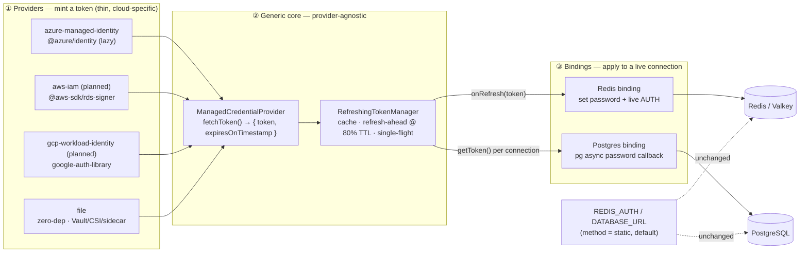
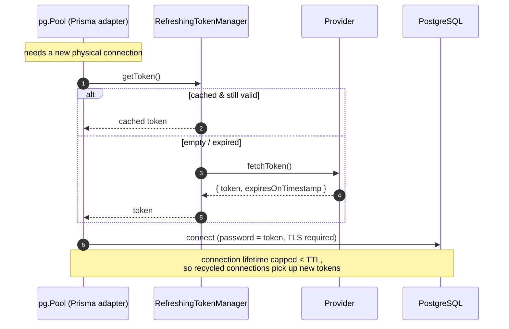

# Short-lived infrastructure credentials

Opt-in support for **identity-based, short-lived credentials** for Langfuse's
infrastructure dependencies, instead of only static username/password secrets.
Primary use case: **Azure Managed Identity**; designed to extend to AWS IAM and
GCP Workload Identity, and to work for **both Redis and Postgres**. See
[langfuse/langfuse#14278](https://github.com/orgs/langfuse/discussions/14278).

This POC implements the generic core + the **Redis** binding end-to-end. The
**Postgres** binding is designed below and is the planned follow-up.

## The idea in one picture

The design separates *who mints a token* (cloud provider) from *who consumes it*
(infra dependency). A single generic core sits in the middle, so each axis can
grow independently: add a provider once → every dependency can use it; add a
dependency once → every provider works with it.



The cloud-specific surface is tiny — only `fetchToken()` differs per provider.
Everything else (caching, refresh-ahead, single-flight, re-auth scheduling) is
shared. `static` (the default) bypasses the whole thing and keeps today's
username/password behaviour byte-for-byte.

## Two axes: providers × dependencies

What changes per **provider** is only token acquisition; what changes per
**dependency** is only how the live connection re-authenticates.

| Provider | Mint mechanism | Net-new dep | Username | Token TTL |
| --- | --- | --- | --- | --- |
| `azure-managed-identity` | `@azure/identity` `getToken(scope)` | `@azure/identity` (lazy) | identity **object id** | ~60–90 min |
| `aws-iam` *(planned)* | `@aws-sdk/rds-signer` / SigV4 presign | none (`@aws-sdk/*` present) | DB user / cache user id | 15 min |
| `gcp-workload-identity` *(planned)* | `google-auth-library` / cloud-sql-connector | none (already present) | IAM principal | ~60 min |
| `file` | read file kept fresh by an external rotator | **none** | configurable | advisory |

| Dependency | Client | Refresh model | Mechanism |
| --- | --- | --- | --- |
| Redis | ioredis (no provider hook) | **push** — re-AUTH the open socket | `onRefresh` → set `options.password` + `AUTH` |
| Postgres | `pg` via Prisma driver adapter | **pull** — fresh token per new connection | async `password` callback → `getToken()` |

Per-dependency the Azure provider just uses a different **scope**:
`https://redis.azure.com/.default` for Redis,
`https://ossrdbms-aad.database.windows.net/.default` for Postgres.

## Redis (implemented) — push / re-AUTH

ioredis v5 has no native credentials-provider hook (unlike node-redis), so the
binding drives it externally: install the first token before connecting, then on
each refresh update `options.password` (so reconnects use the fresh token) **and**
issue a live `AUTH` so the open connection re-authenticates without dropping.

```mermaid
sequenceDiagram
  autonumber
  participant App
  participant Mgr as RefreshingTokenManager
  participant Prov as Provider (e.g. Azure MI)
  participant R as ioredis client

  App->>Mgr: start()
  Mgr->>Prov: fetchToken()
  Prov-->>Mgr: { token, expiresOnTimestamp }
  Mgr-->>App: token
  App->>R: options.password = token; connect()
  Note over Mgr: timer fires at 80% of TTL
  Mgr->>Prov: fetchToken()  (refresh-ahead)
  Prov-->>Mgr: { token₂, … }
  Mgr-->>App: onRefresh(token₂)
  App->>R: options.password = token₂
  App->>R: AUTH token₂   (live, no reconnect)
```

Entry points: `getRedisManagedCredentialProviderFromEnv()` (env → provider, or
`null` for static) and `bindManagedCredentialToRedis(client, provider)`. Wired
into `createNewRedisInstance` for the single-node path; cluster/sentinel are a
follow-up.

## Postgres (design) — pull / per-connection

Prisma's default query engine reads the connection string once, so it cannot
rotate a token. The clean, GA path is **Prisma driver adapters**
(`@prisma/adapter-pg`) with a `pg.Pool` whose `password` is an async callback.
`pg` invokes that callback on **every new physical connection**, which is exactly
where a fresh token belongs (the same point Apache Airflow refreshes RDS IAM
tokens via SQLAlchemy's `do_connect`). The same `RefreshingTokenManager` plugs
straight in — Redis subscribes to `onRefresh`; Postgres simply calls `getToken()`.



Sketch of the wiring (follow-up PR):

```ts
const provider = getDatabaseManagedCredentialProviderFromEnv(); // null = static
if (provider) {
  const manager = new RefreshingTokenManager(provider);
  const pool = new Pool({
    host, port, user: provider.username, database,
    password: async () => (await manager.getToken()).token, // per new connection
    ssl: { /* verify-full + CA bundle */ },
    maxLifetimeSeconds: 600, // recycle below the token TTL
  });
  prisma = new PrismaClient({ adapter: new PrismaPg(pool) });
}
```

Notes: `prisma migrate` / seeding keep a separate static `DATABASE_URL`; a sidecar
proxy (cloud-sql-proxy / RDS Proxy) is an alternative that needs no app changes.

## Extending

**Add a provider** (e.g. AWS IAM): implement `ManagedCredentialProvider`
(`fetchToken()` returning `{ token, expiresOnTimestamp }`) and add a case to the
relevant factory. Nothing in the manager or bindings changes.

**Add a dependency** (e.g. Postgres): add a `*_AUTH_METHOD` env + factory, reuse
`RefreshingTokenManager`, and write a binding (subscribe to `onRefresh` for a
long-lived connection, or call `getToken()` per connection for a pool). Providers
are reused unchanged.

## Backward compatibility

`REDIS_AUTH_METHOD` (and the future `DATABASE_AUTH_METHOD`) default to `static`,
in which case the factory returns `null` and the existing username/password path
runs verbatim — no behavioural change for current deployments.

## Env vars (opt-in)

| Var | Default | Notes |
| --- | --- | --- |
| `REDIS_AUTH_METHOD` | `static` | `static` \| `azure-managed-identity` \| `file` |
| `REDIS_AZURE_CLIENT_ID` | – | user-assigned MI client id (omit for system-assigned) |
| `REDIS_AZURE_SCOPE` | `https://redis.azure.com/.default` | Entra scope |
| `REDIS_AUTH_FILE` | – | required when method = `file` |

Planned, mirroring the above: `DATABASE_AUTH_METHOD`, `DATABASE_AZURE_CLIENT_ID`,
`DATABASE_AZURE_SCOPE` (default the Postgres scope), `DATABASE_AUTH_FILE`.

## Dependencies

`@azure/identity` is the only net-new dependency (`@aws-sdk/*` and
`google-auth-library` are already in the tree) and is **lazy-loaded** via dynamic
`import`, so it never loads unless `azure-managed-identity` is selected. The
`file` provider is fully zero-dependency.

## Tests

`credentials.test.ts` runs fully local — mocks `@azure/identity`, uses fake
timers, and a temp file for the file provider. No cloud resources required.

```bash
pnpm --filter shared exec vitest run src/server/auth/credentials/credentials.test.ts
```
