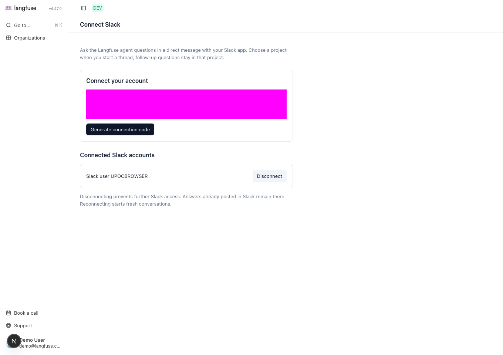

# Halo: individual accounts and project selection

Linked mode lets each Slack user connect their own Langfuse account and choose
among their accessible projects. A question always runs in one project. The
choice belongs to the Slack thread, in a DM or channel, so follow-ups keep the
same context. A new top-level DM message or channel @mention starts a fresh
thread and project selection.

This is an opt-in, single-workspace hackathon implementation. The existing
shared-project channel demo remains the default (`SLACK_AGENT_MODE=shared`).

## Slack app configuration

In [your Slack app settings](https://api.slack.com/apps), open **App Manifest**
and use [manifest.linked.json](./manifest.linked.json). Keep your existing app
name and branding if different. It enables:

- **Socket Mode**, using the existing `xapp-` token with `connections:write`.
- Bot scopes `app_mentions:read`, `chat:write`, `assistant:write`, `im:history`,
  **`channels:history`**, and **`groups:history`**.
- Bot events `app_mention`, `message.im`, **`message.channels`**,
  **`message.groups`**, `app_home_opened`, and `agent_session_stopped`.
- **Interactivity & Shortcuts → On** for the project picker.
- **App Home → Messages tab → Allow users to send messages**.
- The **Agent** feature for Slack's native animated working status and stop button.

Save and **reinstall to the workspace** after adding the channel history scopes
and events, then invite the bot to each channel you want to use. Copy the current
Bot User OAuth Token from **OAuth & Permissions** into your local bot
configuration. Restart the bot after changing tokens. Renaming the app or
channel does not require a code change: routing uses Slack IDs.

Socket Mode carries events and interactive dropdown requests over an outbound
connection. Leave webhook Request URLs and the Options Load URL empty. Slack's
[DM event documentation](https://docs.slack.dev/reference/events/message.im/)
and [external select documentation](https://docs.slack.dev/reference/block-kit/block-elements/select-menu-element/)
describe these requirements.

## Langfuse configuration

Apply this branch's Postgres migration and regenerate the client using the
normal repository commands:

```sh
pnpm run db:generate
pnpm --filter @langfuse/shared run db:deploy
```

Set these values for **Langfuse web**:

```dotenv
LANGFUSE_SLACK_TEAM_ID=T_YOUR_WORKSPACE_ID
LANGFUSE_SLACK_AGENT_SECRET=YOUR_RANDOM_SECRET_AT_LEAST_32_CHARACTERS
```

Generate a random secret locally, for example with `openssl rand -hex 32`.
Give exactly the same secret to the bot. It is an integration credential that
allows the trusted bot to act for accounts explicitly linked in this workspace;
keep it private. It is separate from Slack's bot/app tokens and from project
API keys. The browser never receives it.

Keep the existing in-app agent enabled and configured in web and worker. Each
project needs its normal plan entitlement and organization AI consent. The
linked user must have current `project:read` access. Project API keys and their
project-bound account connections are not used in linked mode.

With the local worktree pool, use an ignored `mise.local.toml` or the supported
slot-local overrides and `lf-wt` restart commands; do not edit generated slot
environment files. `LANGFUSE_BASE_URL` is the API address reachable by the bot.
Set `NEXTAUTH_URL` to the canonical web origin people use to sign in. When that
address differs from the bot's API address, set `LANGFUSE_PUBLIC_URL` on the bot
to the same human-facing origin, including the correct port.

## Bot configuration

Keep the existing Slack tokens in `scripts/slack-agent/.env.local` and set:

```dotenv
SLACK_AGENT_MODE=linked
SLACK_TEAM_ID=T_YOUR_WORKSPACE_ID
LANGFUSE_BASE_URL=http://localhost:3004
LANGFUSE_PUBLIC_URL=https://YOUR_ACCESSIBLE_DEVELOPMENT_HOST
LANGFUSE_SLACK_AGENT_SECRET=THE_SAME_SECRET_AS_LANGFUSE_WEB
```

`LANGFUSE_PUBLIC_URL` is optional and defaults to `LANGFUSE_BASE_URL`. It controls
links people open; API requests still use `LANGFUSE_BASE_URL`. For a laptop-only
demo, both can use the local web URL.

`SLACK_CHANNEL_ID` optionally limits channel use to one channel; DMs remain
available. Omit it to allow channels the bot has joined. `LANGFUSE_PUBLIC_KEY`
and `LANGFUSE_SECRET_KEY` are not required in linked mode. Stop the previous bot
before starting the new one:

```sh
mise exec -- pnpm run slack:agent
```

To keep the existing shared-mode configuration, put the linked-mode settings
in an ignored `scripts/slack-agent/.env.linked.local` overlay instead and run
`mise exec -- pnpm run slack:agent:linked`. Later env files override earlier
ones, so the overlay must include `SLACK_AGENT_MODE=linked`. The existing
`.env.local` continues to hold your Slack tokens and base URL.

Run one bot process per state file. The laptop must stay awake and connected.

## Connect and ask a question

1. Send Halo a question in a DM, or start a channel thread with a top-level
   **@Halo mention**, such as “@Halo Which datasets exist?”. If your account is
   not linked, Halo sends you a private **Connect Langfuse** link. In channels,
   this prompt is visible only to you.
2. Open the link, sign in to the Langfuse account whose projects you want to use,
   and choose **Link my account** in the browser. Check the Slack workspace and
   user shown before confirming. The link expires after ten minutes and works
   once; no connection command needs to be copied into Slack.
3. Send your question again in the same thread. DMs and channels use the same
   searchable project picker. Choose a project; Halo submits the question
   automatically. In channels, the project name and answer are visible to
   everyone who can read the channel.
4. As the person who started the thread, reply there for follow-ups; another
   mention is unnecessary. Messages sent during an active run are queued. The
   selected project stays fixed for that thread. Start a new top-level DM
   message or channel @mention to choose another project. A previous choice is
   a suggestion, never authorization.
5. Return to `/slack-agent` to disconnect. Reconnecting cannot reuse old thread
   history. Answers already posted in Slack remain there.

The connection page after linking a synthetic Slack account (account/workspace
consent details are masked):



Connection links are private bearer credentials; never share them. The older
manual-code flow remains compatible: codes must be sent in a **DM**, never in a
channel. In channel threads, only the owner can select the project or continue the conversation;
other channel members cannot act as that owner. Channel visibility does not
grant Langfuse access, but everyone in the channel can read the posted project
names and answers. Use a channel whose audience may see that project's data.

Slack cannot approve a tool's write request; the adapter cancels runs waiting
for approval. Perform changes through Langfuse's normal in-app approval flow.

## Infrastructure and limits

- **Postgres** stores verified workspace/user/account links, plus the existing
  agent conversations, runs, and event log.
- **Redis** stores expiring browser-link and legacy connection-code hashes and
  runs the existing BullMQ queue. Losing a link requires requesting another;
  it does not lose confirmed connections.
- **The bot's ignored local state file** stores project/thread/owner/link
  bindings, pending questions, and delivery progress. Keep this file private
  and preserve it across restarts. Do not share it between Langfuse instances.
- **The existing worker** executes as the linked Langfuse user. Web checks
  current membership on selection, submission, polling, and cancellation;
  the worker checks permissions again for execution.

This does not add a public OAuth provider, cross-workspace installation flow,
collaborative thread ownership, streamed answer text, or multiple bot
replicas. Before scaling, move bot routing/delivery state to shared storage and
add durable delivery handling. A crash after Slack accepts a reply can still
cause a duplicate reply on recovery.

Slack does not need to reach the laptop. **People do need to reach the Langfuse
web page** to connect their accounts: a localhost URL works for the laptop's
user only. For teammates, run this branch on an accessible development instance
or deliberately expose the web app through an authenticated development tunnel.
Do not point this integration at Langfuse Cloud unless the server-side changes
and configuration have also been deployed there.
