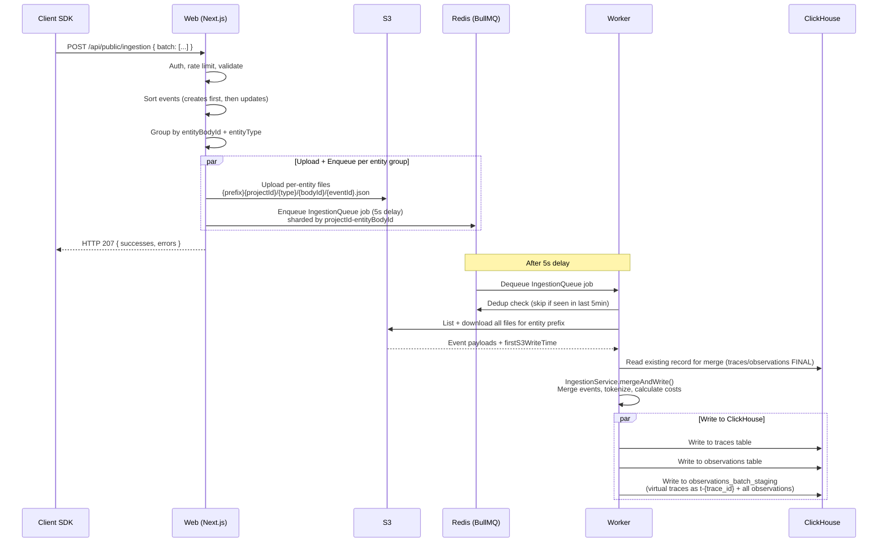
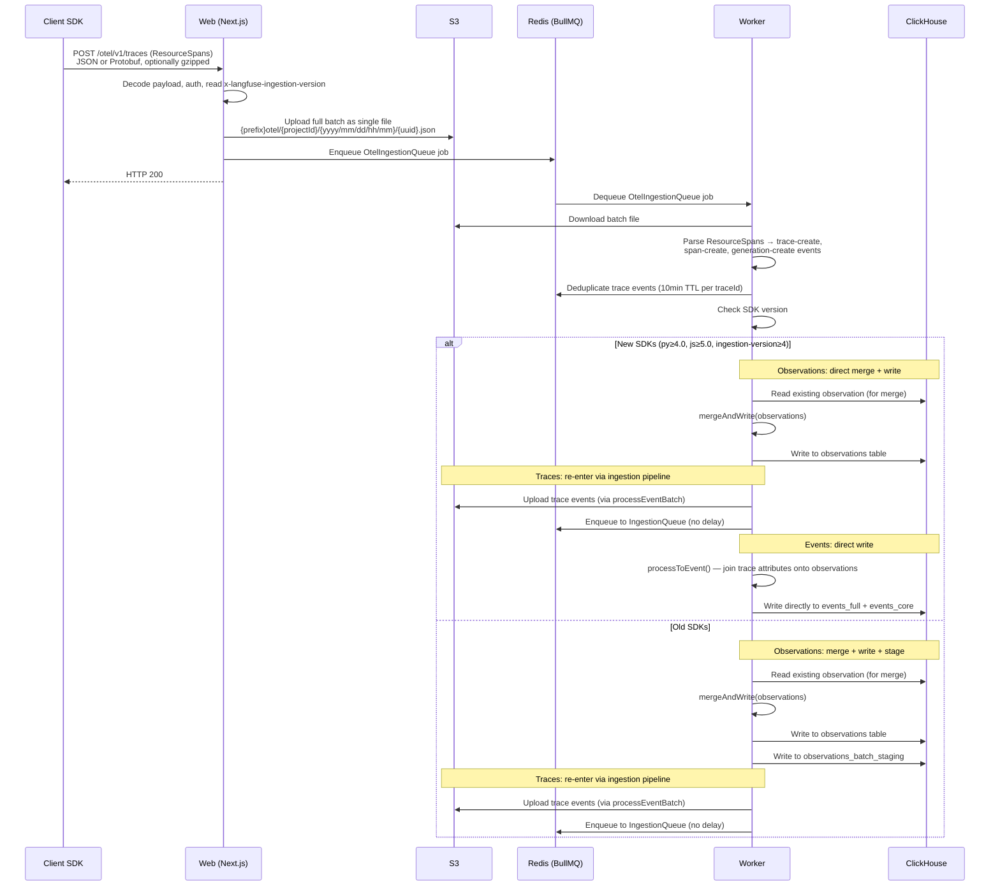
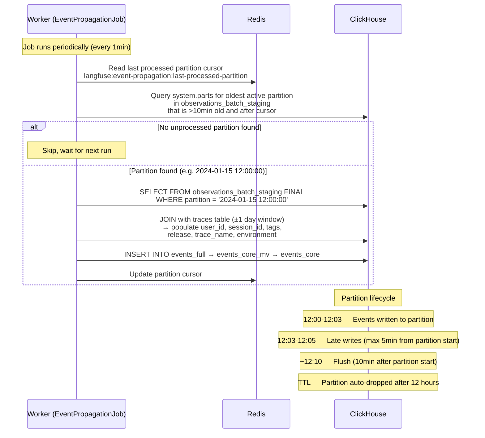
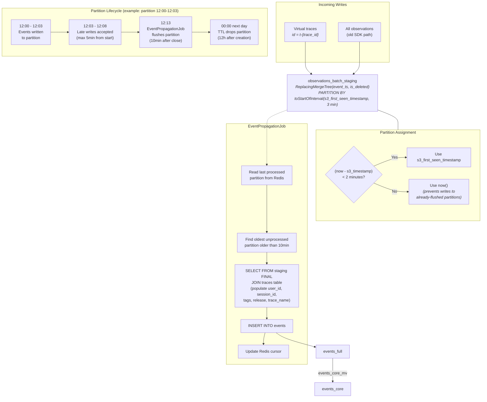
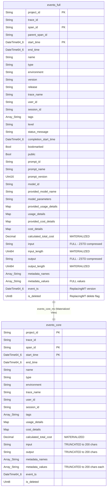

# Ingestion Pipeline Architecture (State: 2026-02-19)

## Sequence Diagram: `/api/public/ingestion`



## Sequence Diagram: `/api/public/otel/v1/traces`



## Sequence Diagram: `observations_batch_staging` Flush



## `observations_batch_staging` Flush Flow



## Data Schema: `events_full`, `events_core`, and Materialized View



```
events_core_mv transformation:
  - input       = leftUTF8(input, 200)
  - output      = leftUTF8(output, 200)
  - metadata_values = arrayMap(v -> leftUTF8(v, 200), metadata_values)
  - All other columns pass through unchanged
```

### Query Patterns

| Query Type | Table Used | Rationale |
|---|---|---|
| List/filter/sort | `events_core` | Smaller rows, faster scans |
| Detail view (full I/O) | `events_full` | Has untruncated input/output |
| Split query | `events_core` + `events_full` | Filter on core, fetch full I/O for matched rows only |

## Limitations

1. **Virtual Root Traces (`t-{trace_id}`)**: Old SDKs don't emit a root span, so the ingestion pipeline creates a synthetic observation with `id = t-{trace_id}` to represent the trace as a span. This preserves trace-level input/output/metadata in the events tables. Once users upgrade to new SDKs (which emit proper root spans), this virtual trace disappears.

2. **Late Trace Updates**: Trace updates arriving after the `observations_batch_staging` partition has been flushed (e.g., a `session_id` set 20+ minutes after ingestion) will NOT be reflected in `events_full` / `events_core`. The flush is a point-in-time JOIN with the traces table, and there is no re-processing mechanism for late-arriving trace metadata.
