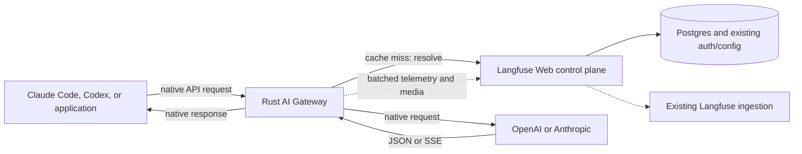

# RFC: Langfuse AI Gateway V1

- Status: Draft
- Linear: [LFE-15204](https://linear.app/clickhouse/issue/LFE-15204/ai-gateway-v1-scope)
- Last updated: 2026-09-01

## Decision

Langfuse will ship a BYOK AI Gateway that lets Claude Code, Codex, and general OpenAI or Anthropic applications use Langfuse as their LLM API base URL. The gateway executes requests with organization-managed LLM credentials, streams the result back to the client, and records usage, cost, latency, and optionally request/response content in Langfuse without client-side hooks.

V1 launches on Langfuse Cloud. The same container and contracts ship for self-hosting as a fast follow.

V1 includes:

- Anthropic Messages, OpenAI Chat Completions, OpenAI Responses, and their native auxiliary endpoints used by Claude Code and Codex.
- OpenAI and Anthropic BYOK connections.
- Native protocol passthrough when the client and upstream protocols match. Incompatible client/upstream protocol pairs are rejected before provider dispatch.
- Gateway virtual keys, deterministic model-to-connection resolution, and automatic Langfuse telemetry.

V1 does not include cross-provider protocol translation, inference resale, multiple routing candidates, fallbacks, gateway retries, rate limits, spend limits, or guardrails.

## Context

Langfuse currently observes coding agents through client-side hooks. This works for individuals but is difficult to deploy and govern across organizations with hundreds of developers. A gateway gives platform teams one centrally managed integration point for tracing, cost attribution, credentials, and future runtime policy.

Cross-provider translation would strengthen that value proposition by letting Codex use Anthropic models or Claude Code use OpenAI models without changing their wire protocol. However, OpenAI Responses and Anthropic Messages are not equivalent contracts. Translation introduces state, tool-lifecycle, streaming, media, and provider-owned artifact semantics whose failures can be silent and agent-breaking. V1 therefore prioritizes reliable native execution and treats translation as a separate interoperability product with its own compatibility contract and release criteria.

## Product Scope

### Public endpoints

| Endpoint | V1 support |
| --- | --- |
| `POST /v1/messages` | Required: Anthropic Messages and Claude Code |
| `POST /v1/messages/count_tokens` | Native Anthropic pass-through; optional to Claude Code |
| `POST /v1/chat/completions` | Required: native OpenAI |
| `POST /v1/responses` | Required: native OpenAI |
| `POST /v1/responses/compact` | Required for native OpenAI/Codex |
| `GET /v1/models` | Required: authenticated gateway-owned catalog |

### Protocol matrix

The requested model deterministically selects one upstream adapter and LLM Connection. V1 only executes matching client and upstream protocols.

| Client protocol | OpenAI upstream | Anthropic upstream |
| --- | --- | --- |
| Anthropic Messages | Not supported | Native passthrough |
| OpenAI Chat Completions | Native passthrough | Not supported |
| OpenAI Responses | Native passthrough | Not supported |

An incompatible model/protocol pair returns a clear client error before provider dispatch. The gateway never silently translates, drops, or approximates provider-specific semantics in V1.

### Model discovery

`GET /v1/models` always returns one OpenAI-compatible list:

```json
{
  "object": "list",
  "data": [
    {
      "id": "claude-sonnet-4-5",
      "object": "model",
      "created": 0,
      "owned_by": "anthropic",
      "display_name": "Claude Sonnet 4.5"
    }
  ]
}
```

The [Claude Code gateway contract](https://code.claude.com/docs/en/llm-gateway-protocol#request-and-response) reads `data[].id` and optional `data[].display_name`, so this shape supports both OpenAI clients and Claude Code without switching response schemas based on a header. It is not full Anthropic Models API compatibility. If that becomes necessary, add an explicit `/anthropic` protocol namespace rather than changing the representation of the root endpoint.

The endpoint requires a Gateway virtual key and returns only models enabled for that key's organization and resolved project policy. The list is generated from Langfuse configuration and never fetched synchronously from an upstream provider. A listed model maps to exactly one upstream adapter and connection, and unlisted models are rejected. This is deterministic destination selection, not routing: there is no candidate set, policy evaluation, or fallback.

Claude Code only discovers IDs containing `claude` or `anthropic`. Because V1 does not translate Messages to OpenAI, the catalog must not make an OpenAI destination appear Messages-compatible by assigning it a Claude-like alias.

## Architecture



The gateway is a separate stateless Rust service built with Axum, Tokio, Hyper/Reqwest, Serde, Bytes, Rustls, and OpenTelemetry. It has no direct Postgres, Redis, ClickHouse, S3, or queue credentials. Langfuse Web remains the authority for authentication, project selection, LLM Connections, and ingestion.

## Control Plane

### Gateway virtual keys

A **Gateway virtual key** is a Langfuse-issued credential accepted only by the gateway. It is named, reveal-once, attributable, expirable, rotatable, revocable, and authorized with an explicit `gateway:invoke` permission preset.

Only organization administrators create Gateway virtual keys in V1. The implementation extends the authorization and key lifecycle planned in the [granular API permissions RFC](https://linear.app/clickhouse/document/rfc-granular-api-permissions-a-unified-authorization-core-for-langfuse-04e83c1c436b); the gateway must not create a parallel permissions system.

Each execution maps to exactly one Langfuse project. Project selection is:

1. A project override fixed when the key is created, if the organization permits it.
2. Otherwise, the organization's current default gateway project.

Clients cannot submit or override a project ID. Changing the organization default affects executions after their cached configuration expires.

### LLM Connections and destinations

LLM Connections become organization-level resources. For V1, an administrator explicitly selects one default connection for each upstream adapter, initially OpenAI and Anthropic. The design must later allow multiple candidates and fallbacks without changing the connection resource, but V1 always resolves one destination.

The model catalog records which adapter owns each model. A request resolves:

```text
Gateway virtual key + ingress protocol + model
  -> organization and project
  -> upstream adapter
  -> one default LLM Connection
  -> native execution
```

Official OpenAI and Anthropic origins are supported first. Custom base URLs require save-time, use-time, connection-time, DNS, and redirect validation plus strict credential stripping. They only enter V1 if that security work is completed for both Cloud and self-hosted deployments.

### Telemetry policy

An organization chooses one gateway telemetry mode:

| Mode | Customer telemetry |
| --- | --- |
| `full` | Input, output, tools, media references, metadata, usage, and cost |
| `metadata` | Model, status, timing, attribution, usage, and cost; no content |
| `none` | No customer request trace or cost record |

`full` is the default. `none` does not disable content-free service health, security, and capacity telemetry. Rate or spend enforcement may later require at least metadata mode.

## Cached Resolution and Internal Authentication

The gateway must not call Web for every inference request. It caches a resolved execution configuration in memory by a fingerprint of the Gateway virtual key, ingress protocol, and model.


### Internal authentication envelope

Gateway-to-Web requests use the standard `Authorization` header so proxies and observability systems are most likely to redact it. The credentials use one deliberately simple, versioned encoding:

```http
Authorization: Langfuse-Gateway <base64url({"v":1,"service":"...","key":"..."})>
```

Telemetry and media submissions replace `key` with the sealed context:

```http
Authorization: Langfuse-Gateway <base64url({"v":1,"service":"...","context":"..."})>
```

The envelope avoids custom authorization-parameter parsing while keeping both credentials in one redacted header. Web validates the shared gateway service token before authenticating the customer key or opening the context. The header must not be logged and is stripped before upstream execution.

`Langfuse-Gateway` distinguishes this private service exchange from ordinary customer `Bearer` authentication. Parsing is one scheme split, one bounded base64url decode, and strict JSON-schema validation. Base64url is encoding, not protection; HTTPS and the two credentials provide the security. Implementations reject oversized envelopes, unsupported versions, unknown or duplicate fields, and invalid combinations. Web, Gateway, and the self-hosting guide must explicitly suppress the full `Authorization` field from logs because arbitrary proxies cannot be assumed to do so.

The shared service token supports current/next rotation and is distributed through Secrets Manager on Cloud or one shared Kubernetes Secret for self-hosting. The internal endpoints are also private at the network layer.

### Execution configuration and sealed context

On a cache miss, Web returns:

- Organization, project, key, and attribution identifiers.
- Ingress and upstream protocols plus the resolved native model.
- One connection ID, official origin, safe headers, and provider credential.
- Telemetry mode.
- A cache hard-expiry timestamp.
- An opaque sealed execution context.

The provider credential exists only in gateway memory and is held in a secret-safe type. The cache key uses a keyed cryptographic digest of the Gateway virtual key and is never logged. The default hard cache TTL is five minutes, matching Langfuse's current API-key cache window. An expired entry is never used; resolution failure without a valid entry fails closed. This makes five minutes the explicit maximum propagation window for revocation or configuration changes in V1.

The sealed context is reusable across all requests using that cached execution configuration. It binds the organization, project, Gateway virtual-key ID, connection, protocols, model, telemetry mode, issued time, and expiry. It intentionally does **not** contain a request ID or provider credential. Each inference request generates its own `gateway_request_id`, returned as `x-langfuse-gateway-request-id` and included in telemetry.

Web seals the context with a Web-only authenticated-encryption key. The gateway treats it as opaque. A longer context lifetime, initially 24 hours, authorizes only delayed telemetry/media delivery; it can never authorize a new inference request or extend the five-minute execution-config cache. There is no grant table, Redis record, refresh flow, or JWKS subsystem.

## Data Plane

### Request lifecycle

1. **Classify and bound:** Select the ingress protocol, normalize the client credential, reject an invalid method/content type or declared oversize body, and read the body once under a hard byte limit.
2. **Authenticate and resolve:** Extract the model, load or refresh the cached execution configuration, and use the catalog's single adapter/connection mapping. No client-controlled origin, connection, or project is accepted.
3. **Protect:** Apply the native protocol's minimal boundary checks plus header and media policy. Reject an incompatible client/upstream protocol pair.
4. **Prepare:** Preserve the native body and apply only the resolved origin, model placement, provider authentication, and safe header adjustments required by the upstream transport.
5. **Execute once:** Replace client authentication with the provider credential and perform one upstream request. Inference POSTs receive zero gateway retries.
6. **Relay and observe:** Stream native response bytes with backpressure and cancellation. Telemetry observes the same stream and never becomes a second consumer.
7. **Finalize:** Enqueue bounded telemetry/media work. Failures after provider dispatch fail open and never corrupt an otherwise healthy client response.

Gateway-generated errors use the client's native error envelope. Provider-native statuses, errors, response bodies, and SSE events are preserved.

### Native protocol handling

Native calls bypass a universal prompt representation. The gateway parses only what resolution, boundary enforcement, and telemetry require; it does not reconstruct provider requests or response events when the semantic protocol already matches.

Native Anthropic execution preserves the evolving, non-credential `anthropic-*` headers and body fields as an open set. Upstream headers are reconstructed: customer/provider credentials, cookies, forwarding and hop-by-hop headers are always removed, and sensitive headers are never followed across origins. The gateway does not fetch prompt-supplied media URLs; it validates inline media type and bytes and passes supported sources to the provider.

Transport adaptation is distinct from cross-provider protocol translation. A future adapter may change authentication, URL/model placement, or event framing while preserving the provider's semantic schema—for example, Anthropic Messages on Bedrock or Vertex. Such an adapter requires its own provider conformance work but does not imply OpenAI-to-Anthropic translation.

### Why translation is excluded from V1

Translation is feasible for a constrained subset, but it is a continuously maintained compatibility product rather than gateway plumbing:

- **Stateful continuation:** Responses can refer only to `previous_response_id` or a stored conversation, while Messages expects complete history. Correct support requires gateway-owned state and reconstruction; LiteLLM has failed second tool turns when those identities diverged ([LiteLLM #26167](https://github.com/BerriAI/litellm/issues/26167)).
- **Agent tool semantics:** Parallel tool calls and results have different grouping, ordering, choice, and terminal rules. Incorrect translation can return a provider `400`, silently enable disabled tools, or end a successful-looking stream before the agent executes its tool ([LiteLLM #23105](https://github.com/BerriAI/litellm/issues/23105), [LiteLLM #32505](https://github.com/BerriAI/litellm/issues/32505), [Bifrost #6123](https://github.com/maximhq/bifrost/issues/6123)).
- **Provider-owned artifacts:** Encrypted reasoning, thinking signatures, hosted tools, file IDs, prompt-cache controls, background execution, and conversation resources do not have lossless cross-provider representations.
- **Streaming and multimodal breadth:** Every request field, response item, nested media location, SSE transition, provider/model capability, and client release expands the conformance matrix. OSS gateways with substantial adapter suites still regress on new server tools and heterogeneous stream items ([Bifrost #4780](https://github.com/maximhq/bifrost/issues/4780), [Bifrost #4713](https://github.com/maximhq/bifrost/issues/4713)).

The dangerous failures are not limited to obvious request rejection. A translated stream can appear successful while losing a tool result, changing a stop reason, enabling a disabled tool, or breaking reasoning continuity. Those failures are difficult to detect from gateway health metrics and directly affect agent correctness and safety.

V1 therefore supports Claude Code with Anthropic destinations and Codex/OpenAI clients with OpenAI-compatible destinations. Codex-to-Claude and Claude-Code-to-OpenAI remain valuable fast-follow use cases, but they require a separate RFC defining one named compatibility profile, explicit rejections, conversation/provider pinning, direct pairwise adapters, translator version telemetry, and real-client multi-turn conformance tests.

This decision is about sequencing, not rejecting interoperability. The likely first post-V1 profile is OpenAI Responses to Anthropic Messages for Codex, limited initially to complete stateless history, text/images, custom function tools/results, and streaming/non-streaming execution. Stateful Responses, hosted tools, provider file IDs, encrypted reasoning translation, and cross-provider fallback after a conversation starts would be rejected.

## Telemetry and Media

The gateway builds one Langfuse generation per provider execution, including project/key attribution, protocol pair, model and connection, timing and time-to-first-token, provider request ID, terminal outcome, usage/cache usage, and cost inputs. Claude Code session and agent headers may be recorded for grouping but are never treated as user identity. Content inclusion follows the resolved telemetry mode and explicit byte bounds.

Telemetry is accumulated into timeout-or-size bounded batches and submitted to a private gateway ingestion endpoint. Web validates the sealed context, derives the project, and reuses the existing S3/queue/OTLP ingestion path. Media uses a corresponding private upload endpoint. The gateway does not receive storage or queue credentials.

V1 does not add a separate ClickHouse gateway-logs table. Langfuse traces/generations remain the customer-facing request record; Datadog metrics and sanitized service logs cover operational health. A separate durable execution ledger should only be introduced when spend enforcement, settlement, or audit guarantees require semantics that best-effort observability cannot provide.

## Deployment and Reliability

### Langfuse Cloud

Deploy `ai-gateway` as an independently scalable Rust ECS/Fargate service in every existing regional environment. Reuse the regional VPC, private subnets, NAT egress, ALB/WAF, Secrets Manager, deployment pipeline, and monitoring foundations while giving the gateway dedicated tasks, target group, security group, IAM roles, and autoscaling.

The public edge uses a gateway hostname and streaming-safe idle/drain settings. Gateway-to-Web resolution, telemetry, and media endpoints are private. Scale primarily on active streams, with CPU, memory, bytes in flight, connection rate, and telemetry-queue pressure as guardrails. Deployments require readiness, graceful draining, a maximum stream duration, and progressive regional rollout.

### Self-hosted fast follow

Ship the same image as an optional first-class Helm component, not a Web sidecar. Enabling the component should automatically create its Deployment and Service, connect it to the in-cluster Web Service, and share a generated or operator-provided gateway service token.

Operators configure only enablement, public ingress/TLS, and optionally an existing Secret. The chart exposes replicas, resources, probes, PDB, topology, graceful termination, and HPA/KEDA settings without requiring direct database, cache, object-store, or queue configuration for the gateway.

## Failure Semantics

- Authentication, expired-cache resolution, destination selection, protocol matching, and boundary validation fail closed before provider dispatch.
- Inference POSTs are never retried by the gateway.
- Provider statuses and errors are passed through unchanged.
- After provider dispatch, telemetry and media failures fail open.
- Capture, batches, and queues are byte- and count-bounded.
- Saturation sheds new work or telemetry according to explicit limits; it never permits unbounded memory growth.

## Delivery Milestones

1. **Contracts and runtime:** Rust service skeleton, internal resolve/cache contract, sealed context, bounded telemetry endpoint, native fixtures, and streaming/load qualification.
2. **Claude Code to Anthropic:** Messages, count tokens, model discovery, native streaming, keys/connections, tracing, cost, and real Claude Code conformance.
3. **OpenAI native:** Chat Completions, Responses, compact, model discovery, OpenAI SDK and Codex conformance.
4. **Cloud qualification:** Dedicated edge configuration, security review, stream-aware autoscaling, graceful deployments, SLOs, and progressive regional rollout.
5. **Self-hosted:** First-class Helm packaging, secret wiring, networking guidance, and the same conformance suite.

These workstreams can proceed mostly independently once the resolve contract, protocol types, terminal outcomes, and telemetry facts are fixed: control-plane keys/permissions, LLM Connections/model catalog, authority/cache endpoints, native protocol adapters, telemetry/media ingestion, Cloud deployment, Helm packaging, and conformance/load testing.

Cross-provider translation is a post-V1 milestone with a separate compatibility RFC and launch gate; it is not on the critical path for the milestones above.

## Launch Gates

- Real Claude Code and Codex sessions, including tools, media, cancellation, long sessions, and model discovery.
- OpenAI and Anthropic TypeScript/Python SDK conformance for native paths.
- Golden native request/response/error fixtures and exact SSE pass-through behavior.
- Strict negative tests for incompatible client protocol and destination combinations.
- Credential/header leak, tenant isolation, revocation-window, SSRF, redirect, and custom-origin tests.
- Long-lived stream, slow-client, disconnect, deployment-drain, Web outage, provider failure, and telemetry saturation tests.
- Measured gateway overhead and capacity on production-like multi-core containers.

## Open Questions

- Are custom public HTTPS LLM Connection base URLs included in V1 after the required transport-security spike, or deferred?
- Are near-native Bedrock Messages and Vertex Messages transport adapters included in V1 after provider conformance, or deferred?

## References

### Native clients and protocols

- [Claude Code LLM gateway protocol](https://code.claude.com/docs/en/llm-gateway-protocol)
- [Anthropic Messages](https://platform.claude.com/docs/en/api/messages/create)
- [Anthropic streaming](https://platform.claude.com/docs/en/build-with-claude/streaming)
- [Anthropic token counting](https://platform.claude.com/docs/en/api/messages/count_tokens)
- [OpenAI Chat Completions](https://developers.openai.com/api/reference/resources/chat/subresources/completions/methods/create)
- [OpenAI Responses](https://developers.openai.com/api/reference/resources/responses/methods/create)
- [OpenAI Responses streaming events](https://developers.openai.com/api/reference/resources/responses/streaming-events)
- [OpenAI Models](https://developers.openai.com/api/reference/resources/models/methods/list)

### Translation decision evidence

- [LiteLLM stateful Responses tool-turn failure](https://github.com/BerriAI/litellm/issues/26167)
- [LiteLLM Responses-to-Vertex tool-result ordering failure](https://github.com/BerriAI/litellm/issues/23105)
- [LiteLLM tool-choice semantic failures](https://github.com/BerriAI/litellm/issues/32505)
- [Bifrost incorrect translated stream termination](https://github.com/maximhq/bifrost/issues/6123)
- [Bifrost missing hosted-tool stream handling](https://github.com/maximhq/bifrost/issues/4780)
- [Bifrost heterogeneous tool stream failure](https://github.com/maximhq/bifrost/issues/4713)

### Deployment and standards

- [Langfuse Kubernetes Helm deployment](https://langfuse.com/self-hosting/deployment/kubernetes-helm)
- [HTTP authentication schemes](https://www.rfc-editor.org/rfc/rfc9110.html#section-11.2)
- [W3C Trace Context](https://www.w3.org/TR/trace-context/)
