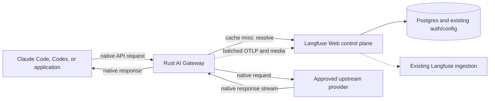
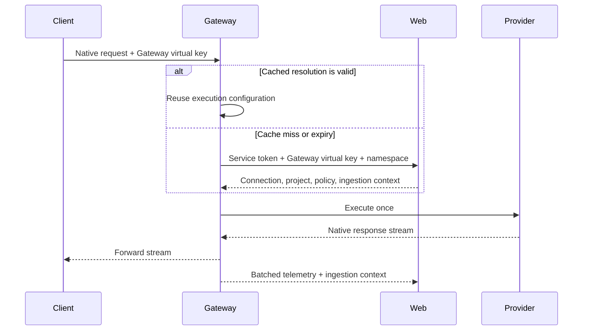

# RFC: Langfuse AI Gateway V1

- Status: Draft
- Last updated: 2026-09-02

## Decision

Langfuse will ship a BYOK AI Gateway that lets Claude Code, Codex, and general OpenAI or Anthropic applications use Langfuse as their LLM API base URL. The gateway executes requests with organization-managed provider credentials, streams native responses back to clients, and records usage, cost, latency, and optionally request and response content without client-side hooks.

V1 launches on Langfuse Cloud and self-hosted at the same time. Both deployment models use the same Rust service and contracts.

V1 includes:

- Native Anthropic Messages, token counting, and model discovery.
- Native OpenAI Chat Completions, Responses, response compaction, and model discovery.
- Organization-owned BYOK connections from an explicit provider registry.
- Gateway virtual keys, deterministic namespace-to-connection resolution, and automatic Langfuse telemetry.

V1 does not include cross-provider translation, arbitrary custom origins, inference resale, routing, fallback, retries, rate limits, spend limits, or guardrails. Bedrock and Vertex support are follow-ups because their authentication and streaming transports are materially different.

## Context

Langfuse currently observes coding agents through client-side hooks. This works for individuals but is difficult to deploy and govern across organizations with hundreds of developers. A gateway gives platform teams one centrally managed integration point for tracing, cost attribution, credentials, and future runtime policy.

Cross-provider translation would strengthen that value proposition, but OpenAI Responses and Anthropic Messages are not equivalent contracts. Translation introduces state, tool-lifecycle, streaming, media, and provider-owned artifact semantics whose failures can be silent and agent-breaking. Langfuse will reconsider it only if measured demand justifies a separate compatibility product and its permanent maintenance burden.

## Product Scope

### Public API namespaces

Clients select a native API namespace as part of their base URL. One organization connection powers every endpoint within that namespace:

| Namespace | V1 endpoints | Selected connection |
| --- | --- | --- |
| `/anthropic/v1` | `POST /messages`, `POST /messages/count_tokens`, `GET /models` | One connection compatible with the complete Anthropic namespace |
| `/openai/v1` | `POST /chat/completions`, `POST /responses`, `POST /responses/compact`, `GET /models` | One connection compatible with the complete OpenAI namespace |

The gateway does not bind individual endpoints independently. Chat Completions, Responses, and model discovery therefore cannot unexpectedly use different credentials, providers, model catalogs, or data regions.

Requests and streams remain provider-native. The gateway preserves unknown fields, forwards the requested model unchanged, and does not normalize calls through a universal prompt schema.

### Controlled provider registry

Gateway connections are created from provider types explicitly supported by Langfuse, initially OpenAI, Anthropic, and OpenRouter. Each provider definition owns its credential fields, official origins, authentication behavior, supported API namespaces, and request construction. Administrators cannot edit these capabilities or enter an arbitrary base URL in V1.

A connection can be selected for a namespace only if its provider definition implements the namespace's complete V1 contract. For example, a provider that supports Chat Completions but not Responses cannot power `/openai/v1`. Langfuse rejects an incompatible configuration before traffic is sent rather than relying on an upstream error for a mismatch it already knows about.

This controlled registry keeps execution, model discovery, credential handling, and security predictable. Additional providers, including Bedrock and Vertex, remain additive registry entries once their native transports pass the same conformance and security gates. Arbitrary origins require a separate secure-fetch boundary and are not part of V1.

### Model discovery

Model discovery uses the same organization connection as inference within its namespace:

```text
/openai/v1/models     -> organization's OpenAI namespace connection
/anthropic/v1/models  -> organization's Anthropic namespace connection
```

The gateway forwards the upstream model response unchanged. Langfuse does not maintain, merge, normalize, or cache a gateway model catalog initially. Model discovery is authenticated and does not create a customer generation.

## Architecture



The gateway is a separate stateless Rust service built for long-lived concurrent streams. It has no direct Postgres, Redis, ClickHouse, S3, or queue credentials. Langfuse Web remains the authority for authentication, project selection, connections, and ingestion.

## Control Plane

### Organization LLM connections

Gateway connections are new organization-owned resources. They are intentionally separate from today's project-owned LLM Connections:

- Gateway credentials are shared infrastructure administered once for the organization.
- Project connections remain private to their current project and continue powering existing playground, evaluation, and other product workflows.
- An optional "import from project connection" flow may copy an existing configuration into a new organization connection, but the two resources are not kept in a live relationship.

An administrator selects at most one default organization connection for each enabled API namespace:

```text
openai     -> one compatible organization connection
anthropic  -> one compatible organization connection
```

The selection contract can later grow to support routing and fallbacks, but V1 always resolves exactly one connection. Project-level connection overrides are not supported in V1.

As a follow-up, Langfuse projects should be able to choose the organization gateway as an execution source for playgrounds, evaluations, and experiments. This lets those features reuse centrally governed credentials without copying them back into project connections.

### Gateway virtual keys and permissions

A **Gateway virtual key** is a Langfuse-issued, reveal-once credential accepted only by the gateway. It can be named, attributed, expired, rotated, and revoked, and it never reaches the upstream provider.

Gateway keys extend Langfuse's common authorization and API-key lifecycle rather than introducing a separate permission system:

- Organization administrators can create service keys.
- A user whose role or group grants `gateway:invoke` can create a user-owned key carrying that permission.
- A key cannot outlive or exceed the creator's effective authorization; removing the permission invalidates future resolutions within the documented cache window.

### Telemetry project selection

Every execution and its telemetry map to exactly one Langfuse project. Clients cannot submit a project ID on inference requests.

Resolution selects the project in this order:

1. Use the key's project override when one was selected at key creation and the organization permits overrides.
2. Otherwise use the organization's current default gateway project.

The creator must have access to an overridden project when the key is created. Changing the organization default reroutes future non-overridden executions after cached configurations expire. The control plane should warn and audit this change because it moves subsequent telemetry; already-issued ingestion contexts retain their original project.

### Telemetry policy

An organization selects one gateway telemetry mode:

| Mode | Customer telemetry |
| --- | --- |
| `usage` | Model, status, timing, attribution, usage, and cost; no request or response content |
| `full` | Usage telemetry plus bounded input, output, tools, and media references |
| `none` | No customer trace or cost record |

`usage` is the default. Full capture requires explicit organization opt-in because coding-agent traffic can contain source code, tool arguments, and secrets. The selected mode is recorded on each observation. `none` does not disable content-free service health, capacity, or security telemetry.

## Resolution and Service Authentication

The gateway must not call Web for every inference request. It caches resolution in memory by a keyed fingerprint of the Gateway virtual key and API namespace for a hard, non-sliding maximum of 60 seconds.



Gateway-to-Web calls use one standard `Authorization` header containing a versioned encoding of both required credentials:

```http
Authorization: Langfuse-Gateway <base64url({"v":1,"service":"...","key":"..."})>
```

Telemetry and media submissions replace `key` with Web's opaque, signed ingestion context. That context binds the organization, selected project, key attribution, connection, namespace, and telemetry mode. It authorizes only OTLP and media writes for a short bounded retry window; it cannot execute inference or select another project. The regular public OTLP and media endpoints validate it and continue through existing ingestion controls.

The shared service token is stored in Secrets Manager on Cloud or a Kubernetes Secret for self-hosting. Rotation uses `current` and `previous`: Web accepts both during rollout, while gateways emit only `current`. HTTPS provides transport protection. Authorization headers, virtual keys, contexts, and provider credentials must be redacted throughout the request path.

An expired cached resolution is never served. Resolution failure without a valid entry fails closed. The execution configuration contains one selected connection and provider credential in addition to trusted project, key, namespace, and telemetry-policy data; the credential remains only in secret-safe gateway memory.

## Data Plane

### Request lifecycle

1. **Classify and bound:** Select the namespace from the path and enforce method, content type, header, body-size, and stream-duration boundaries.
2. **Authenticate and resolve:** Load or refresh the execution configuration. No client-controlled origin, connection, or project is accepted.
3. **Prepare:** Preserve the native body and model unchanged while replacing client authentication with the selected provider authentication.
4. **Execute once:** Send one request to the provider's controlled origin. Inference POSTs receive no gateway retries.
5. **Relay and observe:** Stream native statuses, safe headers, errors, and response bytes with backpressure and cancellation. Telemetry observes the same stream and is never a second consumer.
6. **Finalize:** Enqueue byte- and count-bounded telemetry and media work. Failures after provider dispatch fail open and do not corrupt an otherwise healthy client response.

The upstream provider validates its native schema, model, media formats, and capabilities. Gateway-generated errors use the client's native error envelope.

### Telemetry and media

The gateway creates one Langfuse generation per provider execution. It includes project and key attribution, namespace, model and connection, timings and time to first token, provider request ID, terminal outcome, usage/cache usage, and cost inputs. Content inclusion follows the resolved telemetry mode and explicit byte bounds.

Telemetry is accumulated into timeout-or-size bounded OTLP batches and submitted to Langfuse's regular public OTLP ingestion endpoint. Media uses the regular public media endpoint with the same ingestion context. The gateway does not receive storage or queue credentials.

V1 does not add a separate ClickHouse gateway-logs table. Langfuse generations remain the customer-facing request record; operational metrics and sanitized service logs cover service health. A durable execution ledger should be introduced only when spend enforcement, settlement, or audit guarantees require semantics that best-effort observability cannot provide.

## Deployment and Reliability

### Langfuse Cloud

Deploy `ai-gateway` as an independently scalable Rust ECS/Fargate service in every existing regional environment. It reuses the regional VPC, private subnets, NAT egress, ALB/WAF, Secrets Manager, deployment pipeline, and monitoring foundations while receiving dedicated tasks, target group, security group, IAM role, and autoscaling.

Use a stable gateway hostname from V1. Initially route it through the existing ALB to the gateway target group, while keeping DNS movable if stream behavior, WAF policy, or connection isolation later requires a dedicated load balancer. Scale primarily on active streams with CPU, memory, bytes in flight, connection rate, and telemetry-queue pressure as guardrails.

### Self-hosted

Ship the same image at V1 launch as an optional first-class Helm component rather than a Web sidecar. Enabling it creates its Deployment and Service, connects it to Web, and shares a generated or operator-provided service token. The chart exposes ingress/TLS, replicas, resources, probes, disruption budget, topology, graceful termination, and autoscaling without giving the gateway direct database, cache, object-store, or queue access.

## Failure Semantics

- Authentication, expired-cache resolution, namespace selection, compatibility checks, and boundary validation fail closed before provider dispatch.
- Inference requests are never retried by the gateway.
- Provider statuses and errors pass through unchanged.
- Telemetry and media failures after provider dispatch fail open.
- Captures, batches, and queues are byte- and count-bounded; saturation never permits unbounded memory growth.

## Delivery Milestones

1. **Control plane:** Organization connections and provider registry, namespace defaults, Gateway virtual keys and permissions, project selection, telemetry modes, 60-second resolution, service authentication, and ingestion contexts.
2. **Data plane:** Native OpenAI and Anthropic transports, upstream model discovery, streaming/backpressure/cancellation, bounded OTLP/media publication, and conformance/load testing.
3. **Cloud:** Regional service, stable public edge, secrets, stream-aware autoscaling, graceful draining, observability, SLOs, and progressive rollout.
4. **Self-hosting:** Same release image, first-class Helm component, service-token wiring, ingress/TLS configuration, operations documentation, and the same conformance suite.

The tracks can proceed mostly independently once the resolution response, namespace identifiers, ingestion-context claims, terminal outcomes, and telemetry facts are fixed. V1 launches only when all four tracks are ready.

## Launch Gates

- Real Claude Code and Codex sessions with tools, media, cancellation, long streams, token counting, compaction, and model discovery.
- OpenAI and Anthropic TypeScript/Python SDK conformance for all exposed native endpoints.
- OpenRouter conformance for the complete namespace before it can be selected for that namespace.
- Exact request, response, error, and streaming pass-through fixtures.
- Credential/header leak, tenant-isolation, permission-revocation, and cache-window tests.
- Verification that `Authorization`, `x-api-key`, Gateway virtual keys, ingestion contexts, and provider credentials are redacted from WAF, proxy, application, trace, error, and support output and never forwarded to the wrong boundary.
- Long-lived stream, slow-client, disconnect, deployment-drain, Web outage, provider failure, and telemetry-saturation tests.
- Measured latency, memory, and stream capacity on production-like multi-core containers.

## References

### Native clients and protocols

- [Claude Code LLM gateway protocol](https://code.claude.com/docs/en/llm-gateway-protocol)
- [Anthropic Messages](https://platform.claude.com/docs/en/api/messages/create)
- [Anthropic streaming](https://platform.claude.com/docs/en/build-with-claude/streaming)
- [Anthropic token counting](https://platform.claude.com/docs/en/api/messages/count_tokens)
- [Anthropic Models](https://platform.claude.com/docs/en/api/models/list)
- [OpenAI Chat Completions](https://developers.openai.com/api/reference/resources/chat/subresources/completions/methods/create)
- [OpenAI Responses](https://developers.openai.com/api/reference/resources/responses/methods/create)
- [OpenAI Responses streaming events](https://developers.openai.com/api/reference/resources/responses/streaming-events)
- [OpenAI Models](https://developers.openai.com/api/reference/resources/models/methods/list)

### Provider registries

- [Vercel AI Gateway BYOK](https://vercel.com/docs/ai-gateway/authentication-and-byok/byok)
- [OpenRouter BYOK](https://openrouter.ai/docs/guides/overview/auth/byok)

### Translation decision evidence

- [LiteLLM stateful Responses tool-turn failure](https://github.com/BerriAI/litellm/issues/26167)
- [LiteLLM Responses-to-Vertex tool-result ordering failure](https://github.com/BerriAI/litellm/issues/23105)
- [LiteLLM tool-choice semantic failures](https://github.com/BerriAI/litellm/issues/32505)
- [Bifrost incorrect translated stream termination](https://github.com/maximhq/bifrost/issues/6123)
- [Bifrost missing hosted-tool stream handling](https://github.com/maximhq/bifrost/issues/4780)
- [Bifrost heterogeneous tool stream failure](https://github.com/maximhq/bifrost/issues/4713)

### Deployment and standards

- [Langfuse Kubernetes Helm deployment](https://langfuse.com/self-hosting/deployment/kubernetes-helm)
- [HTTP authentication schemes](https://www.rfc-editor.org/rfc/rfc9110.html#section-11.2)
- [W3C Trace Context](https://www.w3.org/TR/trace-context/)
