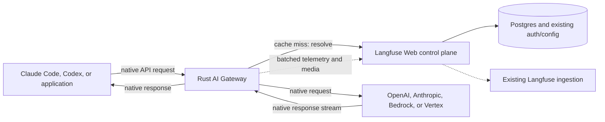
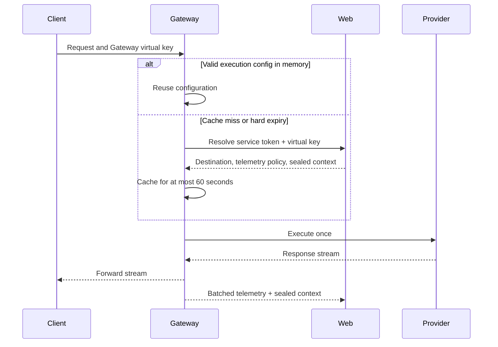

# RFC: Langfuse AI Gateway V1

- Status: Draft
- Linear: [LFE-15204](https://linear.app/clickhouse/issue/LFE-15204/ai-gateway-v1-scope)
- Last updated: 2026-09-01

## Decision

Langfuse will ship a BYOK AI Gateway that lets Claude Code, Codex, and general OpenAI or Anthropic applications use Langfuse as their LLM API base URL. The gateway executes requests with organization-managed LLM credentials, streams the result back to the client, and records usage, cost, latency, and optionally request/response content in Langfuse without client-side hooks.

V1 launches on Langfuse Cloud and self-hosted at the same time. Both deployment models use the same container and contracts.

V1 includes:

- Anthropic Messages, OpenAI Chat Completions, OpenAI Responses, Claude Code's native Bedrock and Vertex protocols, and their required auxiliary endpoints.
- OpenAI, Anthropic, Bedrock, and Vertex BYOK connections.
- Native protocol passthrough when the client and upstream protocols match. Incompatible client/upstream protocol pairs are rejected before provider dispatch.
- Gateway virtual keys, deterministic protocol-to-connection resolution, and automatic Langfuse telemetry.

V1 does not include cross-provider protocol translation, inference resale, multiple routing candidates, fallbacks, gateway retries, rate limits, spend limits, or guardrails.

## Context

Langfuse currently observes coding agents through client-side hooks. This works for individuals but is difficult to deploy and govern across organizations with hundreds of developers. A gateway gives platform teams one centrally managed integration point for tracing, cost attribution, credentials, and future runtime policy.

Cross-provider translation would strengthen that value proposition by letting Codex use Anthropic models or Claude Code use OpenAI models without changing their wire protocol. However, OpenAI Responses and Anthropic Messages are not equivalent contracts. Translation introduces state, tool-lifecycle, streaming, media, and provider-owned artifact semantics whose failures can be silent and agent-breaking. V1 therefore prioritizes reliable native execution. Translation will only be reconsidered if strong measured demand justifies a separate compatibility product and its permanent maintenance burden.

## Product Scope

### Public protocol namespaces

Each native protocol has an explicit namespace. The namespace determines the upstream wire contract and response format without inspecting headers or negotiating a schema.

| Namespace and endpoint family | V1 support |
| --- | --- |
| `POST /anthropic/v1/messages` | Native Anthropic Messages and Claude Code |
| `POST /anthropic/v1/messages/count_tokens` | Native Anthropic token counting |
| `GET /anthropic/v1/models` | Native Anthropic model discovery through the selected connection |
| `POST /openai/v1/chat/completions` | Native OpenAI Chat Completions |
| `POST /openai/v1/responses` | Native OpenAI Responses |
| `POST /openai/v1/responses/compact` | Native OpenAI response compaction for Codex |
| `GET /openai/v1/models` | Native OpenAI model discovery through the selected connection |
| `/bedrock/...` | Claude Code's native Bedrock InvokeModel, streaming, and token-counting paths |
| `/vertex/...` | Claude Code's native Vertex `rawPredict`, streaming, and token-counting paths |

Clients configure the namespace as part of their base URL. The tradeoff is that Langfuse exposes provider-specific base URLs instead of one universal URL; this is acceptable because V1 does not route or translate between protocols, and the namespace makes response/error/model-discovery formats unambiguous. A future unified root API may be added as an alias or separate routing product without breaking these native endpoints.

### Protocol matrix

The protocol namespace deterministically selects one upstream adapter and LLM Connection. V1 only executes matching client and upstream protocols.

| Client protocol | Upstream adapter | Behavior |
| --- | --- | --- |
| Anthropic Messages | Anthropic | Native HTTP/SSE passthrough |
| OpenAI Chat Completions | OpenAI | Native HTTP/SSE passthrough |
| OpenAI Responses | OpenAI | Native HTTP/semantic-event passthrough |
| Claude Code Bedrock | Bedrock | Native InvokeModel HTTP/AWS event-stream passthrough |
| Claude Code Vertex | Vertex | Native `rawPredict` HTTP/SSE passthrough |

An unavailable or incompatible protocol namespace returns a clear client error before provider dispatch. The gateway never silently translates, drops, or approximates provider-specific semantics in V1. Bedrock and Vertex support means accepting Claude Code's native provider protocols; it does not mean translating `/anthropic/v1/messages` into those protocols.

### Model discovery

Model discovery is namespaced and upstream-authoritative:

- `/anthropic/v1/models` forwards to the selected Anthropic connection and returns its native response unchanged.
- `/openai/v1/models` forwards to the selected OpenAI connection and returns its native response unchanged.
- Claude Code does not use model discovery for its native Bedrock or Vertex protocols.

Langfuse does not maintain, merge, normalize, or enforce a gateway model catalog in V1. The selected connection determines which models are available, and the provider remains responsible for accepting or rejecting the request's native model identifier. The discovery path is authenticated and uses the same connection resolution as inference. It is not cached initially; a short response cache may be added later if upstream latency or rate limits require it.

## Architecture



The gateway is a separate stateless Rust service built with Axum, Tokio, Hyper/Reqwest, Serde, Bytes, Rustls, and OpenTelemetry. It has no direct Postgres, Redis, ClickHouse, S3, or queue credentials. Langfuse Web remains the authority for authentication, project selection, LLM Connections, and ingestion.

## Control Plane

### Gateway virtual keys

A **Gateway virtual key** is a Langfuse-issued credential accepted only by the gateway. It is named, reveal-once, attributable, expirable, rotatable, revocable, and authorized with an explicit `gateway:invoke` permission preset.

Only organization administrators create Gateway virtual keys in V1. The implementation extends the authorization and key lifecycle planned in the [granular API permissions RFC](https://linear.app/clickhouse/document/rfc-granular-api-permissions-a-unified-authorization-core-for-langfuse-04e83c1c436b); the gateway must not create a parallel permissions system.

Each execution maps to exactly one Langfuse project. Project selection is:

1. A project override fixed when the key is created, if the organization permits it.
2. Otherwise, the organization's current default gateway project.

Clients cannot submit or override a project ID. Changing the organization default affects executions after their cached configuration expires.

### LLM Connections and destinations

LLM Connections become organization-level resources. For V1, an administrator explicitly selects one default connection for each enabled upstream adapter: OpenAI, Anthropic, Bedrock, and Vertex. The selection contract may later return multiple candidates for routing or fallback, but V1 always resolves exactly one connection.

A request resolves without consulting a model catalog:

```text
Gateway virtual key + protocol namespace
  -> organization and project
  -> one default LLM Connection
  -> native execution with the request's model unchanged
```

Official provider origins and custom LLM Connection base URLs are supported. Custom origins require the Rust equivalent of Langfuse's secure LLM fetch boundary: scheme and URL checks when saved and used, DNS/IP validation when connecting, validation of every redirect, and strict credential/header stripping. Cloud blocks private, loopback, link-local, and metadata destinations. Self-hosters may explicitly allow private destination ranges needed for their own inference infrastructure.

### Telemetry policy

An organization chooses one gateway telemetry mode:

| Mode | Customer telemetry |
| --- | --- |
| `full` | Input, output, tools, media references, metadata, usage, and cost |
| `usage` | Model, status, timing, attribution, usage, and cost; no content |
| `none` | No customer request trace or cost record |

`full` is the default. `none` does not disable content-free service health, security, and capacity telemetry. Rate or spend enforcement may later require at least `usage` mode.

## Cached Resolution and Gateway-to-Web Authentication

The gateway must not call Web for every inference request. It caches a resolved execution configuration in memory by a keyed fingerprint of the Gateway virtual key and protocol namespace.



### Service authentication envelope

Gateway-to-Web requests use the standard `Authorization` header so proxies and observability systems are most likely to redact it. The credentials use one deliberately simple, versioned encoding:

```http
Authorization: Langfuse-Gateway <base64url({"v":1,"service":"...","key":"..."})>
```

Telemetry and media submissions replace `key` with the sealed context:

```http
Authorization: Langfuse-Gateway <base64url({"v":1,"service":"...","context":"..."})>
```

The fields have one meaning at every endpoint:

- `service` is the shared Gateway-to-Web service token.
- `key` is the caller-provided Gateway virtual key used to resolve an execution configuration.
- `context` is Web's sealed execution and ingestion context, used instead of `key` for telemetry and media.

Web validates the shared gateway service token before authenticating the customer key or opening the context. The header must not be logged and is stripped before upstream execution.

`Langfuse-Gateway` distinguishes this service exchange from ordinary customer `Bearer` authentication. Base64url is encoding, not protection; HTTPS and the two credentials provide the security. Web, Gateway, and the self-hosting guide must suppress the full `Authorization` field from logs.

The shared service token supports current/next rotation and is distributed through Secrets Manager on Cloud or one shared Kubernetes Secret for self-hosting. Resolution, telemetry ingestion, and media upload are public authenticated Langfuse endpoints in V1; no private-network connectivity is required.

### Execution configuration and sealed context

On a cache miss, Web returns:

- Organization, project, key, and attribution identifiers.
- Ingress and upstream protocols.
- One connection ID, upstream origin, safe headers, and provider credential.
- Telemetry mode.
- A cache hard-expiry timestamp.
- An opaque sealed execution context.

The provider credential exists only in gateway memory and is held in a secret-safe type. The cache key uses a keyed cryptographic digest of the Gateway virtual key and is never logged. The hard cache TTL is at most 60 seconds and is not sliding. An expired entry is never used; resolution failure without a valid entry fails closed. This makes 60 seconds the explicit maximum propagation window for revocation or configuration changes in V1. The control plane may cache underlying data longer because it has explicit invalidation; the gateway does not.

The sealed context is reusable across all requests using that cached execution configuration. It contains a version, organization ID, project ID, Gateway virtual-key ID and attribution, selected connection ID, ingress/upstream protocols and adapter, telemetry mode, issued time, and expiry. It intentionally does **not** contain a request ID, model, or provider credential. Each inference request generates its own `gateway_request_id`, returned as `x-langfuse-gateway-request-id` and included in telemetry.

Web seals the context with a Web-only authenticated-encryption key. The gateway treats it as opaque. A longer context lifetime, initially 24 hours, authorizes only delayed telemetry/media delivery; it can never authorize a new inference request or extend the 60-second execution-config cache. There is no grant table, Redis record, refresh flow, or JWKS subsystem.

## Data Plane

### Request lifecycle

1. **Classify and bound:** Select the ingress protocol from the namespace, normalize the client credential, reject an invalid method/content type or declared oversize body, and stream or read the body under a hard byte limit.
2. **Authenticate and resolve:** Load or refresh the cached execution configuration for the key and protocol namespace. No client-controlled origin, connection, or project is accepted.
3. **Protect:** Enforce gateway-owned limits, header policy, protocol/connection compatibility, and custom-origin security. The upstream provider validates its native schema, model, media formats, and capabilities.
4. **Prepare:** Preserve the native body and model identifier unchanged. Apply only the resolved origin, provider authentication, and safe header adjustments. Native Bedrock and Vertex transports place the unchanged model in their provider-required path.
5. **Execute once:** Replace client authentication with the provider credential and perform one upstream request. Inference POSTs receive zero gateway retries.
6. **Relay and observe:** Stream native response bytes with backpressure and cancellation. Telemetry observes the same stream and never becomes a second consumer.
7. **Finalize:** Enqueue bounded telemetry/media work. Failures after provider dispatch fail open and never corrupt an otherwise healthy client response.

Gateway-generated errors use the client's native error envelope. Provider-native statuses, errors, response bodies, and SSE events are preserved.

### Native protocol handling

Native calls bypass a universal prompt representation. The gateway parses only what resolution, boundary enforcement, and telemetry require; it does not reconstruct provider requests or response events when the semantic protocol already matches.

Native Anthropic execution preserves the evolving, non-credential `anthropic-*` headers and body fields as an open set. Upstream headers are reconstructed: customer/provider credentials, cookies, forwarding and hop-by-hop headers are always removed, and sensitive headers are never followed across origins. The gateway does not fetch prompt-supplied media URLs. Inline media remains part of the native body, and the provider validates its type and contents.

Transport adaptation is distinct from cross-provider protocol translation. The Bedrock and Vertex adapters accept Claude Code's native provider request paths and framing, change authentication and safe transport details as required, and preserve the provider's semantic schema. They do not accept the Anthropic namespace and convert it to another provider protocol.

### Why translation is excluded from V1

Translation is feasible for a constrained subset, but it is a continuously maintained compatibility product rather than gateway plumbing:

- **Stateful continuation:** Responses can refer only to `previous_response_id` or a stored conversation, while Messages expects complete history. Correct support requires gateway-owned state and reconstruction; LiteLLM has failed second tool turns when those identities diverged ([LiteLLM #26167](https://github.com/BerriAI/litellm/issues/26167)).
- **Agent tool semantics:** Parallel tool calls and results have different grouping, ordering, choice, and terminal rules. Incorrect translation can return a provider `400`, silently enable disabled tools, or end a successful-looking stream before the agent executes its tool ([LiteLLM #23105](https://github.com/BerriAI/litellm/issues/23105), [LiteLLM #32505](https://github.com/BerriAI/litellm/issues/32505), [Bifrost #6123](https://github.com/maximhq/bifrost/issues/6123)).
- **Provider-owned artifacts:** Encrypted reasoning, thinking signatures, hosted tools, file IDs, prompt-cache controls, background execution, and conversation resources do not have lossless cross-provider representations.
- **Streaming and multimodal breadth:** Every request field, response item, nested media location, SSE transition, provider/model capability, and client release expands the conformance matrix. OSS gateways with substantial adapter suites still regress on new server tools and heterogeneous stream items ([Bifrost #4780](https://github.com/maximhq/bifrost/issues/4780), [Bifrost #4713](https://github.com/maximhq/bifrost/issues/4713)).

The dangerous failures are not limited to obvious request rejection. A translated stream can appear successful while losing a tool result, changing a stop reason, enabling a disabled tool, or breaking reasoning continuity. Those failures are difficult to detect from gateway health metrics and directly affect agent correctness and safety.

V1 therefore supports each client through its native provider protocol and does not schedule cross-provider translation as a fast follow. Langfuse will reconsider translation only if strong measured user demand justifies the permanent compatibility maintenance and scope expansion. Any translation work requires a separate RFC with an explicit compatibility profile, rejection rules, translator-version telemetry, and real-client multi-turn conformance tests.

## Telemetry and Media

The gateway builds one Langfuse generation per provider execution, including project/key attribution, protocol pair, model and connection, timing and time-to-first-token, provider request ID, terminal outcome, usage/cache usage, and cost inputs. Claude Code session and agent headers may be recorded for grouping but are never treated as user identity. Content inclusion follows the resolved telemetry mode and explicit byte bounds.

Telemetry is accumulated into timeout-or-size bounded OTLP batches and submitted to Langfuse's regular public OTLP ingestion endpoint. That endpoint validates the sealed context, derives the project and attribution, and reuses the existing ingestion path. Media uses the regular public media upload endpoint with the same context. The gateway does not receive storage or queue credentials.

V1 does not add a separate ClickHouse gateway-logs table. Langfuse traces/generations remain the customer-facing request record; Datadog metrics and sanitized service logs cover operational health. A separate durable execution ledger should only be introduced when spend enforcement, settlement, or audit guarantees require semantics that best-effort observability cannot provide.

## Deployment and Reliability

### Langfuse Cloud

Deploy `ai-gateway` as an independently scalable Rust ECS/Fargate service in every existing regional environment. Reuse the regional VPC, private subnets, NAT egress, ALB/WAF, Secrets Manager, deployment pipeline, and monitoring foundations while giving the gateway dedicated tasks, target group, security group, IAM roles, and autoscaling.

The public edge uses a gateway hostname and streaming-safe idle/drain settings. Gateway-to-Web resolution, telemetry, and media use public authenticated Web endpoints; private routing may be added later as transparent defense-in-depth. Scale primarily on active streams, with CPU, memory, bytes in flight, connection rate, and telemetry-queue pressure as guardrails. Deployments require readiness, graceful draining, a maximum stream duration, and progressive regional rollout.

### Self-hosted

Ship the same image at V1 launch as an optional first-class Helm component, not a Web sidecar. Enabling the component should automatically create its Deployment and Service, connect it to Web, and share a generated or operator-provided gateway service token.

Operators configure only enablement, public ingress/TLS, and optionally an existing Secret. The chart exposes replicas, resources, probes, PDB, topology, graceful termination, and HPA/KEDA settings without requiring direct database, cache, object-store, or queue configuration for the gateway.

## Failure Semantics

- Authentication, expired-cache resolution, destination selection, protocol matching, and boundary validation fail closed before provider dispatch.
- Inference POSTs are never retried by the gateway.
- Provider statuses and errors are passed through unchanged.
- After provider dispatch, telemetry and media failures fail open.
- Capture, batches, and queues are byte- and count-bounded.
- Saturation sheds new work or telemetry according to explicit limits; it never permits unbounded memory growth.

## Delivery Milestones

1. **Control-plane readiness:** Gateway virtual keys and permissions, project selection, organization-level LLM Connections, one explicit default connection per protocol namespace, the 60-second resolution contract, shared service authentication, and sealed execution contexts.
2. **Data-plane readiness:** Rust gateway, native OpenAI/Anthropic/Bedrock/Vertex transports, upstream model discovery, secure custom origins, streaming/backpressure/cancellation, bounded OTLP/media publication, and protocol conformance/load tests.
3. **Cloud readiness:** Regional ECS/Fargate service, public ALB/WAF edge, Secrets Manager wiring, stream-aware autoscaling, graceful draining, observability, SLOs, and progressive rollout.
4. **Self-hosted readiness:** The same release image, first-class Helm component, service-token wiring, ingress/TLS configuration, custom-origin controls, operational documentation, and the same conformance suite.

These tracks can proceed mostly independently once the resolution response, protocol identifiers, sealed-context contents, terminal outcomes, and telemetry facts are fixed. V1 launches only when all four tracks are ready.

## Launch Gates

- Real Claude Code and Codex sessions, including tools, media, cancellation, long sessions, and applicable model discovery.
- OpenAI and Anthropic TypeScript/Python SDK conformance for native paths, plus Claude Code conformance for Anthropic, Bedrock, and Vertex.
- Golden native request/response/error fixtures and exact SSE pass-through behavior.
- Strict negative tests for incompatible protocol namespaces and connection combinations.
- Credential/header leak, tenant isolation, revocation-window, SSRF, redirect, and custom-origin tests.
- Long-lived stream, slow-client, disconnect, deployment-drain, Web outage, provider failure, and telemetry saturation tests.
- Measured gateway overhead and capacity on production-like multi-core containers.

## References

### Native clients and protocols

- [Claude Code LLM gateway protocol](https://code.claude.com/docs/en/llm-gateway-protocol)
- [Anthropic Messages](https://platform.claude.com/docs/en/api/messages/create)
- [Anthropic streaming](https://platform.claude.com/docs/en/build-with-claude/streaming)
- [Anthropic token counting](https://platform.claude.com/docs/en/api/messages/count_tokens)
- [Anthropic Models](https://platform.claude.com/docs/en/api/models/list)
- [OpenAI Chat Completions](https://developers.openai.com/api/reference/resources/chat/subresources/completions/methods/create)
- [OpenAI Responses](https://developers.openai.com/api/reference/resources/responses/methods/create)
- [OpenAI Responses streaming events](https://developers.openai.com/api/reference/resources/responses/streaming-events)
- [OpenAI Models](https://developers.openai.com/api/reference/resources/models/methods/list)

### Translation decision evidence

- [LiteLLM stateful Responses tool-turn failure](https://github.com/BerriAI/litellm/issues/26167)
- [LiteLLM Responses-to-Vertex tool-result ordering failure](https://github.com/BerriAI/litellm/issues/23105)
- [LiteLLM tool-choice semantic failures](https://github.com/BerriAI/litellm/issues/32505)
- [Bifrost incorrect translated stream termination](https://github.com/maximhq/bifrost/issues/6123)
- [Bifrost missing hosted-tool stream handling](https://github.com/maximhq/bifrost/issues/4780)
- [Bifrost heterogeneous tool stream failure](https://github.com/maximhq/bifrost/issues/4713)

### Deployment and standards

- [Langfuse Kubernetes Helm deployment](https://langfuse.com/self-hosting/deployment/kubernetes-helm)
- [HTTP authentication schemes](https://www.rfc-editor.org/rfc/rfc9110.html#section-11.2)
- [W3C Trace Context](https://www.w3.org/TR/trace-context/)
