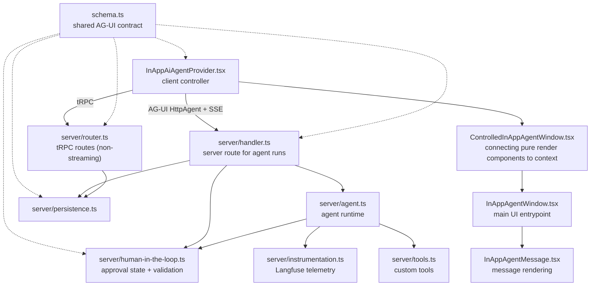

# In-App Agent

The in-app agent is Langfuse's project-scoped foreground assistant inside the authenticated product UI.

## Core Model

AG-UI is the durable contract for live streaming, persistence, replay, and rendering.

The browser owns interaction state and submits intent. The server owns authorization, run/message IDs, request sanitization, MCP credentials, runtime configuration, tool access, persistence, and replay.

Runs are foreground-only. A conversation can have one active run; stale unfinished runs are closed before a new run starts.

## Major Files

- `schema.ts`: runtime-neutral AG-UI schemas and types shared by browser, server, persistence, replay, and rendering, including Langfuse-owned human-in-the-loop wire contracts.
- `server/handler.ts`: streaming route and authority boundary for auth, request sanitization, run creation, MCP credentials, and terminal state.
- `server/agent.ts`: Mastra/Bedrock/MCP runtime setup, custom tool wiring, human-in-the-loop approval gates, AG-UI event normalization, and cleanup.
- `server/human-in-the-loop.ts`: interrupt parsing helpers, pending tool approval Redis state, and resume approval validation/consumption.
- `server/tools.ts`: custom agent tools with strict schemas and scoped, user-visible behavior.
- `server/persistence.ts`: conversations, runs, events, replay, active-run locking, and stale-run recovery.
- `server/router.ts`: non-streaming tRPC routes for conversation lists, replay, and feedback.
- `server/instrumentation.ts`: optional Langfuse tracing for agent runs, prompts, events, and errors.
- `constants.ts`: stable names shared across prompts, tools, persistence, and rendering.
- `components/*`: client controller and prop-driven render components.

## File Relationships

## Run Lifecycle

1. Browser sends the latest message, conversation state, and screen context through `HttpAgent`.
2. `server/handler.ts` validates the request and creates a server-owned run.
3. `server/handler.ts` creates a temporary in-app-agent MCP API key and a per-run MCP secret.
4. `server/agent.ts` connects Mastra to Langfuse MCP with the temporary API key and sends the run secret in `x-langfuse-in-app-agent-run-secret`.
5. `server/agent.ts` streams normalized AG-UI events and calls telemetry hooks.
6. `server/instrumentation.ts` records prompt metadata, stream events, completion, aborts, and errors.
7. `server/persistence.ts` stores compacted events and reconstructs replay messages.
8. `InAppAiAgentProvider.tsx` renders live AG-UI state and hydrates selected conversations through `server/router.ts`.

## MCP Tool Authorization

The in-app agent uses two credentials when calling Langfuse MCP:

- A temporary project-scoped API key marked as an in-app-agent key.
- A server-generated run secret sent with `x-langfuse-in-app-agent-run-secret`.

The API key authenticates the request and scopes it to the project. The run secret proves that a mutating MCP call came from the active server-created agent run, not from a copied or replayed in-app-agent key. The secret is stored in Redis with the same short TTL as pending tool approvals and is deleted when the temporary API key is cleaned up.

MCP registry behavior:

- Normal project API keys can call all enabled MCP tools.
- In-app-agent keys can call read-only tools directly when the tool has `readOnlyHint: true`.
- In-app-agent keys need the valid run secret to call non-read-only tools.

Human approval is separate from the MCP run secret. `server/agent.ts` classifies every Langfuse MCP tool in `IN_APP_AGENT_LANGFUSE_MCP_TOOL_APPROVALS`, using unprefixed MCP registry names and either `"auto"` or `"approval"`. The map is keyed by a type-only `McpToolName` union derived from the MCP feature modules, and tests compare this map against `toolRegistry`, so adding a Langfuse MCP tool requires an explicit in-app agent approval classification without exporting MCP feature modules into production in-app-agent code.

`IN_APP_AGENT_AUTO_APPROVED_TOOL_NAMES` is generated from that map by prefixing Langfuse MCP tools with `langfuse_` and adding local tools such as `IN_APP_AGENT_REDIRECT_TOOL_NAME`; docs MCP tools are auto-approved by the `langfuseDocs_` prefix. `server/agent.ts` marks every other tool with Mastra `requireApproval: true`. Mastra emits an interrupt, the browser asks the user, and resumed approvals are validated by `server/handler.ts` against the pending approval stored in Redis. `server/human-in-the-loop.ts` adapts Mastra's runtime interrupt payload into the Langfuse-owned `tool_approval_request` contract from `schema.ts`; the browser stores and forwards only that runtime-neutral shape. `server/human-in-the-loop.ts` consumes the pending approval, executes approved tool calls at the adapter boundary, and injects synthetic AG-UI tool-call events/messages before the agent continues. The Redis-only pending approval schema stays server-local, stores the tool call identity and a stable argument fingerprint, then is consumed once the resumed stream initializes successfully.

## Change Rules

- Check AG-UI docs at `https://docs.ag-ui.com/llms.txt` before changing event semantics, ordering, stream handling, compaction, tools, state, or `HttpAgent` integration.
- Keep persisted schemas backward-compatible unless there is an explicit migration.
- Keep presentational components prop-driven; connect tRPC, streaming, and persistence at provider/router/handler boundaries.
