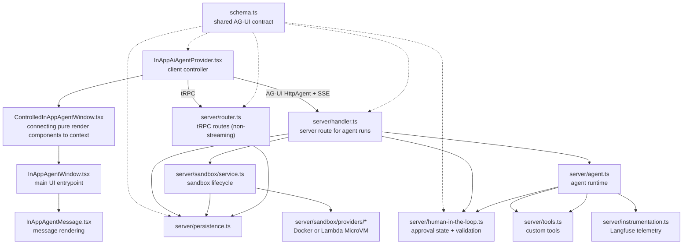

# In-App Agent

The in-app agent is Langfuse's project-scoped foreground assistant inside the authenticated product UI.

## Core Model

AG-UI is the durable contract for live streaming, persistence, replay, and rendering.

The browser owns interaction state and submits intent. The server owns authorization, run/message IDs, request sanitization, MCP credentials, runtime configuration, tool access, persistence, and replay.

Runs are foreground-only. A conversation can have one active run; stale unfinished runs are closed before a new run starts.

## Major Files

- `schema.ts`: runtime-neutral AG-UI schemas and types shared by browser, server, persistence, replay, and rendering, including Langfuse-owned human-in-the-loop wire contracts.
- `server/handler.ts`: streaming route and authority boundary for auth, request sanitization, run creation, MCP credentials, and terminal state.
- `server/agent.ts`: Mastra/Bedrock/MCP runtime setup, custom tool wiring, human-in-the-loop approval gates, AG-UI event normalization, and cleanup.
- `server/human-in-the-loop.ts`: interrupt parsing helpers, pending tool approval persistence, and resume approval validation/consumption.
- `server/tools.ts`: custom agent tools with strict schemas and scoped, user-visible behavior.
- `server/persistence.ts`: conversations, runs, events, replay, active-run locking, and stale-run recovery.
- `server/router.ts`: non-streaming tRPC routes for conversation lists, replay, and feedback.
- `server/instrumentation.ts`: optional Langfuse tracing for agent runs, prompts, events, and errors.
- `server/sandbox/config.ts`: sandbox provider selection and runtime configuration.
- `server/sandbox/service.ts`: conversation-scoped sandbox session reuse, readonly file sync, and turn-end suspension.
- `server/sandbox/providers/*`: provider adapters for local Docker and Lambda MicroVM sandboxes.
- `server/sandbox/types.ts`: runtime-neutral sandbox interface used by tools/agent.
- `constants.ts`: stable names shared across prompts, tools, persistence, and rendering.
- `components/*`: client controller and prop-driven render components.

Outside this feature folder, `packages/in-app-agent-sandbox-runtime/src/*` provides the shared sandbox runtime and contract types used by both the local Docker provider and the Lambda MicroVM image.

## File Relationships

## Run Lifecycle

1. Browser sends the latest message, conversation state, and screen context through `HttpAgent`.
2. `server/handler.ts` validates the request and creates a server-owned run.
3. `server/handler.ts` loads conversation history and creates or resumes a conversation-scoped sandbox when a provider is enabled.
4. `server/persistence.ts` rebuilds readonly `tool_calls/*.json` files from prior non-sandbox tool calls, and `server/sandbox/service.ts` syncs them into the sandbox before each tool use.
5. `server/handler.ts` creates a temporary in-app-agent MCP API key and passes the signed-in user's project role/admin state plus optional sandbox access into the agent runtime.
6. `server/agent.ts` filters Langfuse MCP tools through RBAC, exposes sandbox tools (`read`, `write`, `edit`, `bash`) when available, and for approved Langfuse MCP resumes adds a tool-scoped override payload.
7. `server/agent.ts` connects Mastra to Langfuse MCP with the temporary API key and sends the override in `x-langfuse-in-app-agent-tool-override` when a single approved mutating MCP tool may run.
8. `server/agent.ts` streams normalized AG-UI events, calls telemetry hooks, and lets the request `onFinish` cleanup persist/suspend the sandbox at turn end.
9. `server/instrumentation.ts` records prompt metadata, stream events, completion, aborts, and errors.
10. `server/persistence.ts` stores compacted events and reconstructs replay messages.
11. `InAppAiAgentProvider.tsx` renders live AG-UI state and hydrates selected conversations through `server/router.ts`.

## Sandbox Runtime

`server/sandbox/service.ts` gives the agent a conversation-scoped sandbox interface with `read`, `write`, and `edit` plus a separate turn-end callback. It reuses an existing provider session when the stored provider/session/TTL still match, otherwise it boots a fresh session and persists the new state on the conversation.

Both sandbox providers target the same runtime contract from `packages/in-app-agent-sandbox-runtime`.

- The local `dangerous-docker` provider starts a container from that package's Docker image and calls the runtime over `http://127.0.0.1:5000` using `docker exec`.
- The Lambda MicroVM provider starts a MicroVM image built from the same package and calls the runtime through the AWS-assigned HTTPS endpoint plus `X-aws-proxy-auth`.
- Providers own runtime session lifecycle only: create/resume/suspend/terminate plus proxying sandbox operations.

Provider contract:

- `ensureSession({ conversationId, sessionId? })`
- `syncReadonlyFiles({ sessionId, files })`
- `read`, `write`, `edit`, `bash`
- optional `suspendSession({ sessionId })`

Runtime HTTP surface:

- `GET /health`
- `POST /sandbox`

`POST /sandbox` is the narrow control surface for the current tool set: `read`, `write`, `edit`, and `bash`. Before each request, the provider rebuilds `tool_calls/` from persisted non-sandbox tool calls so the runtime always sees the same readonly context regardless of provider.

## Sandbox Persistence And Cleanup

Sandbox state is stored on the conversation row as `providerSessionId`. The configured sandbox provider is assumed to remain stable for the lifetime of the database.

Session reuse only relies on an existing live or suspended runtime instance identified by `providerSessionId`.

`server/router.ts` clears sandbox state before soft-deleting a conversation.

`dangerous-docker` is development-only. Worker data-retention cleanup only tears down `lambda-microvm` sandboxes; local Docker sandbox cleanup stays in the web process where that provider is used.

## MCP Tool Authorization

The in-app agent uses two request-scoped inputs when calling Langfuse MCP:

- A temporary project-scoped API key marked as an in-app-agent key.
- An optional server-generated tool override sent with `x-langfuse-in-app-agent-tool-override`.

The API key authenticates the request and scopes it to the project. Without an override, in-app-agent keys are restricted to MCP tools annotated with `readOnlyHint: true`. When the user approves a single Langfuse MCP tool call, `server/handler.ts` creates a JSON override naming that one unprefixed MCP registry tool and passes it to the MCP route through the request header above.

MCP registry behavior:

- Normal project API keys can call all enabled MCP tools.
- In-app-agent keys can call read-only tools directly when the tool has `readOnlyHint: true`.
- In-app-agent keys need a valid tool override to call one non-read-only Langfuse MCP tool.

RBAC is the first gate for Langfuse MCP tools. Before a tool is exposed to the model, `server/tools.ts` checks the signed-in user's `projectRole` and `isAdmin` against the tool's required `ProjectScope` with `hasProjectAccess()`. That means the assistant never sees tools the user could not use manually in the product UI or APIs. Human approval is a second gate on top of RBAC for tools classified as `"approval"`: approval can allow one execution of a tool the user already has access to, but it does not widen the user's project permissions.

Human approval is separate from the MCP tool override. `server/agent.ts` classifies every Langfuse MCP tool in `IN_APP_AGENT_LANGFUSE_MCP_TOOL_APPROVALS`, using unprefixed MCP registry names and either `"auto"` or `"approval"`. The map is keyed by a type-only `McpToolName` union derived from the MCP feature modules, and tests compare this map against `toolRegistry`, so adding a Langfuse MCP tool requires an explicit in-app agent approval classification without exporting MCP feature modules into production in-app-agent code.

`IN_APP_AGENT_AUTO_APPROVED_TOOL_NAMES` is generated from that map by prefixing Langfuse MCP tools with `langfuse_` and adding local tools such as `IN_APP_AGENT_REDIRECT_TOOL_NAME`; docs MCP tools are auto-approved by the `langfuseDocs_` prefix. `server/agent.ts` marks every other tool with Mastra `requireApproval: true`. Mastra emits an interrupt, the browser asks the user, and resumed approvals are validated by `server/handler.ts` against the pending approval row persisted in Postgres. `server/human-in-the-loop.ts` adapts Mastra's runtime interrupt payload into the Langfuse-owned `tool_approval_request` contract from `schema.ts`; the browser stores and forwards only that runtime-neutral shape. `server/human-in-the-loop.ts` consumes the pending approval, executes approved tool calls at the adapter boundary, and injects synthetic AG-UI tool-call events/messages before the agent continues. The pending approval row stays server-local, stores the tool call identity and a stable argument fingerprint, and expires after a short TTL.

Sandbox tools are separate from MCP authorization. When a sandbox provider is enabled, `server/tools.ts` adds local `read`, `write`, `edit`, and `bash` tools backed by the sandbox provider contract rather than the MCP registry.

## Change Rules

- Check AG-UI docs at `https://docs.ag-ui.com/llms.txt` before changing event semantics, ordering, stream handling, compaction, tools, state, or `HttpAgent` integration.
- Keep persisted schemas backward-compatible unless there is an explicit migration.
- Keep sandbox conversation state backward-compatible unless there is an explicit migration or cleanup plan.
- Keep presentational components prop-driven; connect tRPC, streaming, and persistence at provider/router/handler boundaries.
