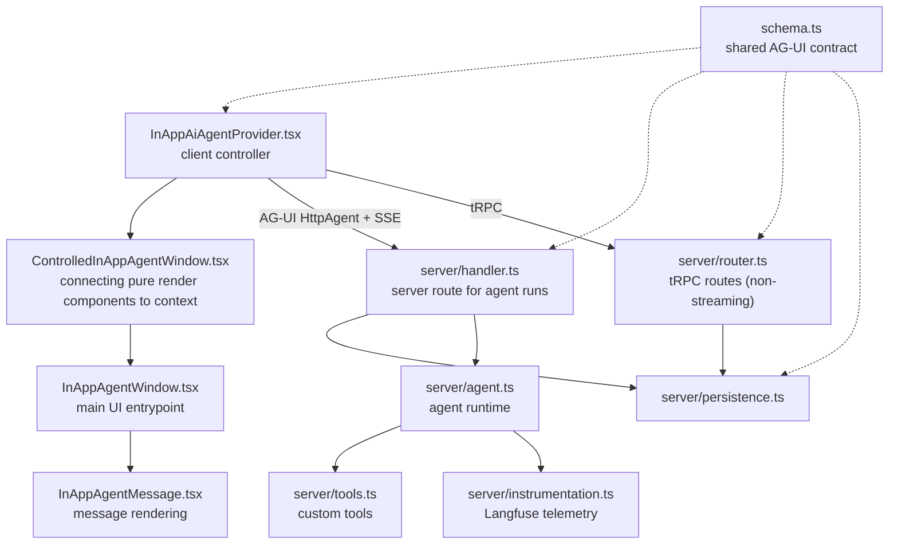

# In-App Agent

The in-app agent is Langfuse's project-scoped foreground assistant inside the authenticated product UI.

## Core Model

AG-UI is the durable contract for live streaming, persistence, replay, and rendering.

The browser owns interaction state and submits intent. The server owns authorization, run/message IDs, request sanitization, MCP credentials, runtime configuration, tool access, persistence, and replay.

Runs are foreground-only. A conversation can have one active run; stale unfinished runs are closed before a new run starts.

## Major Files

- `schema.ts`: runtime-neutral AG-UI schemas and types shared by browser, server, persistence, replay, and rendering.
- `server/handler.ts`: streaming route and authority boundary for auth, request sanitization, run creation, MCP credentials, and terminal state.
- `server/agent.ts`: Mastra/Bedrock/MCP runtime setup, custom tool wiring, AG-UI event normalization, and cleanup.
- `server/tools.ts`: custom agent tools with strict schemas and scoped, user-visible behavior.
- `server/persistence.ts`: conversations, runs, events, replay, active-run locking, and stale-run recovery.
- `server/router.ts`: non-streaming tRPC routes for conversation lists, replay, and feedback.
- `server/instrumentation.ts`: optional Langfuse tracing for agent runs, prompts, events, and errors.
- `constants.ts`: stable names shared across prompts, tools, persistence, and rendering.
- `components/*`: client controller and prop-driven render components.

## File Relationships

## Run Lifecycle

1. Browser sends the latest message, conversation state, and screen context through `HttpAgent`.
2. `server/handler.ts` validates the request and creates a server-owned run.
3. `server/agent.ts` streams normalized AG-UI events and calls telemetry hooks.
4. `server/instrumentation.ts` records prompt metadata, stream events, completion, aborts, and errors.
5. `server/persistence.ts` stores compacted events and reconstructs replay messages.
6. `InAppAiAgentProvider.tsx` renders live AG-UI state and hydrates selected conversations through `server/router.ts`.

## Change Rules

- Check AG-UI docs at `https://docs.ag-ui.com/llms.txt` before changing event semantics, ordering, stream handling, compaction, tools, state, or `HttpAgent` integration.
- Keep persisted schemas backward-compatible unless there is an explicit migration.
- Keep presentational components prop-driven; connect tRPC, streaming, and persistence at provider/router/handler boundaries.
