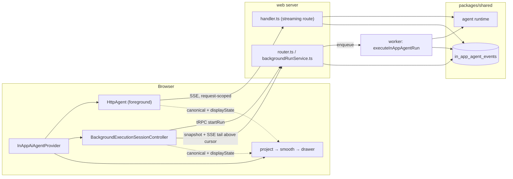
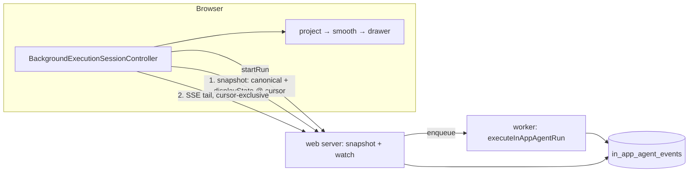

# In-App Agent Architecture

Why the drawer is built the way it is, what the target shape is once background
execution replaces foreground, and which rules keep the two apart until then.

`README.md` is the operational guide: what each file owns, how a run flows, how
the sandbox and MCP authorization work. This document covers the parts you
cannot infer from any single file.

## One log, three derivations

Everything a conversation knows lives in one place: the `in_app_agent_events`
table, ordered by a per-conversation `sequence_number`. Every representation the
product uses is derived from that log. None of them is a second source of truth.

| Derivation                     | Produced by                                                                           | Consumed by                                                                    | Shape                                                                                                                 | Never                                            |
| ------------------------------ | ------------------------------------------------------------------------------------- | ------------------------------------------------------------------------------ | --------------------------------------------------------------------------------------------------------------------- | ------------------------------------------------ |
| **Canonical messages**         | `createConversationMessageAccumulator` (`packages/shared/.../persistence.ts`)         | the `getConversation` wire, the AG-UI seed, feedback identity, title inference | one assistant message per assistant turn, full text, `runId` preserved, in-flight tool calls kept                     | pruned or reordered before seeding a live agent  |
| **Display state + projection** | `lib/display.ts` — `record*` accumulates, `projectInAppAgentMessagesForDisplay` folds | rendering only, once, in `InAppAiAgentProvider`                                | a sidecar describing where interleaved reasoning and tool calls belong, plus synthetic `display-text-<id>-N` segments | written back to the server, or fed to an agent   |
| **Replay messages**            | `getConversationMessagesForReplay` (`packages/shared/.../persistence.ts`)             | model context for a resuming run                                               | reasoning, redirect results, `runId`s and unpaired tool calls stripped                                                | rendered, or used as a client hydration snapshot |

The three exist because they answer different questions: what happened, how it
should look, and what the model should see next. Confusing any two of them is
the failure mode this feature keeps rediscovering, so the table above is the
contract, not a description.

### The invariant: fold once

The display projection runs **exactly once, at render time, in the browser.**

This is not a style preference. The projection is lossy in a specific way: it
truncates an assistant message at its first interleaved block and moves the
continuation into a synthetic sibling message. That is correct for rendering and
wrong for anything else. When the server also projected — the shape this feature
shipped with — the browser seeded its live AG-UI agent with the truncated
message. AG-UI appends `TEXT_MESSAGE_CONTENT` by message id, so the next delta
of a resumed run landed on the truncated seed and the continuation vanished from
the canonical transcript until the run finished and re-hydrated.

The fix was not to pick a different accessor. It was to stop folding twice. The
wire now carries canonical messages plus the display state as a sidecar, and the
one fold happens where the live path already folded.

Two consequences worth stating explicitly:

- **Pruning is presentation too.** `dropUnpairedAssistantToolCalls` and
  `dropEmptyAssistantMessages` run at render time, and only for a settled
  transcript. A live seed must keep an in-flight tool call, otherwise the
  `TOOL_CALL_RESULT` that arrives for it has nothing to attach to and AG-UI
  appends an orphan `tool` message the drawer silently discards.
- **The sidecar is derived, never authoritative.** If it were lost the transcript
  would still be correct, just flatter. `deserializeInAppAgentDisplayState`
  therefore falls back to an empty state rather than throwing.

## Where code lives

`packages/shared` is for what web **and** worker both need. Web-only logic stays
in web even when it executes on a server.

The worker runs agents; it never renders. So the event log, canonical
accumulation, replay, the run lifecycle and watch framing are shared, while
display recording and projection live in `web/src/features/in-app-agent/lib/`
and are imported by both the browser and the web server that builds snapshots.
Shared persistence knows nothing about rendering.

The two message-pruning helpers are the deliberate exception: they prune
`AgUiMessage` shape rather than describe presentation, and replay needs them
from the worker, so they sit in `packages/shared/src/in-app-agent/messages.ts`
and are used by both replay sanitization and render-time settling.

## Current state: two execution paths

Both paths share the agent runtime, persistence, tools, approvals and the entire
render tree. What is genuinely forked is the run driver (an in-request stream
versus a queued worker run), approval resume (request continuation versus a
continuation run), and the client state machine.

Foreground's run cannot outlive the browser session. Background's can: closing
the drawer detaches observation without cancelling the run, and reopening
hydrates one snapshot and resumes the tail above the persisted cursor.

## Target state: background only

Getting there is a deletion, not a redesign: remove `HttpAgent` wiring, the
foreground state in the provider (`foregroundMessages`, its display state, its
seeding), and the streaming route. The contract the remaining path uses is
already the final one.

### The quarantine rule

Until foreground is deleted, no new abstraction may span both paths.

The temptation is to write an adapter that makes them interchangeable. That
adapter would be the most complex code in the feature and would have to be
untangled later rather than deleted. PostHog hit exactly this while migrating
Max from LangGraph to their sandbox runtime: their thread logic reached 3353
lines carrying both runtimes, and they eventually resorted to a written rule
forbidding new work on the legacy path so the eventual removal stayed a removal.

Concretely: foreground-only members are marked delete-with-foreground, shared
code between the paths must be independent of how the server executes a run
(the projection, the drawer, the approval wire contract), and behavior tests
cover each path at its own seam.

## Comparison: PostHog Max

Max's sandbox runtime solves the same problem — a browser observing an agent it
does not host — and independently arrived at the same core invariant: an
append-only frame log as the single source of truth with a pure fold producing
the rendered thread. Their fold is memoized on log identity and their thread
items are derived, never mutated from a listener. That is the same rule as
"fold once", reached from a different direction.

Three things they do that are worth taking:

- **Tag every frame with its source** (`replay`, `live`, `client`). It is what
  lets them suppress side effects on replay — telemetry, auto-approval and tool
  events all check it. Without it every reload re-fires reactions.
- **Pin idempotency for non-idempotent frames.** They dedupe permission requests
  by request id because a cursor resume can legitimately re-deliver the envelope.
- **Test the reconnect matrix.** Resume above cursor, drop-loop abandonment,
  attempt-cap exhaustion, read-only viewers keyed apart from live ones.

One thing to skip: their cold-reopen path connects the stream first, then reads
the snapshot, then reconciles the seam by hashing frame content — necessary only
because their SSE ids come from Redis and their snapshot comes from S3, so the
two share no identifier. Langfuse's snapshot and tail already share
`sequence_number`, so that entire problem does not exist here. Keep it that way:
if a future transport cannot express the shared cursor, it is the wrong
transport.

Their smoothing decision differs from ours and both are defensible. Max appends
text verbatim and spends its budget on block-memoized markdown and DOM-direct
virtualization; Langfuse paces reveal in `useSmoothStreamingMessages`. Ours is a
perceived-quality choice with a real re-render cost, and it stays a display-only
layer: canonical messages are never rewritten for animation.

## Change rules

- Adding a representation means adding a row to the table above, with its
  producer, its consumers, and where it must never appear. If you cannot fill
  those in, you are probably reaching for one that already exists.
- Do not project, prune or reorder messages on the way to a live agent.
- Keep the snapshot and the tail on one cursor.
- Read `README.md` for AG-UI event semantics before changing anything that
  touches ordering, compaction or persistence.
