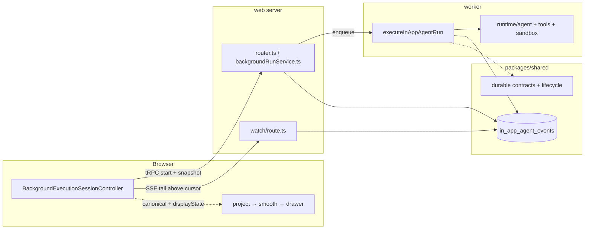

# In-App Agent Architecture

Why the drawer is built the way it is and how durable worker execution keeps the
browser, persisted transcript, and run lifecycle coherent.

`README.md` is the operational guide: what each file owns, how a run flows, how
the sandbox and MCP authorization work. This document covers the parts you
cannot infer from any single file.

## One log, three derivations

Every message representation of a conversation is derived from one place: the
`in_app_agent_events` table, ordered by a per-conversation `sequence_number`.
Canonical, display and replay messages are not persisted independently as
additional sources of transcript truth.

| Derivation                     | Produced by                                                                           | Consumed by                                                                    | Shape                                                                                                                 | Never                                            |
| ------------------------------ | ------------------------------------------------------------------------------------- | ------------------------------------------------------------------------------ | --------------------------------------------------------------------------------------------------------------------- | ------------------------------------------------ |
| **Canonical messages**         | `createConversationMessageAccumulator` (`packages/shared/.../persistence.ts`)         | the `getConversation` wire, the AG-UI seed, feedback identity, title inference | complete assistant messages keyed by stable AG-UI message ids, `runId` preserved, in-flight tool calls kept           | pruned or reordered before seeding a live agent  |
| **Display state + projection** | `lib/display.ts` — `record*` accumulates, `projectInAppAgentMessagesForDisplay` folds | rendering only, once, in `InAppAiAgentProvider`                                | a sidecar describing where interleaved reasoning and tool calls belong, plus synthetic `display-text-<id>-N` segments | written back to the server, or fed to an agent   |
| **Replay messages**            | `getConversationMessagesForReplay` (`packages/shared/.../persistence.ts`)             | model context for a resuming run                                               | reasoning, redirect results, `runId`s and unpaired tool calls stripped                                                | rendered, or used as a client hydration snapshot |

The three exist because they answer different questions: what happened, how it
should look, and what the model should see next. Confusing any two of them is
the failure mode this feature keeps rediscovering, so the table above is the
contract, not a description.

### The invariant: fold once

The display projection runs **exactly once, at render time, in the browser.**

This is not a style preference. The projection is lossy in a specific way: it
truncates an assistant message at its first interleaved block and moves the
continuation into a synthetic sibling message. That is correct for rendering and
wrong for anything else. When the server also projected — the shape this feature
shipped with — the browser seeded its live AG-UI agent with the truncated
message. AG-UI appends `TEXT_MESSAGE_CONTENT` by message id, so the next delta
of a resumed run landed on the truncated seed and the continuation vanished from
the canonical transcript until the run finished and re-hydrated.

The fix was not to pick a different accessor. It was to stop folding twice. The
wire now carries canonical messages plus the display state as a sidecar, and the
one fold happens where the live path already folded.

Two consequences worth stating explicitly:

- **Pruning is presentation too.** `dropUnpairedAssistantToolCalls` and
  `dropEmptyAssistantMessages` run at render time, and only for a settled
  transcript. A live seed must keep an in-flight tool call, otherwise the
  `TOOL_CALL_RESULT` that arrives for it has nothing to attach to and AG-UI
  appends an orphan `tool` message the drawer silently discards.
- **The sidecar is derived, never authoritative.** If it were lost the transcript
  would still be correct, just flatter. `deserializeInAppAgentDisplayState`
  therefore falls back to an empty state rather than throwing.

## Where code lives

`packages/shared` is for what web **and** worker both need. Web-only logic stays
in web even when it executes on a server.

The worker runs agents; it never renders. Mastra adaptation, tools,
instrumentation, continuation handling, prompt loading, skills, and sandbox
providers therefore live in `worker/src/features/in-app-agent/runtime/`.
Shared owns only durable cross-process contracts and storage behavior: the
event log, canonical accumulation, replay, lifecycle, approval events, MCP
policy, tool-result redaction, and seeded prompt. Watch framing, display
recording, projection, IDs, feedback/source schemas, and conversation access
live in web. Shared persistence knows nothing about rendering.

The two message-pruning helpers are the deliberate exception: they prune
`AgUiMessage` shape rather than describe presentation, and replay needs them
from the worker, so they sit in `packages/shared/src/in-app-agent/messages.ts`
and are used by both replay sanitization and render-time settling.

## Durable execution path

Closing the drawer detaches observation without cancelling the run. Reopening
hydrates one snapshot and resumes the tail above the persisted cursor. The
session is the sole browser owner of the canonical transcript, approvals,
attachment, cancellation, and current run state.

## Change rules

- Adding a representation means adding a row to the table above, with its
  producer, its consumers, and where it must never appear. If you cannot fill
  those in, you are probably reaching for one that already exists.
- Do not project, prune or reorder messages on the way to a live agent.
- Keep the snapshot and the tail on one cursor.
- Read `README.md` for AG-UI event semantics before changing anything that
  touches ordering, compaction or persistence.
