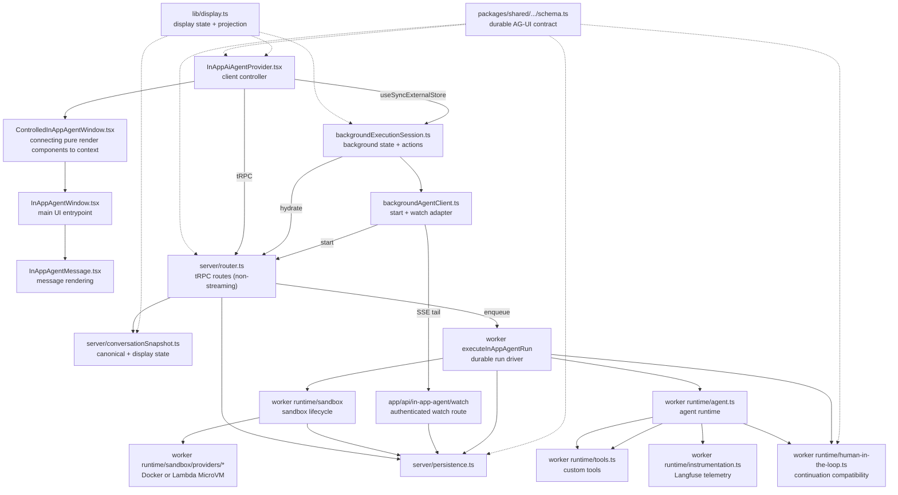

# In-App Agent

The in-app agent is Langfuse's project-scoped assistant inside the authenticated
product UI. Runs execute durably in a worker while the browser observes their
persisted event stream.

`ARCHITECTURE.md` covers why the feature is shaped this way: the one-log /
three-derivations contract, where code lives and why, and the boundaries between
browser, web server, shared durable contracts, and worker runtime.
Read it before changing how messages are represented or where logic lives.

## Core Model

AG-UI events are the durable transcript vocabulary. Langfuse-owned protocols
coordinate persistence, watching, run lifecycle, approvals, and display
projection around those events.

The browser owns interaction state and submits intent. Web owns authorization,
run/message IDs, request sanitization, admission, snapshots, and watching. The
worker owns runtime configuration, MCP credentials, tools, execution, and
continuations. Shared owns durable contracts, persistence, and lifecycle.

A conversation can have one active run. The browser starts a durable run,
hydrates one persisted transcript/cursor snapshot, and observes its tail.
Closing the drawer detaches observation without cancelling the worker run.

## Major Files

- `packages/shared/src/in-app-agent/schema.ts`: runtime-neutral AG-UI and durable
  human-in-the-loop wire contracts.
- `packages/shared/src/in-app-agent/interrupts.ts`: browser-safe durable
  approval interrupt parsing used by browser, web, and worker.
- Explicit `packages/shared/src/in-app-agent/server/*` modules own persistence,
  lifecycle, MCP policy, persisted tool-result handling, compaction, tunables,
  and the seeded system prompt. There is no aggregate server barrel.
- `schema.ts`, `ids.ts`, and `watchFrames.ts`: web-owned feedback/source/rate
  schemas, browser/server IDs, and watch wire framing.
- `lib/display.ts`: display-state recording, the render-time projection, and its
  wire serialization. Web-only; used by the browser and by the web server when
  it builds a conversation snapshot.
- `server/conversationSnapshot.ts`: rebuilds canonical messages and display state
  from one read of the persisted event log.
- `server/router.ts`: tRPC routes for durable run start/cancel/approval, conversation snapshots and lists, and feedback.
- `worker/src/features/in-app-agent/runtime/*`: Mastra/Bedrock/MCP execution,
  continuation handling, instrumentation, prompt loading, tools, skills, and
  sandbox providers.
- `constants.ts`: stable names shared across prompts, tools, persistence, and rendering.
- `components/InAppAiAgentProvider.tsx`: query integration and the React bridge
  to the background session.
- `components/ControlledInAppAgentWindow.tsx` and
  `components/InAppAgentWindow.tsx`: prop-driven rendering and the explicit
  execution controls.
- `lib/backgroundAgentClient.ts`: durable run start/watch AG-UI adapter.
- `lib/backgroundExecutionSession.ts`: background transcript, cursor, run,
  approval, attachment, cancel, and decision owner.

The worker entrypoint at `worker/src/features/in-app-agent/executeInAppAgentRun.ts`
owns runtime credentials, sandbox lifecycle, event persistence, approval
continuations, and terminal run transitions.

Outside this feature folder, `packages/in-app-agent-sandbox-runtime/src/*` provides the shared sandbox runtime and contract types used by both the local Docker provider and the Lambda MicroVM image.

## File Relationships

## Run Lifecycles

1. The provider submits one user message plus browser context to the session.
   The session owns optimistic insertion and constructs the internal AG-UI run
   input before starting the durable run through `startRun`; the server remains
   the authoritative sanitizer before persisting the request.
2. `BackgroundExecutionSessionController` installs the persisted canonical
   messages, the display state, and the cursor before attaching the watch
   stream. The seed is never projected or pruned; see `ARCHITECTURE.md`.
3. The session snapshot is the sole owner of messages, approvals,
   current run, cancellation, and attachment state. React subscribes with
   `useSyncExternalStore`; it does not mirror those facts into component state.
4. Approval and cancellation promises represent the durable mutation. A later
   hydration/watch failure is attachment state and cannot undo an accepted
   command or resurrect an approval.
5. Closing the drawer calls `detach()`, which stops browser observation only.
   Reopening hydrates and resumes from the persisted cursor.

## Client State Ownership

- React Query owns conversation-list and persisted conversation query state.
- `BackgroundExecutionSessionController` owns the live execution facts;
  persisted query data only seeds the coherent bootstrap view consumed by the
  same external-store hook before a controller exists. Rendering never unions
  query state with a live session snapshot.
- `InAppAgentWindow` receives an execution-UI value derived from that session.
- Display pacing remains in `useSmoothStreamingMessages`; canonical AG-UI
  messages are never rewritten for animation.
- Messages and their display state always come from the same source. The
  provider selects both together, so a live transcript can never be folded
  against persisted display state or the reverse.

The provider is still a large integration controller. Do not add another
background state mirror.

## Consumers And Stability Boundaries

`InAppAgentWindowHost` wraps page content and docks the assistant in a right
split by default. Detached and fullscreen presentations still render through
the `agent` overlay layer; the handheld drawer is unchanged. Presentational
components must remain context-free and consume explicit props.

Streaming publications and background session snapshots are high-frequency.
Keep their subscription boundary narrow, derive status/notice values during
render, and preserve stable message references between session publications.

Stop intentionally emits no separate analytics event: the run lifecycle is
sufficient to diagnose correctness, and there is no product decision that a
separate click event would answer.

## Operations

Rollback is a code revert; background execution does not require a schema
rollback.

Workers with `LANGFUSE_IN_APP_AGENT_ENABLED` set consume the run queue and
reconcile stale runs; without it, runs commit as `QUEUED` and die at
`queue_timeout`. Cloud is on unless the flag is `"false"`. Split-role workers
can keep the instance on and set
`QUEUE_CONSUMER_IN_APP_AGENT_RUN_QUEUE_IS_ENABLED=false` (and
`LANGFUSE_IN_APP_AGENT_INTEGRITY_RUNNER_ENABLED=false`) to skip those
surfaces. Check
`LANGFUSE_IN_APP_AGENT_MAX_ACTIVE_RUNS_PER_ORG` against execution capacity too:
its default of 20 equals full US capacity and exceeds JP and staging.

Conversation switching, detached invalidations, retry, and conversation-list run
statuses remain separate project concerns.

Environment ownership:

- Worker: queue concurrency, sandbox provider and Lambda MicroVM values,
  and development-only `LANGFUSE_IN_APP_AGENT_AWS_PROFILE`. Enablement is
  `LANGFUSE_IN_APP_AGENT_ENABLED` (shared with web); optional `"false"`
  queue and integrity flags opt a split-role worker out.
- Fixed lifecycle policy: queue timeout (300000 ms), maximum run duration
  (900000 ms), and approval TTL (86400000 ms). These are shared constants, so
  web and worker cannot diverge.
- Web: per-user (5) and per-org (20) active-run ceilings.
- Fixed implementation timings: 5000 ms worker heartbeat, 60000 ms stale
  heartbeat, 1000 ms watch poll, 15000 ms keepalive, and 90000 ms watch
  connection. These are intentionally not environment variables.

## Sandbox Runtime

The worker runtime sandbox service gives the agent a conversation-scoped sandbox interface with `read`, `write`, and `edit` plus a separate turn-end callback. It reuses an existing provider session when the stored provider/session/TTL still match, otherwise it boots a fresh session and persists the new state on the conversation.

Both sandbox providers target the same runtime contract from `packages/in-app-agent-sandbox-runtime`.

- The local `dangerous-docker` provider starts a container from that package's Docker image and calls the runtime over `http://127.0.0.1:5000` using `docker exec`.
- The Lambda MicroVM provider starts a MicroVM image built from the same package and calls the runtime through the AWS-assigned HTTPS endpoint plus `X-aws-proxy-auth`.
- Providers own runtime session lifecycle only: create/resume/suspend/terminate plus proxying sandbox operations.

Provider contract:

- `ensureSession({ conversationId, sessionId? })`
- `syncReadonlyFiles({ sessionId, files })`
- `read`, `write`, `edit`, `bash`
- optional `probeSession({ sessionId })`, returning why a stored session is unusable
- optional `suspendSession({ sessionId })`
- optional `terminateSession({ sessionId })`

Runtime HTTP surface:

- `GET /health`
- `POST /sandbox`

`POST /sandbox` is the narrow control surface for the current tool set: `read`, `write`, `edit`, and `bash`. Before each request, the provider rebuilds `tool_calls/` from persisted non-sandbox tool calls so the runtime always sees the same readonly context regardless of provider.

## Sandbox Persistence And Cleanup

Sandbox state is stored on the conversation row as `providerSessionId`. The configured sandbox provider is assumed to remain stable for the lifetime of the database.

Live or suspended MicroVMs keep workspace files and memory. A terminated session cannot be revived, so continuation starts a clean VM: conversation history and the reconstructed `tool_calls/` survive, but workspace files, installed packages, and process state do not.

`createInAppAgentSandbox` calls the provider's `probeSession` up front and returns `workspaceWasReset` when the stored session is gone. The worker passes that on as `sandboxWorkspaceWasReset`, which adds a run-scoped system message telling the model its earlier files are gone and that `tool_calls/` was restored. It is not a transcript message, so the user never sees it.

Nothing in the application terminates a MicroVM; the AWS idle policy reclaims them, suspending after 60s idle and terminating four hours after either suspension or creation. Deleting a conversation clears `providerSessionId` without terminating, so that workspace outlives the delete.

`dangerous-docker` is development-only. Local Docker sandbox cleanup stays in the web process where that provider is used.

## MCP Tool Authorization

The in-app agent worker uses two run-scoped inputs when calling Langfuse MCP:

- A temporary project-scoped API key marked as an in-app-agent key.
- An optional server-generated tool override sent with `x-langfuse-in-app-agent-tool-override`.

The API key authenticates the request and scopes it to the project. Without an override, in-app-agent keys are restricted to MCP tools annotated with `readOnlyHint: true`. With an override, the key may additionally call the named mutating tools. The worker builds the override from the current one-off approval and the conversation's stored grants. The parser also accepts the earlier singular `{"toolName":…}` shape so already-enqueued continuations remain executable during rollout.

MCP registry behavior:

- Normal project API keys can call all enabled MCP tools.
- In-app-agent keys can call read-only tools directly when the tool has `readOnlyHint: true`.
- In-app-agent keys need a valid tool override to call named non-read-only Langfuse MCP tools.

RBAC is the first gate for Langfuse MCP tools. Before a tool is exposed to the model, shared `mcpPolicy.ts` checks the signed-in user's `projectRole` and `isAdmin` against the tool's required `ProjectScope` with `hasProjectAccess()`. That means the assistant never sees tools the user could not use manually in the product UI or APIs. Human approval is a second gate on top of RBAC for tools classified as `"approval"`: approval can allow one execution of a tool the user already has access to, but it does not widen the user's project permissions.

Human approval is separate from the MCP tool override. Shared `mcpPolicy.ts` classifies every Langfuse MCP tool in `IN_APP_AGENT_LANGFUSE_MCP_TOOL_POLICIES`, using unprefixed MCP registry names and either `"auto"` or `"approval"`. The web in-app-agent server test imports the MCP registry's `McpToolName` contract and verifies both type equality and runtime registry equality, so adding a Langfuse MCP tool requires an explicit in-app agent approval classification without making MCP bootstrap depend on the in-app agent.

The internal auto-approval set is derived from that map by prefixing Langfuse MCP tools with `langfuse_` and adding local tools such as `IN_APP_AGENT_REDIRECT_TOOL_NAME`; docs MCP tools are auto-approved by the `langfuseDocs_` prefix. The worker runtime agent marks every other tool with Mastra `requireApproval: true`. Mastra emits an interrupt, the browser asks the user, and the router records the decision for a durable worker continuation. The browser-safe `interrupts.ts` parser adapts Mastra's runtime payload into the Langfuse-owned `tool_approval_request` contract from `schema.ts`; browser, web server, and worker all consume that same parser.

The `InAppAgentPendingToolApproval` table is not used by background execution.
It remains temporarily so existing rows and Prisma relations stay valid.

Sandbox tools are separate from MCP authorization. When a sandbox provider is enabled, the worker runtime adds local `read`, `write`, `edit`, and `bash` tools backed by the sandbox provider contract rather than the MCP registry.

## Change Rules

- Check AG-UI docs at `https://docs.ag-ui.com/llms.txt` before changing event semantics, ordering, stream handling, compaction, tools, or state.
- Keep persisted schemas backward-compatible unless there is an explicit migration.
- Keep sandbox conversation state backward-compatible unless there is an explicit migration or cleanup plan.
- Keep presentational components prop-driven; connect tRPC, watching, streaming, and persistence at provider/router/watch/worker boundaries.
- Before changing client state ownership or adding effects, read the
  frontend-large-feature architecture and refactor-react-effects skills.
- Protect the background session and worker contracts with behavior tests at
  their public seams.
