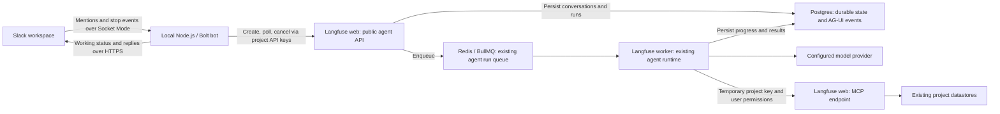

# Slack / Public API PoC

This hackathon prototype lets users mention a Slack bot and ask questions about
one shared Langfuse project. Slack shows its native working indicator and stop
button; answers and subsequent mentions stay in the same thread. It is an
experimental, opt-in API, not a general-purpose user-delegation API.

## Quick setup

1. Start a local Langfuse web and worker with the normal development services and
   a working in-app-agent model configuration. Use synthetic project data.
2. Run `pnpm --filter @langfuse/shared run db:seed` to create the dedicated
   `slack-agent-demo` VIEWER identity. For a fresh database, use
   `db:seed:examples` for example datasets too; existing worktree-pool slots
   already contain examples.
3. Configure the web process with the two values below. Enable the in-app agent
   in both web and worker with `LANGFUSE_IN_APP_AGENT_ENABLED=true`, and restart
   those processes. Existing entitlement and organization AI-consent checks
   still apply.
4. Follow the [Slack setup guide](../../../../scripts/slack-agent/README.md)
   to import the app manifest, install it, create the two Slack tokens, and fill
   the ignored bot configuration. Invite the app to the configured channel.
5. From the repository root, run `mise exec -- pnpm run slack:agent`, then send
   `@langfuse-hackathon What datasets exist in this project?`. Mention it again
   in the reply thread for a follow-up.

```dotenv
LANGFUSE_IN_APP_AGENT_API_PROJECT_ID=7a88fb47-b4e2-43b8-a06c-a5ce950dc53a
LANGFUSE_IN_APP_AGENT_API_USER_ID=slack-agent-demo
```

These IDs refer to the local synthetic seed project and user. The API is
disabled unless both variables are set. Configure model-provider credentials
in Langfuse's normal environment, not in the Slack bot. For Bedrock, an expired
AWS SSO session must be refreshed before running the demo.

## Architecture and infrastructure



**Where it runs.** Slack hosts the conversation UI. The bot is a separate Node.js
process on the laptop and initiates the outbound WebSocket connection to Slack.
It requires no public laptop URL, tunnel, or inbound webhook. Langfuse web
accepts requests; the existing worker executes the agent. Keep all three
processes running and the laptop awake.

**What infrastructure changes.** The PoC adds the bot process and three web
routes. It reuses Langfuse's existing Postgres tables, Redis/BullMQ run queue,
worker, MCP server, and project datastores such as ClickHouse. It adds no
database migration, queue type, cloud deployment, or separate model runtime.
The worker must reach the web MCP endpoint through `LANGFUSE_MCP_BASE_URL` or
`NEXTAUTH_URL`, as well as its configured model provider. Model credentials
stay with Langfuse; Slack tokens stay with the bot.

**How a request travels.** The bot filters incoming events to one workspace and
channel, maps each Slack thread to an API conversation, and submits a message.
Web authenticates the project key, validates the configured VIEWER identity,
and calls the existing background-run service. The worker consumes that run and
uses the same model, prompt, and authorized MCP tools as the in-app agent.
The bot polls every two seconds, posts the completed assistant text, and clears
the working status. A Slack stop event requests cancellation of the same run.
Model execution continues independently of the polling HTTP requests.

**What is persisted.** Langfuse stores conversations, run status, and events in
Postgres. The bot stores thread mappings and pending deliveries in an ignored
local state file; restarting it resumes those runs. A Slack event ID becomes a
durable API idempotency key, so retries reuse the same run. Completed Slack
deliveries are remembered for seven days; a crash after Slack accepts a reply
but before the bot saves its state can still duplicate that reply.

## API and code ownership

| Route                                        | Purpose                                                                                              |
| -------------------------------------------- | ---------------------------------------------------------------------------------------------------- |
| `POST /api/public/agent/runs`                | Submit `{message, conversationId?, idempotencyKey}`; return HTTP 202 with `{runId, conversationId}`. |
| `GET /api/public/agent/runs/{runId}`         | Poll status and assistant text; excludes reasoning and tool results.                                 |
| `POST /api/public/agent/runs/{runId}/cancel` | Request cancellation; poll to observe the final status.                                              |

All routes use normal project public/secret-key BasicAuth. The
[adapter guide](../../../../scripts/slack-agent/README.md#api-contract)
documents the full response shape and terminal states are defined by the
existing shared agent contract.

- [publicAgentService.ts](./server/publicAgentService.ts) owns the fixed project
  and VIEWER checks, API-only conversation boundary, idempotency, and result
  projection. [backgroundRunService.ts](./server/backgroundRunService.ts) owns
  admission, durable run creation, queueing, and cancellation.
- [scripts/slack-agent](../../../../scripts/slack-agent) owns Slack routing,
  statuses, polling, formatting, and local recovery state.
- [executeInAppAgentRun.ts](../../../../worker/src/features/in-app-agent/executeInAppAgentRun.ts)
  owns model execution and temporary MCP credentials. Its runtime is unchanged
  by this PoC. [ARCHITECTURE.md](./ARCHITECTURE.md) covers the agent's existing
  persistence and package boundaries.
- [agent.yml](../../../../fern/apis/server/definition/agent.yml) owns the
  public API specification; served OpenAPI is generated from it.

## Scope and next steps

Everyone in the allowed Slack channel shares one non-admin Langfuse VIEWER's
access. The API checks the configured user's actual membership on each request;
it cannot read the user's private in-app conversations. The worker's existing
permission checks still apply, and the bot cancels any run awaiting approval.
Channel membership does not grant individual Langfuse permissions.

The demo supports mentions in one channel and one bot process. Direct messages,
unmentioned follow-ups, token streaming, tool-progress cards, OAuth installation
across workspaces, and production hosting are outside this PoC. The animated
working indicator uses Slack's native agent-session API and does not require
token streaming. A normal PR preview does not run the Slack bot or opt into this
API configuration; use the local setup to reproduce the integration.

For individual permissions, add verified Slack-to-Langfuse account linking and
user-scoped API authorization, then execute as the linked user with current
project membership. A caller-supplied user ID is not sufficient. Bind private
conversation state to its owner and choose a reply surface whose audience is
authorized to see the result. Hosting the bot later requires a continuously
running process and durable shared delivery state before adding replicas.

## Verification

The adapter tests cover routing, retry/recovery, cancellation, and status
cleanup. The server integration tests cover authorization, idempotency,
conversation isolation, and result boundaries. Run them with:

```sh
pnpm run slack:agent:test
pnpm --filter web run test public-agent-runs.servertest.ts
```

For a live check, expect a working indicator, an answer in the originating
thread, continuity after another mention, and cancellation through Slack's stop
button. Finish build/lint checks first: local file watchers can restart the
worker during a run. The first request after a cold web start can time out while
Next.js compiles MCP; warm the route or send a new message after compilation.
