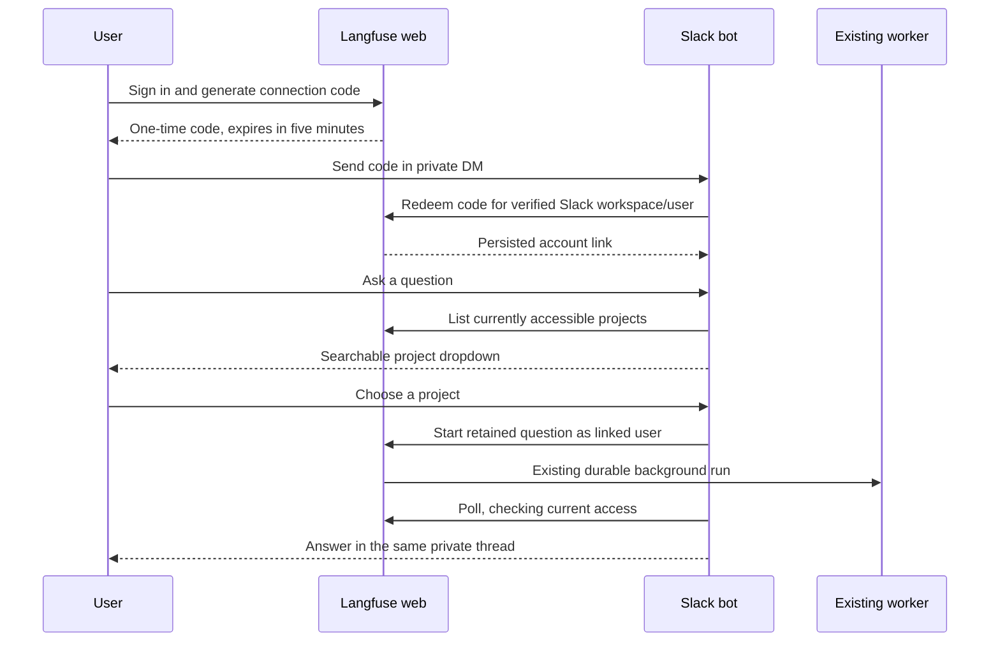
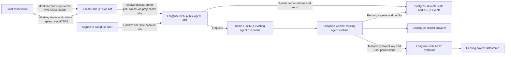

# Slack / Public API PoC

This hackathon prototype connects Slack to the existing project-scoped agent.
It has two opt-in modes: a single-project channel demo with private ephemeral
replies, and a project picker in private DMs. Both require individual Langfuse
account linking, check current user permissions, and use Slack's native working
indicator and stop button.

## Linked accounts and multiple projects

Follow [the linked-account setup guide](../../../../scripts/slack-agent/LINKED_SETUP.md)
for the exact Slack manifest, server configuration, and connection steps.



**Identity and authorization.** A signed-in Langfuse user generates a random
connection code with a same-origin, authenticated mutation. Redis stores its
hash for five minutes and consumes it once. The bot redeems it through
`POST /api/slack-agent`, authenticated with a dedicated service secret and
restricted to the configured workspace. The server stores the verified mapping
in `SlackAgentUserLink`; it never accepts a caller-supplied Langfuse user ID.
The trusted bot credential can act for linked users in that workspace, so it
must be held only by the bot operator. Project API keys use separate,
project-bound account connections and cannot access these workspace-wide links.

**Project selection.** The bot offers only projects allowed by the linked
user's current membership and the agent's normal feature eligibility checks.
It retains the question while the user chooses. A thread is bound to one
Slack owner, one account-link ID, one project, and one Langfuse conversation.
Changing projects means starting a new thread. A remembered last project is
only a suggestion. Stale dropdowns, another user, or a replacement account
link cannot move an existing conversation into another scope.

**Privacy and revocation.** Linked-mode project names and answers stay in DMs;
channel mentions direct the requester there. The server rechecks membership on
submission, polling, and cancellation, and the worker applies its existing
permission checks. Disconnecting on `/slack-agent` revokes further access and
reconnecting uses a new link identity. Previously delivered Slack messages are
not deleted. Slack does not provide tool-approval controls; runs awaiting
approval are cancelled, and changes should use Langfuse's in-app flow.

**Storage.** Verified links live in Postgres; expiring code hashes live in
Redis. Agent events and runs use the existing Postgres tables. Thread bindings,
project preferences, pending questions, and delivery progress live in the
bot's ignored `state.linked.local.json`. This supports one local bot process
and restart recovery; multiple replicas need shared routing/delivery storage.
The new link table requires the included Postgres migration. The worker, queue
contract, model runtime, and MCP tools are unchanged.

**Browser surface.** `/slack-agent` uses the existing signed-in session and
tRPC. Connection codes are excluded from client logging and replay capture.
No product analytics event is added for this opt-in credential setup flow.
Expected connection/configuration failures are rendered in the UI; no new
client-side Sentry capture is added.

## Shared-project quick setup

1. Start a local Langfuse web and worker with the normal development services and
   a working in-app-agent model configuration. Use synthetic project data.
2. Apply database migrations, then run `pnpm --filter @langfuse/shared run db:seed`
   if you need a synthetic project. For a fresh database, use `db:seed:examples`
   for example datasets too; existing worktree-pool slots already contain
   examples. Sign in to Langfuse with an account that belongs to the project.
3. Configure the web process with the project below. Enable the in-app agent
   in both web and worker with `LANGFUSE_IN_APP_AGENT_ENABLED=true`, and restart
   those processes. Existing entitlement and organization AI-consent checks
   still apply.
4. Follow the [Slack setup guide](../../../../scripts/slack-agent/README.md)
   to import the app manifest, install it, create the two Slack tokens, and fill
   the ignored bot configuration. Invite the app to the configured channel.
5. From the repository root, run `mise exec -- pnpm run slack:agent`, then send
   `@langfuse-hackathon What datasets exist in this project?`. Open the private
   account link, sign in, and confirm. Mention the bot again to ask your question;
   subsequent mentions in that thread continue your own conversation.

```dotenv
LANGFUSE_IN_APP_AGENT_API_PROJECT_ID=7a88fb47-b4e2-43b8-a06c-a5ce950dc53a
```

This ID refers to the local synthetic seed project. The API is disabled unless
the project variable is set. Configure model-provider credentials
in Langfuse's normal environment, not in the Slack bot. For Bedrock, an expired
AWS SSO session must be refreshed before running the demo.

## Architecture and infrastructure



**Where it runs.** Slack hosts the conversation UI. The bot is a separate Node.js
process on the laptop and initiates the outbound WebSocket connection to Slack.
It requires no public laptop URL, tunnel, or inbound webhook. Langfuse web
accepts requests; the existing worker executes the agent. Keep all three
processes running and the laptop awake.

**What infrastructure changes.** The PoC adds the bot process, public API routes,
an account-confirmation page, and the `user_connections` Postgres table. It
reuses the existing conversation/run tables, Redis/BullMQ queue, worker, MCP
server, and project datastores such as ClickHouse. It adds no queue type, cloud
deployment, or separate model runtime.
Linked mode additionally adds the separate Slack identity link table, private
bot transport, and account page described above.
The worker must reach the web MCP endpoint through `LANGFUSE_MCP_BASE_URL` or
`NEXTAUTH_URL`, as well as its configured model provider. Model credentials
stay with Langfuse; Slack tokens stay with the bot.

**How a request travels.** The bot filters incoming events to one workspace and
channel and resolves a connection for the event's Slack user. An unlinked user
receives a private, single-use link valid for ten minutes and confirms their
Langfuse account in the browser. The bridge then maps each Slack thread, sender,
and linked account to a separate API conversation. Web authenticates the project
key, resolves its confirmed connection, checks current project access, and
calls the existing background-run service with that user as the run owner.
The server adds `langfuse_user_id` to message context. The worker consumes that run and
uses the same model, prompt, and authorized MCP tools as the in-app agent.
The bot polls every two seconds, posts the completed assistant text, and clears
the working status. A Slack stop event requests cancellation of the same run.
Model execution continues independently of the polling HTTP requests.

**What is persisted.** Langfuse stores connections, conversations, run status,
and events in Postgres. Connection identities include the project, bridge API
key, provider, Slack workspace, and Slack user. Link tokens are stored only as
digests and cleared atomically when consumed. The bot stores per-user thread
mappings and pending deliveries in an ignored
local state file; restarting it resumes those runs. A Slack event ID becomes a
durable API idempotency key, so retries reuse the same run. Completed Slack
deliveries are remembered for seven days; a crash after Slack accepts a reply
but before the bot saves its state can still duplicate that reply.

## API and code ownership

| Route                                                         | Purpose                                                                                                            |
| ------------------------------------------------------------- | ------------------------------------------------------------------------------------------------------------------ |
| `POST /api/public/agent/connections`                          | Resolve `{provider: "slack", workspaceId, externalUserId}`; return `{connectionId, userId, linkUrl}`.              |
| `POST /api/public/agent/runs`                                 | Submit `{connectionId, message, conversationId?, idempotencyKey}`; return HTTP 202 with `{runId, conversationId}`. |
| `GET /api/public/agent/runs/{runId}?connectionId=...`         | Poll status and assistant text; excludes reasoning and tool results.                                               |
| `POST /api/public/agent/runs/{runId}/cancel?connectionId=...` | Request cancellation; poll to observe the final status.                                                            |

All routes use normal project public/secret-key BasicAuth. The
[adapter guide](../../../../scripts/slack-agent/README.md#api-contract)
documents the full response shape and terminal states are defined by the
existing shared agent contract.

- [userConnectionService.ts](./server/userConnectionService.ts) owns connection
  lookup, expiring links, project access checks at consent, and atomic linking.
- [publicAgentService.ts](./server/publicAgentService.ts) owns the configured project
  and current user checks, API-only conversation boundary, idempotency, and result
  projection. [backgroundRunService.ts](./server/backgroundRunService.ts) owns
  admission, durable run creation, queueing, and cancellation.
- [scripts/slack-agent](../../../../scripts/slack-agent) owns Slack routing,
  statuses, polling, formatting, and local recovery state.
- [slack-agent/server/service.ts](../slack-agent/server/service.ts) owns verified
  account links, connection codes, and current linked-user access. Its router
  serves the signed-in account page, and `/api/slack-agent` is the private
  bot transport. Linked mode reuses the external-run helpers in
  `publicAgentService.ts`, with conversations namespaced by account-link ID.
- [executeInAppAgentRun.ts](../../../../worker/src/features/in-app-agent/executeInAppAgentRun.ts)
  owns model execution and temporary MCP credentials. Its runtime is unchanged
  by this PoC. [ARCHITECTURE.md](./ARCHITECTURE.md) covers the agent's existing
  persistence and package boundaries.
- [agent.yml](../../../../fern/apis/server/definition/agent.yml) owns the
  public API specification; served OpenAPI is generated from it.

## Shared-mode scope and deployment limits

The bridge is trusted to report the Slack identity from authenticated events.
Account confirmation delegates that identity only to the specific bridge API
key: other project keys cannot reuse the connection. Deleting the key removes
its connections. Use a dedicated bridge key, and reconfirm accounts if replacing
it. API callers cannot supply arbitrary Langfuse user IDs.

The API checks the linked user's actual membership on each request; it cannot
read the user's private in-app conversations. The worker checks current
permissions again at execution. The bot cancels any run awaiting approval
because Slack has no approval UI. Replies are ephemeral and visible only to the
requesting user, so channel membership does not reveal another user's results.

Shared mode supports mentions in one channel and one bot process. Linked mode
supports private DMs and unmentioned thread follow-ups. Token streaming,
tool-progress cards, OAuth installation across workspaces, authorized shared
channel answers, and production hosting are outside this PoC. The animated
working indicator uses Slack's native agent-session API and does not require
token streaming. A normal PR preview does not run the Slack bot or opt into this
API configuration; use the local setup to reproduce the integration.

Hosting the bot later requires a continuously running process and durable
shared delivery state before adding replicas. Socket Mode needs no inbound
access to the laptop, but users must be able to reach Langfuse's account-linking
page. A localhost Langfuse URL only supports linking from that laptop.
Ephemeral channel replies do not provide a durable Slack conversation archive.

## Verification

The adapter tests cover linking prompts, private replies, per-user routing,
retry/recovery, cancellation, and status cleanup. Server integration tests cover
token expiry/replay, concurrent confirmation, API-key binding, current project
authorization, idempotency, conversation isolation, and result boundaries. Run
them with:

```sh
pnpm run slack:agent:test
pnpm --filter web run test public-agent-runs.servertest.ts
pnpm --filter web run test agent-user-connections.servertest.ts
```

For a live check, first expect a private linking prompt. Confirm the correct
project and Slack identity while signed into Langfuse, then mention the bot
again. Expect a working indicator, a private answer in the channel or existing thread,
continuity after another mention, and cancellation through Slack's stop button.
Repeat as another Slack user to verify a separate linking prompt and conversation.
Finish build/lint checks first: local file watchers can restart the
worker during a run. The first request after a cold web start can time out while
Next.js compiles MCP; warm the route or send a new message after compilation.
