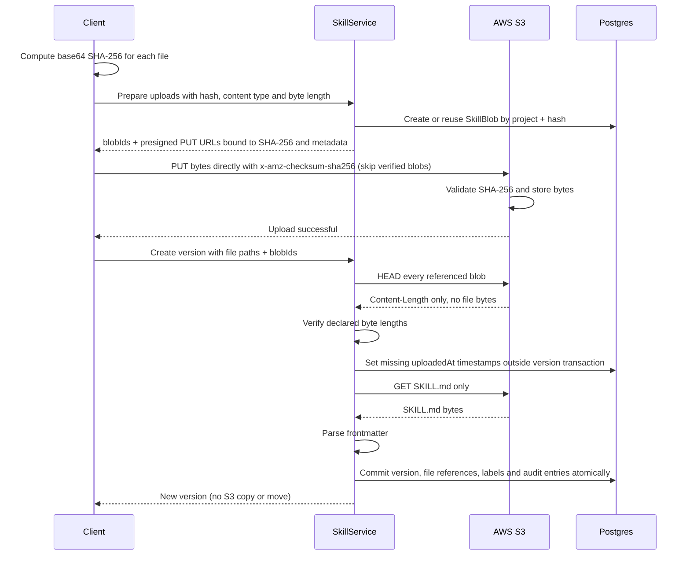
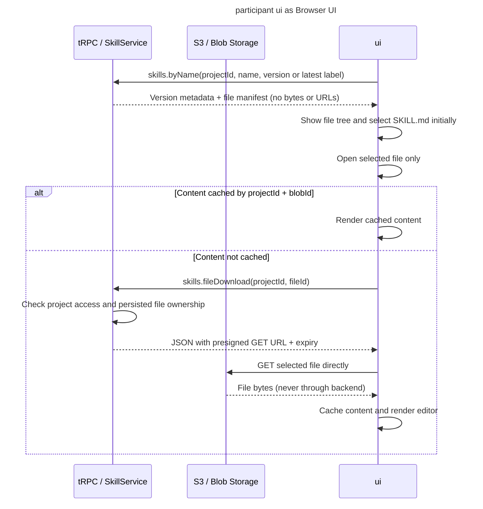

## REST

- `GET /api/public/v1/skills`
- `POST /api/public/v1/skills`
- `POST /api/public/v1/skills/blobs`
- `GET /api/public/v1/skills/{skillName}`
- `GET /api/public/v1/skills/files/{fileId}/content`
- `PATCH /api/public/v1/skills/{skillName}/versions/{skillVersion}`
- `DELETE /api/public/v1/skills/{skillName}/versions/{skillVersion}`

## tRPC

- Query: `skills.all`
- Query: `skills.filterOptions`
- Query: `skills.byName`
- Query: `skills.fileDownload`
- Query: `skills.allVersions`
- Mutation: `skills.prepareUploads`
- Mutation: `skills.createVersion`
- Mutation: `skills.setLabels`
- Mutation: `skills.setTags`
- Mutation: `skills.deleteVersion`
- Mutation: `skills.deleteSkill`

## MCP

Tools at `/api/public/mcp`:

- `listSkills`
- `getSkill`

### Upload new skill version

### Open a skill in the UI

